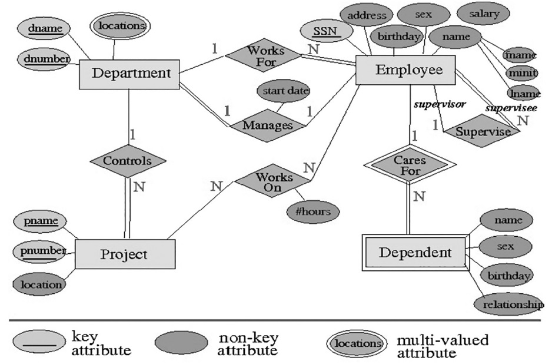
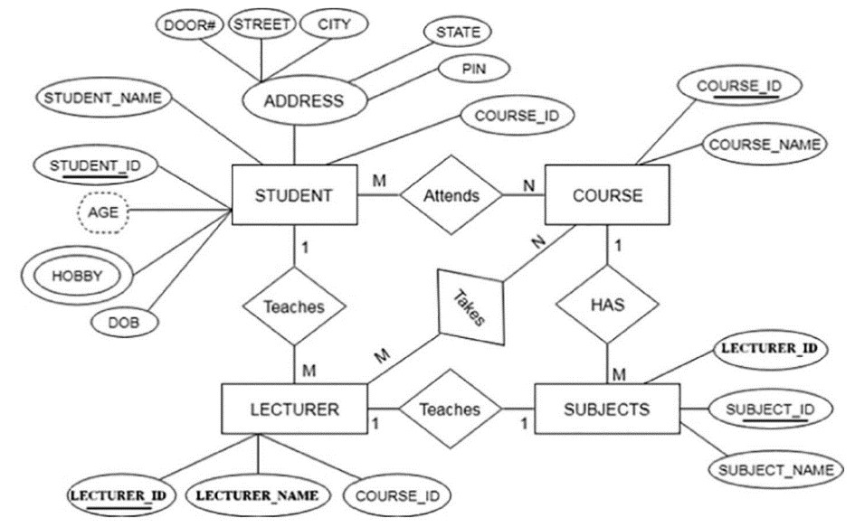
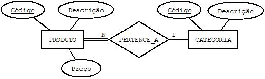

## [Tópico 02a] - Exercícios de revisão (1/4)
###### *by Prof. Plinio Sa Leitao-Junior (INF/UFG)*

#### <ins>EXERCÍCIO:</ins> Qual a distinção entre ?
- Esquema conceitual, esquema lógico e esquema físico.
- Requisitos de software e requisitos de dados.
- Independência lógica e independência física.
- Dado e metadado.
- Definição, construção e manipulação de banco de dados.
- Banco de dados e sistema gerenciador de banco de dados.
- Tipo de dado e restrição de integridade.
- Modelo de dados e esquema de banco de dados.
- Redundância e redundância controlada.
- Independência física e independência lógica.
- Modelo entidade relacionamento e modelo relacional.

#### <ins>EXERCÍCIO:</ins> Quais as possíveis inconsistências no diagrama abaixo ?

#### <ins>EXERCÍCIO:</ins> Quais as possíveis inconsistências no diagrama abaixo ?

#### <ins>EXERCÍCIO:</ins> Que esquema conceitual de banco de dados, segundo o MER, pode ser empregado para suportar consultas por quaisquer parentes de determinada pessoa ?

#### <ins>EXERCÍCIO:</ins> Por que a <ins>ordenação de _tuplas_</ins> não é relevante no contexto do <ins>modelo relacional</ins> ?

#### <ins>EXERCÍCIO:</ins> O que significa <ins>valor nulo</ins> no jargão de banco de dados ? Quais as semelhanças e distinções entre ?
- Valor nulo e valor ausente.
- Valor nulo e informação.

#### <ins>EXERCÍCIO:</ins> No contexto do modelo relacional, qual a distinção entre os conceitos:
- Restrição de integridade de chave, restrição de integridade de entidade, restrição de integridade de domínio e restrição de integridade referencial.
- Superchave, chave candidata, chave primária e chave estrangeira.
- Distintos valores que um atributo pode ter e número total de distintos valores que um atributo pode ter.

#### <ins>EXERCÍCIO:</ins> No contexto do modelo relacional, analisar as sentenças:
- Um banco de dados é tipicamente composto por várias relações.
- Em geral, cada _tupla_ de um banco de dados se relaciona com uma ou mais _tuplas_ (via a associação entre chave estrangeira e chave primária).

#### <ins>EXERCÍCIO:</ins> No contexto do modelo relacional, que conceito se refere em ?

- Conjunto de esquemas de relação: { R1, R2, ..., Rm }.
- Conjunto de relações: { r1(R1), r2(R2), ..., rm(Rm) }.
- R(A1, A2, ...,An).
- Conjunto de n-tuplas: { t1, t2, ..., tm }.
- Lista ordenada de n valores: <v1, v2, ..., vn>.
- Nenhum valor de chave primária pode ser NULL.

#### <ins>EXERCÍCIO:</ins> Qualquer relação é um <ins>subconjunto</ins> do <ins>produto cartesiano</ins> entre os <ins>conjuntos de domínios</ins> dos atributos da relação ?
- Se R(A1, A2, ...,An), então
- r(R) ⊆ ( dom(A1) × dom(A2) × ... × dom(An) ) ?

#### <ins>EXERCÍCIO:</ins> Um banco de dados simples (**BD Simples**):

> <ins>Esquema conceitual</ins>:

> <ins>Esquema lógico</ins>:

&#8718; PRODUTO(<ins>CodProduto</ins>, Descrição, Preço, _Categ_) 
&#8718; CATEGORIA(<ins>CodCateg</ins>, Nome) 
&#8718; PRODUTO(Categ) REFERENCIA CATEGORIA(CodCateg) 

> <ins>Ilustração</ins>:

CATEGORIA
| <ins>CodCateg</ins> | Nome |
|-|-|
| **papel** | Papelaria e escritório |
| **esporte** | Material esportivo |

PRODUTO
| <ins>CodProduto</ins> | Descrição | Preço | _Categ_ |
|-|-|-|-|
| **1234** | Lápis | 0.70 | _papel_ |
| **1111** | Bola | 20.00 | _esporte_ |
| **2222** | Caneta | 1.20  | _papel_ |
| **1212** | Meião | 12.40 | _esporte_ |
| **1112** | Viseira| 12.40 | _esporte_ |

Quais as restrições de integridade - _domínio_, _chave_, _integridade de entidade_ e _integridade referencial_ - são violadas em cada uma das seguintes operações? 
**(a)** Incluir a _tupla_ **<NULL,"Boné",12.00,"vestuário">** em PRODUTO. 
**(b)** Incluir a _tupla_ **<1212,"Borracha",2.10,"papel">** em PRODUTO. 
**(c)** Incluir a _tupla_ **<1212,2.10,"Borracha","papel">** em PRODUTO. 
**(d)** Alterar a _tupla_ **<"papel","Papelaria e escritório">** para **<"papeis","Papelaria e Outros">** em CATEGORIA. 
**(e)** Excluir a _tupla_ **<"papel","Papelaria e escritório">** em CATEGORIA. 
**(g)** Alterar a _tupla_ **<"papel","Papelaria e escritório">** para **<"papelaria","Papelaria e Escritório">** em CATEGORIA. 
**(h)** Excluir a _tupla_ **<1111,"Bola",20.00,"esporte">** em PRODUTO.

IMPORTANTE: 
&#8718; Para analisar cada operação, considere o banco de original conforme a ilustração. Por exemplo, para analisar a operação em (d), desconsidere possíveis modificações no banco de dados pelas operações em (a), (b) e (c). 
&#8718; Ao responder, calcule o somatório dos números que identificam cada restrição violada pela operação: 
(01) Restrição de domínio 
(02) Restrição de chave 
(04) Restrição de integridade de entidade 
(08) Restrição de integridade referencial 

