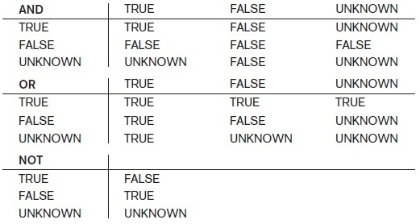

## [Tópico 02c] - Exercícios de revisão (3/4)
###### *by Prof. Plinio Sa Leitao-Junior (INF/UFG)*

Para ilustrar as operações da SQL, considere o esquema lógico do BD Empresa.

#### <ins>EXERCÍCIO:</ins> Escreva em SQL as operações (1), (2) e (3).

|(1)|
|-|
|π Pnome, **F.Sexo**, Nome_dependente, **D.Sexo** &nbsp;&nbsp;&nbsp;&nbsp;(**ρ F** (FUNCIONARIO) ⨝ Cpf = Fcpf **ρ D** (DEPENDENTE))|

|(2)|
|-|
|D(Cpf, Nome_dependente, Sexo_dependente) ← &nbsp;&nbsp;&nbsp;&nbsp;π Fcpf, Nome_dependente, Sexo (DEPENDENTE) RESULT ← π Pnome, Sexo, Nome_dependente, Sexo_dependente (FUNCIONARIO * D)|

|(3)|
|-|
|FUNC(**Cpf**, Pnome_func, Unome_func) ←  &nbsp;&nbsp;&nbsp;&nbsp;π **Cpf_supervisor**, Pnome, Unome (FUNCIONARIO) SUPER ← π Cpf, Pnome, Unome (FUNCIONARIO) RESULT ← π Pnome_func, Unome_func, Pnome, Unome (FUNC * SUPER)|

#### <ins>EXERCÍCIO:</ins> Interprete as expressões a seguir (veja a tabela).

&#9888; (5 + NULL) 
&#9888; (5 < NULL) 
&#9888; (NULL <> NULL) 
&#9888; (NULL = NULL) 
&#9888; NULL OR TRUE 
&#9888; NULL OR FALSE 
&#9888; NULL OR NULL 
&#9888; TRUE AND NULL 
&#9888; FALSE AND NULL 
&#9888; NULL AND NULL 
&#9888; NOT NULL

#### <ins>EXERCÍCIO:</ins> Reescreva a junção abaixo sem usar a cláusula HAVING. Em seguida, transforme a solução em junção natural.

|(1)|
|-|
SELECT Pnome, Unome, COUNT(Fcpf) FROM FUNCIONARIO JOIN DEPENDENTE &nbsp;&nbsp;&nbsp;&nbsp;ON Cpf = Fcpf  GROUP BY Fcpf, Pnome, Unome HAVING COUNT(Fcpf) >= 2|

#### <ins>EXERCÍCIO:</ins> A construção abaixo é válida?

|(1)|
|-|
|SELECT Pnome, Unome, COUNT(Fcpf) FROM FUNCIONARIO JOIN DEPENDENTE &nbsp;&nbsp;&nbsp;&nbsp;ON Cpf = Fcpf  GROUP BY Fcpf, Pnome, Unome HAVING COUNT(Fcpf) >= 2 ORDER BY 3 DESC, 1|

#### <ins>EXERCÍCIO:</ins> Qual o propósito do comando abaixo?

|(1)|
|-|
|SELECT Salario FROM FUNCIONARIO WHERE Salario >  &nbsp;&nbsp;( SELECT MIN(Salario) FROM FUNCIONARIO WHERE Salario <  &nbsp;&nbsp;&nbsp;&nbsp;( SELECT MAX(Salario) FROM FUNCIONARIO WHERE Salario <  &nbsp;&nbsp;&nbsp;&nbsp;&nbsp;&nbsp;( SELECT MAX(Salario) FROM FUNCIONARIO ) ) )|

#### <ins>EXERCÍCIO:</ins> Qual o propósito dos comandos abaixo?

|(1)|(2)|(3)|
|-|-|-|
|SELECT S.Cpf, S.Pnome, S.Unome FROM FUNCIONARIO AS F JOIN &nbsp;&nbsp;&nbsp;&nbsp;FUNCIONARIO AS S &nbsp;&nbsp;&nbsp;&nbsp;ON F.Cpf_supervisor = S.Cpf EXCEPT SELECT F.Cpf, F.Pnome, F.Unome  FROM DEPENDENTE AS D JOIN &nbsp;&nbsp;&nbsp;&nbsp;FUNCIONARIO AS F &nbsp;&nbsp;&nbsp;&nbsp;ON D.Fcpf = F.Cpf|SELECT S.Cpf, S.Pnome, S.Unome FROM FUNCIONARIO AS F JOIN &nbsp;&nbsp;&nbsp;&nbsp;FUNCIONARIO AS S &nbsp;&nbsp;&nbsp;&nbsp;ON F.Cpf_supervisor = S.Cpf UNION SELECT F.Cpf, F.Pnome, F.Unome  FROM DEPENDENTE AS D JOIN &nbsp;&nbsp;&nbsp;&nbsp;FUNCIONARIO AS F &nbsp;&nbsp;&nbsp;&nbsp;ON D.Fcpf = F.Cpf|SELECT S.Cpf, S.Pnome, S.Unome FROM FUNCIONARIO AS F JOIN &nbsp;&nbsp;&nbsp;&nbsp;FUNCIONARIO AS S &nbsp;&nbsp;&nbsp;&nbsp;ON F.Cpf_supervisor = S.Cpf INTERSECT SELECT F.Cpf, F.Pnome, F.Unome  FROM DEPENDENTE AS D JOIN &nbsp;&nbsp;&nbsp;&nbsp;FUNCIONARIO AS F &nbsp;&nbsp;&nbsp;&nbsp;ON D.Fcpf = F.Cpf|

#### <ins>EXERCÍCIO:</ins> Os comandos em (1) e (2) são equivalentes?

|(1)|(2)|
|-|-|
|SELECT Pnome, Unome FROM FUNCIONARIO WHERE EXISTS ( &nbsp;&nbsp;&nbsp;&nbsp;**SELECT \*** &nbsp;&nbsp;&nbsp;&nbsp;**FROM DEPENDENTE** &nbsp;&nbsp;&nbsp;&nbsp;**WHERE FUNCIONARIO.Cpf = DEPENDENTE.Fcpf** )|SELECT Pnome, Unome FROM FUNCIONARIO WHERE EXISTS ( &nbsp;&nbsp;&nbsp;&nbsp;**SELECT NULL** &nbsp;&nbsp;&nbsp;&nbsp;**FROM DEPENDENTE** &nbsp;&nbsp;&nbsp;&nbsp;**WHERE FUNCIONARIO.Cpf = DEPENDENTE.Fcpf** )|
|SELECT Pnome, Unome FROM FUNCIONARIO WHERE Cpf IN ( &nbsp;&nbsp;&nbsp;&nbsp;**SELECT Cpf_gerente** &nbsp;&nbsp;&nbsp;&nbsp;**FROM DEPARTAMENTO** )|SELECT Pnome, Unome FROM FUNCIONARIO WHERE Cpf = ( &nbsp;&nbsp;&nbsp;&nbsp;**SELECT Cpf_gerente** &nbsp;&nbsp;&nbsp;&nbsp;**FROM DEPARTAMENTO** )|

#### <ins>EXERCÍCIO:</ins> A consulta abaixo poderia retornar _tuplas_ iguais?

|(1)|
|-|
|SELECT Pnome, Unome FROM FUNCIONARIO WHERE (Cpf, 10) IN &nbsp;&nbsp;&nbsp;&nbsp;( **SELECT Fcpf, Horas** &nbsp;&nbsp;&nbsp;&nbsp;&nbsp;&nbsp;**FROM TRABALHA_EM** )|

#### <ins>EXERCÍCIO:</ins> Qual o propósito do comando abaixo?

|(1)|
|-|
|SELECT Pnome, Unome, Salario FROM FUNCIONARIO AS EXTERNA WHERE NOT EXISTS ( &nbsp;&nbsp;&nbsp;&nbsp;**SELECT \*** &nbsp;&nbsp;&nbsp;&nbsp;**FROM FUNCIONARIO AS INTERNA** &nbsp;&nbsp;&nbsp;&nbsp;**WHERE INTERNA.Salario < EXTERNA.Salario** )|

#### <ins>EXERCÍCIO:</ins> Qual o propósito do comando abaixo?

|(1)|
|-|
|SELECT Pnome, Unome, Salario FROM FUNCIONARIO AS EXTERNA WHERE 3 > ( &nbsp;&nbsp;&nbsp;&nbsp;**SELECT COUNT(DISTINCT Salario)** &nbsp;&nbsp;&nbsp;&nbsp;**FROM FUNCIONARIO AS INTERNA** &nbsp;&nbsp;&nbsp;&nbsp;**WHERE INTERNA.Salario > EXTERNA.Salario** )|

#### <ins>EXERCÍCIO:</ins> Os comandos em (1), (2) e (3) são equivalentes?

|(1)|(2)|(3)|
|-|-|-|
|SELECT Pnome, Unome, Salario FROM FUNCIONARIO WHERE Salario >= ALL  ( &nbsp;&nbsp;&nbsp;&nbsp;**SELECT Salario** &nbsp;&nbsp;&nbsp;&nbsp;&nbsp;&nbsp;&nbsp;&nbsp;**FROM FUNCIONARIO** )|SELECT Pnome, Unome, Salario FROM FUNCIONARIO WHERE Salario NOT IN ( &nbsp;&nbsp;&nbsp;&nbsp;**SELECT Salario** &nbsp;&nbsp;&nbsp;&nbsp;**FROM FUNCIONARIO** &nbsp;&nbsp;&nbsp;&nbsp;**WHERE Salario < ANY (** &nbsp;&nbsp;&nbsp;&nbsp;&nbsp;&nbsp;&nbsp;&nbsp;**SELECT Salario** &nbsp;&nbsp;&nbsp;&nbsp;&nbsp;&nbsp;&nbsp;&nbsp;**FROM FUNCIONARIO )** )|SELECT Pnome, Unome, Salario FROM FUNCIONARIO AS EXTERNA WHERE Salario NOT IN ( &nbsp;&nbsp;&nbsp;&nbsp;**SELECT Salario** &nbsp;&nbsp;&nbsp;&nbsp;**FROM FUNCIONARIO AS CENTRAL** &nbsp;&nbsp;&nbsp;&nbsp;**WHERE EXISTS (** &nbsp;&nbsp;&nbsp;&nbsp;&nbsp;&nbsp;&nbsp;&nbsp;**SELECT Salario** &nbsp;&nbsp;&nbsp;&nbsp;&nbsp;&nbsp;&nbsp;&nbsp;**FROM FUNCIONARIO AS INTERNA &nbsp;&nbsp;&nbsp;&nbsp;&nbsp;&nbsp;&nbsp;&nbsp;WHERE CENTRAL.Salario < INTERNA.Salario )** )|

