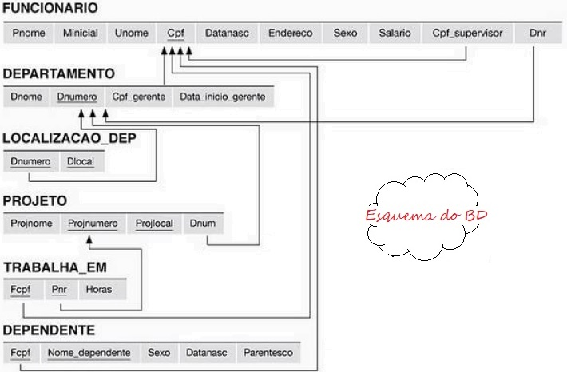

## [Tópico 02d] - Exercícios de revisão (4/4)
###### *by Prof. Plinio Sa Leitao-Junior (INF/UFG)*

<hr style="border:2px solid blue">

Para ilustrar as expressões do Cálculo Relacional de _Tupla_, considere o esquema lógico do BD Empresa.



<hr style="border:2px solid blue">

#### `Exemplo 01.`
**[Q01]** Liste o nome e endereço de todos os funcionários que trabalham no departamento de 'Pesquisa'.

```
{  Q01:
   f.Pnome, f.Unome, f.Endereco |
   FUNCIONARIO(f) AND
   (∃d) (DEPARTAMENTO(d) AND d.Dnome='Pesquisa' AND d.Dnumero=f.Dno)
}
```
:traffic_light: Se uma _tupla_ satisfizer as condições especificadas após a barra (|),<br>
&nbsp;&nbsp;&nbsp;&nbsp;&nbsp;&nbsp;&nbsp;&nbsp;... os atributos _Pnome_, _Unome_ e _Endereco_ serão recuperados para a _tupla_.<br>
:traffic_light: Sobre as condições após a barra (|):<br>
&nbsp;&nbsp;&nbsp;&nbsp;&nbsp;&nbsp;&nbsp;&nbsp;... `FUNCIONARIO(f)` especifica a <ins>relação de intervalo</ins> para a variável de _tupla_ **f**;<br>
&nbsp;&nbsp;&nbsp;&nbsp;&nbsp;&nbsp;&nbsp;&nbsp;... `DEPARTAMENTO(d)` especifica a <ins>relação de intervalo</ins> para a variável de _tupla_ **d**;<br>
&nbsp;&nbsp;&nbsp;&nbsp;&nbsp;&nbsp;&nbsp;&nbsp;... `d.Dnome='Pesquisa'` é uma <ins>condição de seleção</ins> &#8212; operação _seleção_ da álgebra relacional;<br>
&nbsp;&nbsp;&nbsp;&nbsp;&nbsp;&nbsp;&nbsp;&nbsp;... `d.Dnumero=t.Dno` é uma <ins>condição de junção</ins> &#8212; operação _junção_ da álgebra relacional.<br>
:traffic_light: Sobre as variáveis de _tupla_:<br> 
&nbsp;&nbsp;&nbsp;&nbsp;&nbsp;&nbsp;&nbsp;&nbsp;... **f** é uma variável livre em Q01;<br>
&nbsp;&nbsp;&nbsp;&nbsp;&nbsp;&nbsp;&nbsp;&nbsp;... **d** é uma variável ligada (vinculada) em Q01.
​
<hr style="border:2px solid blue">

#### `Exemplo 02.`
**[Q02]** Para cada projeto localizado em 'Sao Paulo', liste:<br>
&nbsp;&nbsp;&nbsp;&nbsp;&nbsp;&nbsp;&nbsp;&nbsp;(i) o número do projeto;<br>
&nbsp;&nbsp;&nbsp;&nbsp;&nbsp;&nbsp;&nbsp;&nbsp;(ii) o número do departamento que controla o projeto;<br>
&nbsp;&nbsp;&nbsp;&nbsp;&nbsp;&nbsp;&nbsp;&nbsp;(iii) o sobrenome, data de nascimento e endereço do gerente do departamento.

```
{  Q02:
   p.Pnumero, p.Dnum, f.Unome, f.DataNasc, f.Endereco |
   PROJETO(p) AND
   FUNCIONARIO(f) AND
   p.Plocal = 'Sao Paulo' AND
   (∃d)(DEPARTAMENTO(d) AND
        p.Dnum = d.Dnumber AND
        d.Cpf_gerente = f.Cpf)
}
```
:traffic_light: Sobre as variáveis de _tupla_:<br> 
&nbsp;&nbsp;&nbsp;&nbsp;&nbsp;&nbsp;&nbsp;&nbsp;... **p** e **f** são variável livres em Q02;<br>
&nbsp;&nbsp;&nbsp;&nbsp;&nbsp;&nbsp;&nbsp;&nbsp;... **d** é uma variável ligada (vinculada) em Q02.

<hr style="border:2px solid blue">

#### `Exemplo 03.`
**[Q03]** Para cada funcionário, recupere:<br>
&nbsp;&nbsp;&nbsp;&nbsp;&nbsp;&nbsp;&nbsp;&nbsp;(i) o nome e sobrenome do funcionário;<br>
&nbsp;&nbsp;&nbsp;&nbsp;&nbsp;&nbsp;&nbsp;&nbsp;(ii) o nome e sobrenome do seu supervisor imediato.

```
{  Q03:
   f.Fnome, f.Lnome, s.Fnome, s.Lnome |
   FUNCIONARIO(f) AND
   FUNCIONARIO(s) AND
   f.Cpf_supervisor = s.Cpf
}
```

<hr style="border:2px solid blue">

#### `Exemplo 04.`
**[Q04]** Liste o nome de cada funcionário que trabalha em algum projeto controlado pelo departamento número 5.

```
{  Q04:
   f.Lnome, f.Fnome |
   FUNCIONARIO(f) AND
   ((∃p)(∃t)(PROJETO(p) AND
             TRABALHA_EM(t) AND
             p.Dnum = 5 AND
             t.Fcpf = f.Cpf AND
             p.Pnumero = t.Pnr))
}
```

<hr style="border:2px solid blue">

#### `Exemplo 05.`
**[Q05]** Listar os projetos em que haja um funcionário de sobrenome 'Silva' que:<br>
&nbsp;&nbsp;&nbsp;&nbsp;&nbsp;&nbsp;&nbsp;&nbsp;(i) trabalha no projeto; **`OU`**<br>
&nbsp;&nbsp;&nbsp;&nbsp;&nbsp;&nbsp;&nbsp;&nbsp;(ii) é gerente do departamento de controle do projeto.

```
{  Q05:
   p.Pnúmero |
   PROJETO(p) AND
   (
      ( (∃f)(∃t)(FUNCIONARIO(f) AND
                 TRABALHA_EM(t) AND
                 t.Pnr = p.Pnumber AND
                 f.Unome = 'Silva' AND
                 f.Cpf = t.Fcpf) )
   OR
      ( (∃f)(∃d)(FUNCIONARIO(f) AND
                 DEPARTAMENTO(d) AND
                 p.Dnum = d.Dnumero AND
                 d.Cpf_gerente = f.Cpf AND
                 f.Unome = 'Silva') )
   )
}
```

<hr style="border:2px solid blue">

#### `Exemplo 06.`
**[Q06]** Liste os nomes dos funcionários que trabalham em todos os projetos controlados pelo departamento número 5.

```
{  Q06:
   f.Unome, f.Pnome |
   FUNCIONARIO(f) AND
   ( (∀p) NOT (PROJECT(p)) OR           /* IF PROJETO(p) THEN ... */
          NOT (p.Dnum=5) OR             /* IF (p.Dnum=5) THEN ... */
          ( (∃t) ( TRABALHA_EM(t) AND
                   t.Fcpf=f.Cpf AND
                   p.Pnumero=t.Pnr ) )
   )
}
```
```
{  Q06: Alternativamente ...
   f.Unome, f.Pnome |
   FUNCIONARIO(f) AND
   ( (∀p) PROJECT(p) AND
          (p.Dnum=5) AND
          ( NOT (∃t) ( TRABALHA_EM(t) AND
                       t.Fcpf=f.Cpf AND
                       p.Pnumero=t.Pnr ) )
   )
}
```

<hr style="border:2px solid blue">

#### `Exemplo 07.`
**[Q07]** Liste os gerentes de departamento que possuem pelo menos um dependente.
```
{  Q07:
   f.Cpf, f.Unome, f.Pnome |
   FUNCIONARIO(f) AND
   ( (∃d)(∃x) (DEPARTMENTO(d) AND
               DEPENDENTE(x) AND
               f.Cpf=d.Cpf_gerente AND
               x.Fcpf=f.Cpf) )
}
```

<hr style="border:2px solid blue">

#### Exercício
Escreva uma expressão do cálculo relacional:<br>
Liste os funcionários que não possuem dependentes.
