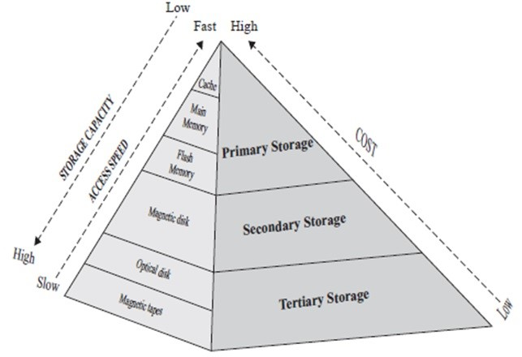
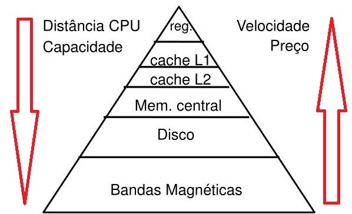
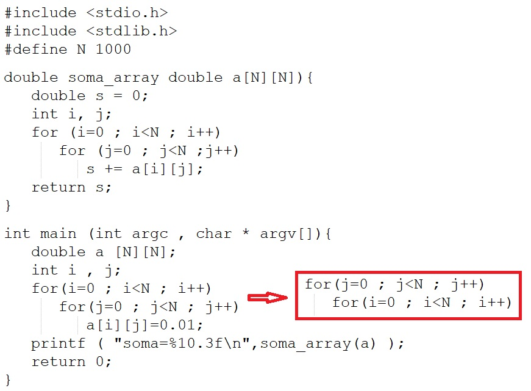

## [Tópico 03] - Estruturas de armazenamento (1/10)
###### *by Prof. Plinio Sa Leitao-Junior (INF/UFG)*

### <ins>CONTEÚDO</ins>

|_Item do conteúdo_|_Item do conteúdo_|
|-|-|
|1. <ins>**VISÃO GERAL**</ins>|8. Cabeçalho do arquivo e cabeçalho de bloco|
|2. <ins>**ARMAZENAMENTO FÍSICO**</ins>|9. Alocação de blocos de arquivo no disco|
|3. <ins>**ARQUIVO, BLOCO E REGISTRO**</ins>|10. Acesso a registros|
|4. _Buffering_ de blocos|11. Organização de arquivos _vs._ Método de acesso|
|5. Registro de tamanho fixo|12. Organização de arquivos não ordenados (_heap_)|
|6. Registro de tamanho variável|13. Organização de arquivos sequenciais|
|7. Organização de registros em blocos<br>(espalhada e não espalhada)|14. Organização de arquivos _hashing_|

<hr style="border:2px solid blue">

### 1. <ins>VISÃO GERAL</ins>

O desempenho de sistemas computacionais depende de três elementos fundamentais:
- computação;
- comunicação;
- armazenamento (<ins>memória</ins>):
  - <ins>elemento sensível</ins> em aplicações de banco de dados.

Requisitos <ins>ideais</ins> de uma memória (apenas teórico):
- tamanho ilimitado;
- acesso instantâneo para escrita ou leitura [de dados].

A cada 'necessidade de processamento':
- a CPU acessa os dados em memória principal (volátil);
- <ins>aplicações de banco de dados</ins>, em geral, utilizam uma pequena parte do banco de dados.

Dados persistentes _vs._ dados transitórios:
- bancos de dados residem em armazenamento secundário (não volátil);
- em geral, bancos de dados são maiores que a memória principal (volátil).

<hr style="border:2px solid blue">

### 2. <ins>ARMAZENAMENTO FÍSICO</ins>

As mídias de armazenamento são classificadas por: 
- <ins>velocidade</ins> com que os dados podem ser acessados;
- <ins>custo por unidade de dados</ins> para selecionar/adquirir a mídia;
- <ins>confiabilidade da mídia</ins>.

Conceitos para ter atenção:
- armazenamento volátil/não volátil; armazenamento de longo prazo; armazenamento primário/secundário/terciário; armazenamento de acesso sequencial/acesso direto.

Contradição para os requisitos de uma memória:
- quanto maior a memória, maior será o seu tempo de acesso;
- solução:
  - criar uma <ins>hierarquia de memória</ins>;
  - "ilusão" para o processador, de forma que a memória pareça grande e rápida o suficiente para não ser <ins>gargalo no sistema</ins>.

#### &#x267B;&#x26BE;&#x270D; <ins>HIERARQUIA DE MEMÓRIA</ins>:
- organização em níveis de memória;
- cada nível contem uma cópia <ins>das **instruções** (código) e dos **dados**</ins> mais usados em cada instante; 
- quanto mais "perto" a memória se encontra do processador, mais rápido será o acesso aos dados (<ins>maior o custo</ins> por byte, <ins>menor a capacidade</ins> de armazenamento).



Nas figuras acima:
- os dados no armazenamento secundário ou terciário não podem ser processados diretamente pela CPU;
- embora a _memória flash_ seja classificada na figura como 'memória principal', porque a leitura de dados pode ser tão rápida quanto a leitura da memória principal, ela requer que um bloco inteiro seja apagado e gravado de uma só vez;
- há várias camadas de _cache_ (L1, L2, L3, etc.), cada com capacidades e velocidades diferentes;
- a _cache_ busca armazenar cópias dos dados e instruções frequentemente usados, reduzindo o tempo de acesso à memória em comparação com a RAM.

#### &#x267B;&#x26BE;&#x270D; <ins>PRINCÍPIO DA LOCALIDADE</ins>:

A hierarquia de memória objetiva que:
- a grande maioria dos dados/instruções `'necessários'` esteja disponível nos níveis de memória mais altos (_cache_, memória principal), e pouquíssimos acessos sejam mandatórios à memória secundária.
- a maioria dos programas apresenta características de localidade.

```diff
- O que é o PRINCÍPIO DA LOCALIDADE ?
```

Um programa 'executável' tem instruções ordenadas sequencialmente:
- na execução de um programa, o processador busca instruções sequencialmente na memória, exceto quando a sequência de acesso é alterada: (i) ocorre um _loop_; ou (ii) ocorre um comando de desvio, tal como a chamada de uma subrotina.

<ins>Localidade Temporal</ins>: 
- se um endereço [de memória] foi referenciado, é provável que ele seja referenciado novamente em pouco tempo:
  - exemplo: _loops_ repetem um mesmo conjunto de instruções;
- os dados (ou instruções) acessados recentemente tendem a ser acessados novamente em um futuro próximo;
- a _cache_ mantém cópias de dados recentemente usados para o acesso rápido.

<ins>Localidade Espacial</ins>:
- se um endereço [de memória] foi referenciado, existe grande probabilidade do endereço seguinte ser referenciado:
  - exemplo: execução sequencial de comandos;
- os dados próximos a um endereço de memória tendem a ser acessados conjuntamente;
- a _cache_ e a RAM carregam <ins>blocos de dados adjacentes</ins>, para reduzir o tempo de acesso subsequente.

A maioria dos programas apresenta características de localidade, felizmente:
- alguns programas apresentam mais, outros programas apresentam menos localidade;
- um programador experiente sabe explorar a localidade para aumentar o desempenho dos programas.

#### &#x267B;&#x26BE;&#x270D; <ins>PARA REFLETIR:

[ENADE 2005] O grande desejo de todos os desenvolvedores de programas é utilizar quantidades ilimitadas de memória que, por sua vez, sejam extremamente rápidas. Infelizmente, isso não corresponde à realidade, como tenta representar a figura abaixo, que descreve uma hierarquia de memória:


- para cada elemento, estão indicados os tamanhos típicos disponíveis para armazenamento de informação e o tempo típico de acesso à informação armazenada;
- registradores do processador e memória cache operam com tempos distintos, o mesmo ocorrendo com a memória principal com relação à memória cache, e com a memória secundária com relação à memória principal.

#### &#x267B;&#x26BE;&#x270D; <ins>PARA RESPONDER:<br>Analise as respostas às questões abaixo.</ins>

<ins>(Questão 01)</ins> Que características um programa deve ter para que o uso de memória _cache_ seja muito vantajoso?
- O programa deve ter trechos pequenos que sejam executados várias vezes, e os dados devem estar localizados próximos uns dos outros; OU
- Dados e instruções devem ter localidade espacial (próximos uns dos outros) e localidade temporal (serem usados várias vezes em um certo instante de tempo).

<ins>(Questão 02)</ins> Se registradores do processador e a memória _cache_ operassem com os mesmos tempos de acesso, ainda haveria vantagem em se utilizar a memória _cache_? E se a memória _cache_ e a memória principal operassem com os mesmos tempos de acesso, ainda haveria vantagem em se utilizar a memória _cache_? 
- se os registradores do processador e a memória _cache_ têm o mesmo tempo de acesso , ainda assim seria vantajoso utilizar _cache_, porque o seu objetivo é justamente fornecer dados e instruções na velocidade do processador;
- se a memória principal e a memória _cache_ operassem com os mesmos tempos, não haveria mais razão para se usar a memória _cache_;
- obviamente, aspectos de custo e de confiabilidade devem ser considerados nessas respostas.

<ins>(Questão 03)</ins> [POSCOMP 2011] Ao medir o desempenho de um certo sistema, verificou-se que este passava muito tempo com a CPU ociosa e tinha um alto volume de acessos a disco. Assinale a alternativa que apresenta a solução traduzida na melhoria de desempenho desse sistema:<br>
a) Troca da CPU por uma mais rápida<br>
b) Aumento na capacidade de memória do sistema<br>
c) Aumento na capacidade de armazenamento do disco<br>
d) Uso de memória _cache_<br>
e) Troca do sistema operacional

<ins>(Questão 04)</ins> [POSCOMP 2013] A memória do computador é organizada em níveis. Assinale a alternativa que apresenta, corretamente, as estruturas encontradas no nível mais alto dessa hierarquia:<br>
a) _Cache_ L1<br>
b) _Cache_ L2<br>
c) Disco rígido<br>
d) Memória DRAM<br>
e) Registradores do processador

<ins>(Questão 05)</ins> Com respeito ao princípio da localidade, qual o potencial impacto da alteração de código assinalada em vermelho?



<hr style="border:2px solid blue">

### 3. <ins>ARQUIVO, BLOCO e REGISTRO</ins>

> A maioria dos bancos de dados usa "arquivos do sistema operacional" como uma <ins>camada intermediária</ins> para armazenar registros.

Um <ins>banco de dados</ins> é mapeado em <ins>um número arquivos diferentes</ins>, que geralmente são mantidos pelo sistema operacional subjacente:
- é assumida a existência de um sistema de arquivos subjacente.

Um <ins>arquivo</ins> é organizado <ins>logicamente</ins> como uma <ins>sequência de registros</ins>:
- dados costumam ser armazenados na forma de registros;
- cada <ins>registro</ins> consiste em uma <ins>coleção</ins> de valores ou itens de <ins>dados relacionados</ins>;
- cada <ins>valor</ins> é formado por <ins>um ou mais bytes</ins> e corresponde a um determinado <ins>campo do registro</ins>;
- os <ins>valores dos dados</ins> podem ser <ins>interpretados como fatos</ins> sobre entidades, seus atributos e seus relacionamentos;
- por exemplo, a definição de um registro para representar entidades do tipo FUNCIONARIO:
  - &nbsp;&nbsp;struct employee {<br>&nbsp;&nbsp;&nbsp;&nbsp;char name[30];<br>&nbsp;&nbsp;&nbsp;&nbsp;char ssn[09];<br>&nbsp;&nbsp;&nbsp;&nbsp;int salary;<br>&nbsp;&nbsp;&nbsp;&nbsp;int job_code;<br>&nbsp;&nbsp;&nbsp;&nbsp;char department[20];<br>&nbsp;&nbsp;} ;

Sempre que uma determinada parte dos dados for necessária:
- localizar os dados na memória secundária;
- copiar os dados para a memória principal;
- processar os dados;
- regravar (salvar) os dados na memória secundária, se for o caso.

#### &#x267B;&#x26BE;&#x270D; <ins>BLOCO</ins>

A transferência de dados entre níveis da hierarquia de memória ocorre por grupos de bytes (bloco, página):
- diminuição de custo de transferência;
- antecipar acessos (considerando o princípio da localidade espacial).

Um arquivo também é <ins>particionado logicamente</ins> em unidades de armazenamento de comprimento fixo chamadas <ins>**blocos**</ins>:
- um <ins>bloco</ins> é a <ins>unidade de alocação</ins> de _**armazenamento**_ e _**transferência**_ de dados;
- a maioria dos bancos de dados usa <ins>tamanhos de bloco de 4 a 8 kilobytes</ins> por padrão, mas eles podem ser especificados quando uma instância de banco de dados é criada (por exemplo, múltiplos de 512 bytes).

Um bloco tipicamente <ins>contém vários registros</ins>:
- o conjunto exato de registros que um bloco contém depende da forma de organização física dos dados utilizada;
- assume-se que nenhum registro é maior que um bloco: é sempre verdade?
- quais itens de dados podem ser significativamente maiores que um bloco?

#### &#x267B;&#x26BE;&#x270D; <ins>ACESSO AO BLOCO</ins>

Em geral, um único número chamado LBA (endereço de _bloco lógico_), que é um número entre **0** e **n** (assumindo que a capacidade total do disco é de $n+1$ blocos), é mapeado automaticamente para o bloco físico pelo controlador de acesso ao dispositivo.

#### &#x267B;&#x26BE;&#x270D; <ins>BUFFER</ins>

Um **_buffer_** é uma área reservada <ins>contígua</ins> na memória principal (armazenamento primário) para armazenar um bloco:
- Para um comando de leitura, o bloco do disco é copiado para o _buffer_;
- Para um comando de gravação, o conteúdo do _buffer_ é copiado para o bloco do disco.

Vários blocos contíguos, denominados **_cluster_**, podem ser transferidos como uma unidade:
- Nesse caso, o tamanho do _buffer_ é ajustado para corresponder ao número de bytes no _cluster_.

<hr style="border:2px solid blue">

#### <ins>EXERCÍCIO:</ins>
