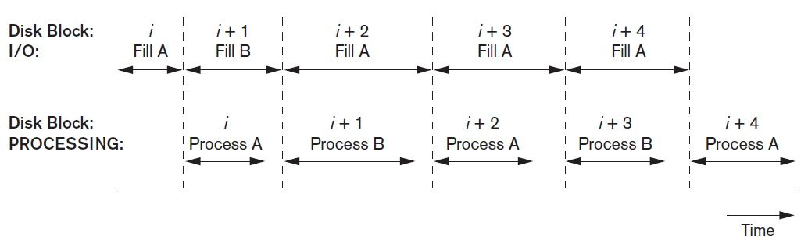
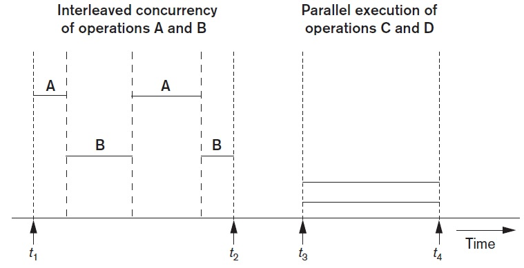
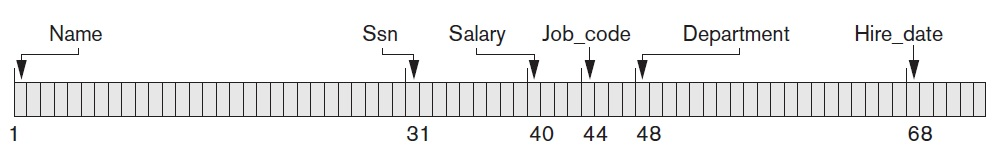
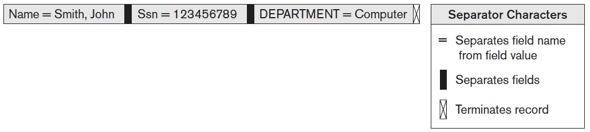

## [Tópico 04] - Estruturas de armazenamento (2/10)
###### *by Prof. Plinio Sa Leitao-Junior (INF/UFG)*

### <ins>CONTEÚDO</ins>

|_Item do conteúdo_|_Item do conteúdo_|
|-|-|
|1. Visão geral|8. Cabeçalho do arquivo e cabeçalho de bloco|
|2. Armazenamento físico|9. Alocação de blocos de arquivo no disco|
|3. Arquivo, bloco e registro|10. Acesso a registros|
|4. <ins>**_BUFFERING_ DE BLOCOS**</ins>|11. Organização de arquivos _vs._ Método de acesso|
|5. <ins>**REGISTRO DE TAMANHO FIXO**</ins>|12. Organização de arquivos não ordenados (_heap_)|
|6. <ins>**REGISTRO DE TAMANHO VARIÁVEL**</ins>|13. Organização de arquivos sequenciais|
|7. Organização de registros em blocos (espalhada e não espalhada)|14. Organização de arquivos _hashing_|

#### <ins>RECAPTULANDO</ins> ... _`BUFFER`_ ...

Um **_buffer_** é uma área reservada <ins>contígua</ins> na memória principal (armazenamento primário) para armazenar um bloco:
- Para um comando de leitura, o bloco do disco é copiado para o _buffer_;
- Para um comando de gravação, o conteúdo do _buffer_ é copiado para o bloco do disco.

Vários blocos contíguos, denominados **_cluster_**, podem ser transferidos como uma unidade:
- Nesse caso, o tamanho do _buffer_ é ajustado para corresponder ao número de _bytes_ no _cluster_.

#### <ins>RECAPTULANDO</ins> ... _`DOMINÂNCIA DO CUSTO DE E/S`_ ...

Suponha um <ins>computador simples</ins>:
- Um processador (CPU), um processador de E/S, um disco.
- Um SGBD está em execução:
  - vários usuários que estão realizando <ins>consultas</ins> e <ins>modificações</ins> no banco de dados.

Sobre a <ins>gerência de memória</ins>:
- O banco de dados em si é muito grande para caber na memória principal.
- Inicialmente, cada parte do banco de dados que um dos usuários acessa terá que ser recuperada (transferida) do disco [para a memória principal]:
  - `partes "importantes"` do banco de dados podem ser armazenadas (mantidas) em _buffer_ na memória principal. 
 
Sobre a <ins>**dominância do custo de E/S**</ins>:
- O tempo gasto para realizar um acesso ao disco é `muito maior` do que o tempo provavelmente usado para manipular dados na memória principal.
- O número de acessos de bloco (E/S de disco) é uma "boa aproximação" do tempo necessário para o algoritmo e deve ser minimizado.

### 4. <ins>_BUFFERING_ DE BLOCOS</ins>

**Seja o cenário:** 
&#9888; <ins>Vários blocos</ins> que necessitam ser transferidos (copiados) entre memória secundária e memória principal; 
&#9888; Os enderedos desses blocos são conhecidos; e 
&#9888; A CPU e o processador de E/S de disco são independentes (_as usual_). 

Para lidar com a <ins>incompatibilidade de velocidades</ins> entre uma CPU e a memória secundária ... 
&#9996; `Duas operações` <ins>em paralelo</ins> podem ocorrer: 
&nbsp;&nbsp;&nbsp;&nbsp; :red_circle: enquanto um _buffer_ está sendo lido ou gravado pelo processador de E/S; 
&nbsp;&nbsp;&nbsp;&nbsp; :red_circle: a CPU pode processar dados em outro _buffer_.

#### &#x267B;&#x26BE;&#x270D; <ins>_DOUBLE BUFFERING_ (_PREFETCHING_, _READ-AHEAD_)</ins>

A figura abaixo ilustra o emprego de **_buffer_ duplo** (_double buffering_): 
&#9745; Dois _buffers_ - A e B - são utilizados para permitir leitura de dados e processamento de dados em paralelo; 
&#9745; Observe que: &nbsp;&nbsp;&nbsp;&nbsp;&nbsp;&nbsp;&nbsp;&nbsp;o tempo necessário para <ins>processar um bloco em memória</ins> &nbsp;&nbsp;&nbsp;&nbsp;&nbsp;&nbsp;&nbsp;&nbsp;é menor que &nbsp;&nbsp;&nbsp;&nbsp;&nbsp;&nbsp;&nbsp;&nbsp;o tempo necessário para <ins>ler o próximo bloco e preencher um _buffer_</ins>.

Em síntese, ao empregar o **_double buffering_**:
- A CPU pode começar a processar um bloco assim que sua transferência para a memória principal for concluída.
- Ao mesmo tempo, o processador de E/S pode ler e transferir o próximo bloco para um _buffer_ diferente.

#### &#x267B;&#x26BE;&#x270D; <ins>EXECUÇÃO INTERCALADA _vs._ EXECUÇÃO PARALELA</ins>

Quando <ins>uma única CPU</ins> controla vários processos, a execução paralela não é possível (ver figura a seguir): 
- Na figura à esquerda, os processos A e B estão rodando concorrentemente de <ins>forma intercalada</ins>.
- Na figura à direita, os processos C e D estão rodando concorrentemente de <ins>forma paralela</ins>.

O benefícios do _buffering_ de blocos podem ser alcançados em ambos: processos executados concorrentemente de forma intercalada e de maneira paralela.

#### &#x267B;&#x26BE;&#x270D; <ins>GERENCIAMENTO DE _BUFFER_</ins>

Uma reflexão: 
- _Buffer_ - Área na memória principal para receber blocos (páginas) de dados da memória secundária.
- _Double buffering_ - Estratégia para a melhoria de eficência de execução:
  - execução da operação de E/S entre o memória secundária e a memória principal em uma área de _buffer_, concomitantemente com o processamento dos dados de outro _buffer_.
- Visto que o <ins>_buffer pool_ possui tamanho limitado</ins>:
  - o _buffer pool_ é compartilhado pelas transações das diversas aplicações, e seu tamanho é um parâmetro do próprio SGBD, que é especificado pelo DBA (o administrador do banco de dados).
  - então, como decidir <ins>que páginas (blocos) serão substituídas no _buffer pool_ (memória principal)</ins> para acomodar os blocos recém-solicitados?

> O gerenciamento de _buffer_ busca:
>> (1) maximizar a probabilidade de que a página solicitada esteja na memória principal; (2) no caso de leitura de um novo bloco na memória secundária, encontrar uma página para substituição que causará o menor dano, tal que a página substituída não seja usada brevemente (nas próximas operações).

<ins>Para cada página</ins> presente no _buffer pool_, <ins>duas informações</ins> são usualmente empregadas na gerência de _buffer_:
- **pin-count** - Para determinar <ins>se a página está fixada (_pinned_)</ins>:
  - o contador define o número de vezes que a página foi solicitada, ou o número de usuários atuais da página;
  - inicialmente, a contagem de pinos para cada página é definida como 0 (zero);
  - aumentar a contagem de pinos denota 'fixação';
  - em geral, não se deve permitir que um 'bloco fixado' seja gravado no disco.
- **dirty bit** - Para determinar <ins>se o conteúdo da página foi modificado</ins>:
  - inicialmente, o bit é definido como 0 (zero) para todas as páginas;
  - se o conteúdo da página foi modificado [por qualquer transação], o bit é então modificado para 1 (um).

Quando uma determinada página é solicitada, o gerenciador de _buffer_ verifica se a <ins>página solicitada</ins> já está em um _buffer_ no _buffer pool_:
- Em caso positivo:
  -  aumenta a contagem de pinos da página solicitada.
- Em caso negativo:
  1. escolhe uma <ins>página para substituição</ins>, usando uma <ins>política de substituição de _buffer_</ins>;
  2. se o _dirty bit_ da página escolhida para substituição for 1 (um):
     - grava a página para substituição no disco, substituindo a cópia antiga da página.
  3. copia a <ins>página solicitada</ins> no _buffer_ liberado da página para substituição;
     - a contagem de pinos dessa página é definida como 0 (zero) ?
  4. aumenta sua contagem de pinos da página solicitada;
- O endereço da memória principal da nova página é passado para o aplicativo solicitante.

> O que acontece se: _(i)_ a página solicitada não estiver disponível no _buffer pool_; e _(ii)_ não houver qualquer página não fixada disponível no _buffer pool_ ??
>> A <ins>transação</ins> que solicitou a página pode entrar em <ins>estado de espera</ins>, ou ser <ins>abortada</ins>.

#### &#x267B;&#x26BE;&#x270D; <ins>POLÍTICAS DE SUBSTITUIÇÃO DE _BUFFER_</ins>

#### <ins>1. _Least Recently Used_ (LRU)</ins>

A <ins>página para substituição</ins> será aquela que não é usada (lida ou escrita) há mais tempo:
- <ins>Premissa</ins>: se um _buffer_ não é utilizado por um longo período de tempo, a chance de ser acessado novamente é pequena.
- Requer que o gerenciador de _buffer_ tenha o <ins>registro de tempo</ins> cada vez que uma página em um _buffer_ é acessada:
  - embora seja um _overhead_, o benefício potencialmente justifica a escolha dessa política.

#### <ins>2. _Clock Policy_ (_round-robin_ da política LRU)</ins>

Os buffers são [logicamente] dispostos como um círculo, semelhante a um <ins>relógio</ins>:
- Cada _buffer_ possui um <ins>sinalizador</ins>:
  - _buffers_ com sinalizador igual a 0 (zero) são vulneráveis e podem ser selecionados para substituição;
  - _buffers_ com sinalizador igual a 1 (um) não são vulneráveis:
    - quando um bloco é lido (ou acessado) em um _buffer_, o sinalizador desse _buffer_ é definido como 1 (um).
- O ponteiro do relógio está posicionado em um <ins>_buffer_ atual</ins>.
- Quando o gerenciador de _buffer_ precisa de um _buffer_ para um novo bloco:
  - o ponteiro gira até encontrar um _buffer_ com sinalizador igual a 0 (zero), então elege esse _buffer_ para substituição:
    - obviamente, se o _dirty bit_ do _buffer_ estiver ativado, a página (conteúdo) do _buffer_ será gravada em disco, substituindo assim a página antiga em seu endereço no disco.
  - ao girar o ponteiro, se o ponteiro passar por um _buffer_ com sinalizador igual a 1 (um), o valor 0 (zero) será atribuído ao sinalizador (e o ponteiro passa para o próximo _buffer_).
- em suma, um bloco é substituído de seu _buffer_ somente se não for acessado até que o ponteiro complete uma rotação, e o sinalizador do _buffer_ tenha o valor 0 (zero).

#### <ins>3. _First-In-First-Out_ (FIFO)</ins>

Quando um _buffer_ é necessário, aquele que foi ocupado por mais tempo [por uma página] é selecionado para substituição:
- O gerenciador de _buffer_ registra o tempo em que cada página é carregada em um _buffer_:
  - diferentemente da política LRU, não precisa controlar o tempo em que as páginas são acessadas.
- <ins>Questão:</ins> Um bloco que permanece no _buffer_ por um longo período deveria ser o escolhido para substituição ?
  - por exemplo, se o bloco raiz de uma estrutura em árvore que implementa um índice ... for descartado ... no momento seguinte pode ser necessário trazê-lo de volta para um _buffer_ ?

Reflexões:
- Modificação da política **FIFO**:
  - garantir que os <ins>blocos fixados</ins>, tal como o bloco raiz de um índice, possam permanecer no _buffer_.
- Modificação da política **_Clock Policy_**:
  - garantir que <ins>_buffers_ importantes</ins> tenham o valor do sinalizador superior a 1 (um) e, portanto, não estarão sujeitos a substituição após várias rotações do ponteiro. 
- Há cenários em que o SGBD necessita gravar determinados blocos no disco, mesmo que seu _buffer_ não tenha sido selecionado para substituição:
  - por exemplo, a gravação forçada que ocorre quando os registros de _log_ precisam ser gravados no disco, antes da gravação no banco de dados das páginas modificadas em uma transação, para fins de recuperação.

### 5. <ins>REGISTRO DE TAMANHO FIXO</ins>

Um <ins>arquivo</ins> é uma <ins>sequência de registros</ins>. 
Em arquivos com <ins>registros de tamanho fixo</ins>:
- <ins>todos os registros</ins> do arquivo são do <ins>mesmo tipo</ins>;
- <ins>todos os registros</ins> do arquivo têm exatamente o <ins>mesmo tamanho (em bytes)</ins>.

Na figura acima, os registros de EMPREGADO têm comprimento fixo: 71 bytes. 
Cada registro tem os <ins>mesmos campos</ins> (a sequência de conteúdo para campos é a mesma para todos os registros) e os <ins>comprimentos dos campos são fixos</ins>, para que o sistema possa identificar a <ins>posição inicial do byte de cada campo</ins> em relação à posição inicial do registro:
- tal facilita a localização de valores dos campos pelos programas que acessam o arquivo.

### 6. <ins>REGISTRO DE TAMANHO VARIÁVEL</ins>

Se registros diferentes no arquivo tiverem tamanhos diferentes, diz-se que o arquivo é composto por <ins>registros de comprimento variável</ins>.

Um arquivo pode ter registros de comprimento variável por vários motivos:
- Os registros do arquivo são do mesmo tipo de registro, mas <ins>um ou mais campos têm tamanhos variados</ins> (campos de comprimento variável):
  - por exemplo, o campo Nome de EMPREGADO pode ser um campo de comprimento variável.
- Os registros do arquivo são do mesmo tipo de registro, mas <ins>um ou mais campos podem ter vários valores em um mesmo registro</ins>:
  - tal campo é chamado de campo de repetição.
- Os registros do arquivo são do mesmo tipo de registro, mas <ins>um ou mais campos são opcionais</ins>:
  - alguns registros têm valor para o campo, mas há registros sem valor para o campo.
- O arquivo contém registros de diferentes tipos e, portanto, de tamanhos variados (arquivo misto):
  - registros relacionados de tipos diferentes são agrupados (colocados juntos) em blocos de disco;
  - por exemplo, o arquivo conteria registros dos tipos NOTA (notas obtidas pelos alunos) e ALUNO (os dados de cada aluno).

#### &#x267B;&#x26BE;&#x270D; <ins>CAMPO DE TAMANHO VARIÁVEL</ins>

Em <ins>campos de comprimento variável</ins>, como cada registro possui um valor próprio para cada campo, o comprimento exato de alguns valores de campo pode variar. Duas alternativas para a representação de <ins>campo de tamanho variável</ins>, para <ins>determinar os bytes</ins> (conteúdo) de cada campo em um registro específico:
- Usar <ins>caracter separador</ins> especial, para sinalizar o término do conteúdo do campo (ver figura abaixo);
  - o caractere especial não deveria pertencer ao domínio de qualquer dos campos do arquivo.
- Armazenar o comprimento em bytes do campo no registro, precedendo o valor do campo.

#### &#x267B;&#x26BE;&#x270D; <ins>CAMPO OPCIONAL</ins>

Duas alternativas para a representação de <ins>registros com campos opcionais</ins>:
- Usar um <ins>caractere especial</ins> que denota que <ins>o campo não possui valor (conteúdo)</ins> em um registro:
  - o caractere especial não deveria pertencer ao domínio de qualquer dos campos do arquivo.
- Incluir em cada registro uma <ins>sequência de pares <nome-campo, valor-campo></ins>, em vez de apenas os valores do campo:
  - um cenário para essa alternativa é: quando o número total de campos para o tipo de registro é grande, mas o número de campos que realmente aparecem em um registro típico é pequeno;
  - na figura abaixo, há três caracteres separadores.

#### &#x267B;&#x26BE;&#x270D; <ins>CAMPO COM VÁRIOS VALORES EM UM MESMO REGISTRO</ins>

Uma representação para <ins>campo com vários valores em um mesmo registro</ins>:
- Usar um caractere especial para separar os valores repetidos do campo, e outro caractere especial para indicar o término do campo:
  - ambos os caracteres especiais não deveriam pertencer ao domínio de qualquer dos campos do arquivo.

#### &#x267B;&#x26BE;&#x270D; <ins>ARQUIVO COM REGISTROS DE DIFERENTES TIPOS</ins>

Uma representação para <ins>arquivo com registros de diferente tipos</ins>:
- Usar um <ins>indicador de tipo de registro</ins>, precedendo cada registro do arquivo.

#### <ins>EXERCÍCIO:</ins>

Suponha um banco de dados que contém uma relação R. 
Uma consulta solicita a _tupla_ de R, que atende um certo valor-chave k.

Analise as sentenças abaixo:
- É bastante desejável ter um índice em R para identificar o bloco de disco no qual a _tupla_ com valor-chave k está.
- No entanto, geralmente "não é importante" se o índice nos diz onde no bloco essa _tupla_ está.

#### <ins>EXERCÍCIO:</ins>

Uma forma de validar as operações de E/S é o emprego de _checksum_ 
Analise as sentenças abaixo:
- _Checksum_ representa alguns bits no conteúdo de um bloco, cujo conteúdo depende dos valores dos demais bits de dados armazenados no bloco.
- Se, na leitura, o _checksum_ não for adequado para os bits de dados, então há um erro na leitura.
- Se o _checkum_ for adequado, ainda há uma pequena chance de que o bloco não tenha sido lido corretamente:
  - mas o emprego de "muitos" bits de _checksum_ pode tornar baixa a probabilidade "falso positivo".

Uma forma simples para implementar _checksum_ é baseada na paridade de um conjunto de bits.
- Se houver um número ímpar de 1s entre uma coleção de bits, dizemos que os bits têm paridade ímpar e adicionamos um bit de paridade que é 1.
- Da mesma forma, se houver um número par de 1s entre os bits, então dizemos que os bits têm paridade par e adicionamos o bit de paridade 0. Como resultado:
- Em suma, o número de 1s entre uma coleção de bits e seu bit de paridade é sempre par.
- Essa estratégia é sujeita a erros? Se sim, uma forma para mitigá-la é ter oito bits de paridade para cada byte de dados, um bit de paridade para cada bit de dados?
