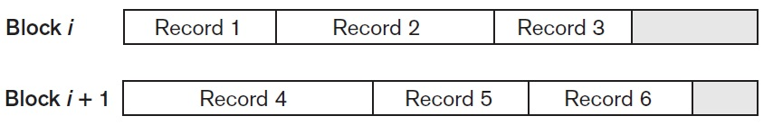
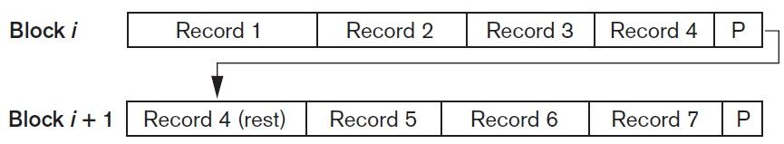
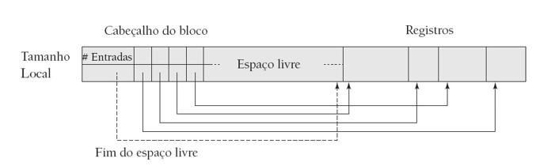

## [Tópico 05] - Estruturas de armazenamento (3/10)
###### *by Prof. Plinio Sa Leitao-Junior (INF/UFG)*

### <ins>CONTEÚDO</ins>

|_Item do conteúdo_|_Item do conteúdo_|
|-|-|
|1. Visão geral|8. <ins>**CABEÇALHO DE ARQUIVO E CABEÇALHO DE BLOCO**</ins>|
|2. Armazenamento físico|9. <ins>**ALOCAÇÃO DE BLOCOS DE ARQUIVO NO DISCO**</ins>|
|3. Arquivo, bloco e registro|10. Acesso a registros|
|4. _Buffering_ de blocos|11. Organização de arquivos _vs._ Método de acesso|
|5. Registro de tamanho fixo|12. Organização de arquivos não ordenados (_heap_)|
|6. Registro de tamanho variável|13. Organização de arquivos sequenciais|
|7. <ins>**ORGANIZAÇÃO DE REGISTROS EM BLOCOS**</ins> **(espalhada e não espalhada)**|14. Organização de arquivos _hashing_|

### 7. <ins>ORGANIZAÇÃO DE REGISTROS EM BLOCOS</ins>

<ins>Bloco de dados</ins>:
- <ins>Unidade de alocação</ins> de dados em arquivos.
- <ins>Unidade de transferência</ins> de dados entre a memória secundária e a memória principal.

Usualmente, o tamanho do bloco é maior do que o tamanho do registro:
- Cada bloco possivelmente conterá vários registros.
- Contudo, há tipos de itens de dados que podem ser significativamente maiores que um bloco, tal como imagens.

Seja um arquivo, cujos <ins>registros têm tamanho fixo</ins>:
- <ins>tamanho do bloco</ins> igual a **B bytes**;
- <ins>tamanho do registro</ins> igual a **R bytes**;
- B ≥ R.

O <ins>fator de bloco</ins> determina o número de registros por bloco:
- **bfr = ⎣B/R⎦** registros por bloco;
  - onde: ⎣(x)⎦ representa a função _floor_ (retorna o maior valor inteiro menor ou igual a **x**).
- em geral, **B** não possui divisão exata em **R**:
  - então, algum espaço não utilizado em cada bloco pode ser desperdiçado:
    - **Desperdício = B − (bfr * R)** bytes.

#### &#x267B;&#x26BE;&#x270D; <ins>ORGANIZAÇÃO NÃO ESPALHADA</ins>

A <ins>organização não espalhada</ins> [de registros em blocos] pressupõe que algum <ins>desperdício ocorre em cada bloco</ins>:
- Há espaço não utilizado (desperdício) em arquivos de <ins>registros de tamanho fixo</ins>.
- Há espaço não utilizado (desperdício) em arquivos de <ins>registros de tamanho variável</ins> (ver figura abaixo).

#### &#x267B;&#x26BE;&#x270D; <ins>ORGANIZAÇÃO ESPALHADA</ins>

A <ins>organização espalhada</ins> busca evitar o desperdício de espaço em cada bloco:
- Para lidar com o espaço não utilizado em cada bloco, um registro é dividido em <ins>duas frações</ins> (ver figura abaixo):
  - as frações do registro são <ins>alocadas em dois blocos</ins> do arquivo;
  - um ponteiro no final do primeiro bloco aponta para o bloco que contém o restante do registro.
- Se o tamanho do registro for superior ao tamanho do bloco (R > B):
  - a organização espalhada deve ser aplicada.

Para arquivos com <ins>registros de tamanho variável</ins>:
- Pode ser usada uma organização espalhada ou não espalhada.
  - se o tamanho médio do registro for grande, é vantajoso usar a organização espalhada, para reduzir o espaço perdido em cada bloco.
- Cada bloco pode armazenar um <ins>número diferente de registros</ins>.
- O <ins>fator de bloco</ins> (bfr) é o <ins>número médio de registros</ins> por bloco do arquivo.
- O <ins>número de blocos</ins> **b** necessários para ter um arquivo com **r** registros:
  - **b = ⎡(r/bfr)⎤ blocos**
    - onde ⎡(x)⎤ representa a função _ceiling_ (retorna o menor valor inteiro maior ou igual a **x**).

### 8. <ins>CABEÇALHO DE ARQUIVO E CABEÇALHO DE BLOCO</ins>

O <ins>cabeçalho de arquivo</ins>:
- É um <ins>descritor de arquivo</ins> que contém <ins>metadados</ins> úteis aos programas do sistema que acessam os registros.
- Alguns exemplos de metadados:
  - endereços de disco dos blocos de arquivo;
  - para organização não espalhada e registros de comprimento fixo:
    - comprimento de campos, ordem dos campos dentro de um registro;
  - para registros de comprimento variável:
    - código de tipo de registro, código de tipo de campo, caracteres separadores.

O <ins>cabeçalho do bloco</ins> contém (ver figura abaixo):
- <ins>Número de entradas</ins> de registro.
- <ins>Posição do final</ins> de espaço livre no bloco.
- Matriz com a <ins>Posição inicial</ins> e o <ins>tamanho</ins> de cada registro.

Os registros podem ser <ins>movimentados dentro de uma página</ins> para mantê-los contíguos:
- A <ins>operação de exclusão</ins> causa a movimentação dos registros à esquerda do registro excluído.
- A cada movimentação, a(s) entrada(s) no cabeçalho precisa(m) ser atualizada(s).
- O custo da movimentação é 'baixo', pois o bloco possui tamanho limitado.
- Essa movimentação previne a fragmentação dentro do bloco.

Qualquer <ins>ponteiro externo ao bloco</ins>:
- <ins>Não deve apontar diretamente</ins> para qualquer dos registros no bloco.
- <ins>Deve apontar para o cabeçalho do bloco</ins>, que contém a posição de cada registro no bloco. 

### 9. <ins>ALOCAÇÃO DE BLOCOS DE ARQUIVO NO DISCO</ins>

Há diversas estratégias para alocar os blocos de um arquivo no disco. 

<ins>Alocação de blocos contígua</ins>:
- Os blocos de arquivos são alocados em blocos de disco consecutivos,
- Agiliza a leitura de todo o arquivo usando <ins>_buffer_ duplo</ins>.
- Dificulta a manutenção e a expansão do arquivo.

<ins>Alocação de blocos ligada</ins>:
- Cada bloco de arquivo contém um ponteiro para o próximo bloco de arquivo.
- Favorece a expansão do arquivo.
- Torna lenta a leitura de todo o arquivo.

<ins>Alocação de blocos em _clusters_</ins>:
- Representa uma combinação das alocações contígua e ligada.
- Aloca _clusters_ (conjuntos) de blocos de forma contígua no disco, e cada _cluster_ contém um ponteiro para o próximo _cluster_.

<ins>Alocação de blocos indexada</ins>:
- Um ou mais blocos de índice contêm ponteiros para os blocos de arquivo reais.

### Exercício

Um arquivo de clientes tem r = 20.000 registros de comprimento fixo. Cada registro tem os seguintes campos: Nome (30 _bytes_), CPF (9 _bytes_), Endereço (40 _bytes_), Telefone (9 _bytes_), Data de nascimento (8 _bytes_), Sexo (1 _byte_), Estado civil (4 _bytes_), Cor/raça (4 _bytes_), Categoria de cliente (4 _bytes_), e Grau de escolaridade (3 _bytes_). Um byte adicional é utilizado como um marcador de exclusão. O arquivo é armazenado no disco com tamanho de bloco B = 512 _bytes_. 
(a) Calcule o tamanho de registro **R** (incluindo o marcador de exclusão) em bytes. 
(b) Calcule o fator de bloco **bf**r e o número de blocos de arquivo **b**, considerando uma organização não espalhada. 
(c) Calcule o <ins>número médio de blocos acessados</ins> necessários para pesquisar um <ins>registro arbitrário</ins> no arquivo, usando <ins>busca linear</ins>. 
(d) Suponha que o arquivo é <ins>ordenado pelo CPF</ins>, calcular o tempo que leva para procurar um registro a partir do valor de CPF, por meio de <ins>busca binária</ins>.

[Uma solução](./topico-05solucao-01.md)

### Exercício

Seja o arquivo de clientes do exercício anterior. Contudo, suponha que apenas 80% dos registros têm um valor para Telefone, 85% para Estado civil, 15% para Cor/raça, e 90% para Grau de escolaridade, e usa-se um arquivo de registros de comprimento variável. Cada registro ainda tem: um 1 byte para cada finalizar cada campo; um marcador de exclusão de 1 byte; e um marcador de fim-de-registro de 1 byte. Suponha que usemos uma organização registro estendidos, onde cada bloco possui um ponteiro de 5 bytes para o próximo bloco (este espaço não é utilizado para armazenamento de registros).

(a) Calcule o tamanho médio do registro em _bytes_. 
(b) Calcule o número de blocos necessários para o arquivo.

[Uma solução](./topico-05solucao-02.md)

