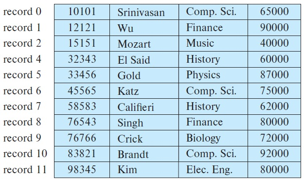
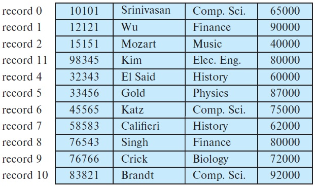
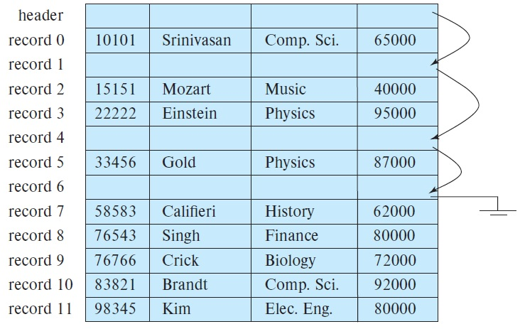

## [Tópico 07] - Estruturas de armazenamento (5/10)
###### *by Prof. Plinio Sa Leitao-Junior (INF/UFG)*

### <ins>CONTEÚDO</ins>

|_Item do conteúdo_|_Item do conteúdo_|
|-|-|
|1. Visão geral|8. Cabeçalho de arquivo e cabeçalho de bloco|
|2. Armazenamento físico|9. Alocação de blocos de arquivo no disco|
|3. Arquivo, bloco e registro|10. Acesso a registros|
|4. _Buffering_ de blocos|11. Organização de arquivo _vs._ Método de acesso|
|5. Registro de tamanho fixo|12. <ins>**ORGANIZAÇÃO DE ARQUIVOS NÃO ORDENADOS (_HEAP_)**</ins>|
|6. Registro de tamanho variável|13. Organização de arquivos sequenciais|
|7. Organização de registros em blocos<br>(espalhada e não espalhada)|14. Organização de arquivos _hashing_|

<hr style="border:2px solid blue">

### 12. <ins>ORGANIZAÇÃO DE ARQUIVOS NÃO ORDENADOS (_HEAP_)</ins>

Tipo de organização simples e básico, os registros são dispostos no arquivo na ordem em que foram inseridos:
- Novos registros podem ser <ins>inseridos ao final do arquivo</ins>, ou em qualquer outro local.
- Não raramente, essa organização é usada com <ins>caminhos de acesso adicionais</ins>, tal como <ins>índice secundário</ins>.

**<ins>Inserção de novo registro</ins>.** Envolve a escolha de um bloco para inserir o registro:<br>
&#x2714; o <ins>último bloco</ins> de disco [alocado] para o arquivo é copiado para um _buffer_:<br>
&#x2714; o novo registro é adicionado na página [presente no _buffer_];<br>
&#x2714; o bloco é então reescrito de volta no disco;<br>
&#x2714; o endereço do último bloco do arquivo é mantido no cabeçalho do arquivo.<br>

**<ins>Pesquisa (busca) por um registro</ins>.** Independente do predicado de busca, envolve uma <ins>busca linear</ins> através do arquivo:<br>
&#9888; bloco por bloco – um procedimento caro.<br>
Se <ins>apenas um registro</ins> satisfizer o predicado de pesquisa (seja um <ins>arquivo com **b** blocos</ins>):<br>
&#9888; o programa irá ler, em média, <ins>**b/2** blocos</ins>.<br>
Se <ins>nenhum registro</ins> ou <ins>vários registros</ins> satisfizerem o predicado de pesquisa:<br>
&#9888; o programa irá ler <ins>todos os blocos</ins> (**b** blocos).

**<ins>Exclusão de um registro existente</ins>.** O primeiro passo é pesquisar o registro a ser excluído:<br>
&#x2714; o bloco do registro é localizado;<br>
&#x2714; o bloco é copiado para um _buffer_, caso o mesmo não esteja presente no _buffer pool_;<br>
&#x2714; o registro é excluído do _buffer_;<br>
&#x2714; o bloco é reescrito de volta no disco [quando oportuno].

**Como lidar com os espaços deixados pelos registros excluídos?**<br>
&#x2618; O <ins>espaços não utilizados</ins> no bloco do disco podem ser <ins>reutilizados</ins>?

&#x2600; **<ins>Estratégia E1</ins>.** Mover <ins>vários registros</ins> do arquivo:<br>
&nbsp;&nbsp;&nbsp;&nbsp;&#x2611; o registro subsequente ao registro removido é movido para o espaço até então ocupado pelo registro excluído;<br>
&nbsp;&nbsp;&nbsp;&nbsp;&#x2611; os demais registros subsequentes são também movidos;<br>
&nbsp;&nbsp;&nbsp;&nbsp;&#x2611; ou seja, requer a potencial movimentação de um grande número de registros;<br>
&nbsp;&nbsp;&nbsp;&nbsp;&#x2611; na figura a seguir, o Registro #3 foi removido.



&#x2600; **<ins>Estratégia E2</ins>.** Mover <ins>um único registro</ins> do arquivo:<br>
&nbsp;&nbsp;&nbsp;&nbsp;&#x2611; na figura a seguir, o último registro do arquivo (#11) foi movido para o espaço até então ocupado pelo registro excluído (#3).



&#x2600; **<ins>Estratégia E3</ins>.** Aplicar uma <ins>marcação</ins> para os registros excluídos:<br>
&nbsp;&nbsp;&nbsp;&nbsp;&#x2611; um simples <ins>marcador de exclusão</ins> é acrescido a cada registro do arquivo (01 byte adicional?);<br>
&nbsp;&nbsp;&nbsp;&nbsp;&#x2611; o marcador de exclusão [em um registro] <ins>assinala se o registro foi removido</ins> do arquivo;<br>
&nbsp;&nbsp;&nbsp;&nbsp;&#x2618; como reaproveitar (utilizar) os espaços antes ocupados pelos registros excluídos? (usar uma tabela de espaços vazios?).

&#x2600; **<ins>Estratégia E4</ins>.** Ter uma <ins>lista de registros excluídos</ins>.<br>
&nbsp;&nbsp;&nbsp;&nbsp;&#x2611; um <ins>ponteiro</ins> é acrescido a cada registro do arquivo (08, 16 ou 32 bytes adicionais)?<br>
&nbsp;&nbsp;&nbsp;&nbsp;&#x2611; o <ins>cabeçalho</ins> do arquivo possui um <ins>ponteiro [com o endereço] para o primeiro elemento da lista</ins> de registros excluídos (ver figura abaixo);<br>
&nbsp;&nbsp;&nbsp;&nbsp;&#x2618; <ins>ao incluir</ins> um registro, o novo registro utilizará o espaço apontado pelo primeiro ou pelo último elemento da lista [de registros excluídos]?<br>
&nbsp;&nbsp;&nbsp;&nbsp;&#x2618; <ins>ao excluir</ins> um registro, o endereço do registro excluído será posto no início ou no final da lista [de registros excluídos]?<br>
&nbsp;&nbsp;&nbsp;&nbsp;&#x2618; nessa estratégia, é necessária uma <ins>marcação</ins> para os registros excluídos?



> As estratégias acima possuem implementação mais simples em arquivos de registros de tamanho fixo, quando se compara com arquivos de registros de tamanho variável.

>> A manutenção das <ins>Estratégias 03 e 04</ins> requerem <ins>reorganização periódica do arquivo</ins>, para:<br>
&#x2611; recuperar o espaço não utilizado dos registros excluídos;<br>
&#x2611; reduzir o número de blocos alocados para o arquivo;<br>
&#x2611; melhorar o tempo de execução das operações do banco de dados.

```diff
@@ Na organização de arquivos não ordenados, são aplicáveis: @@
+ As organizações de registros espalhada e não espalhada.
+ Os arquivos de registros de tamanho fixo e variável.

@@ A modificação de um registro de comprimento variável pode exigir: @@
- a exclusão do registro antigo e a inserção do registro modificado,
+ em vez de modificar o registro antigo, 
- pois o registro modificado pode não caber no espaço do antigo registro.
```
