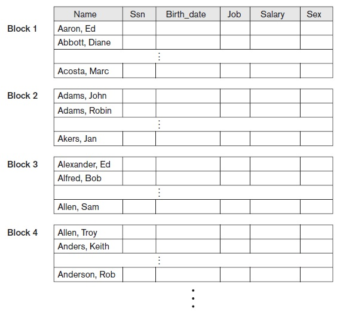
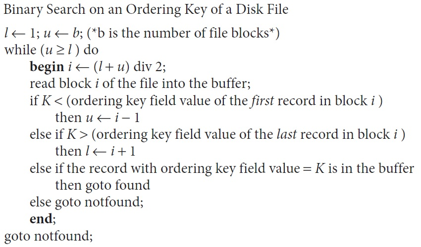

## [Tópico 08] - Estruturas de armazenamento (6/10)
###### *by Prof. Plinio Sa Leitao-Junior (INF/UFG)*

### <ins>CONTEÚDO</ins>

|_Item do conteúdo_|_Item do conteúdo_|
|-|-|
|1. Visão geral|8. Cabeçalho de arquivo e cabeçalho de bloco|
|2. Armazenamento físico|9. Alocação de blocos de arquivo no disco|
|3. Arquivo, bloco e registro|10. Acesso a registros|
|4. _Buffering_ de blocos|11. Organização de arquivo _vs._ Método de acesso|
|5. Registro de tamanho fixo|12. Organização de arquivos não ordenados (_heap_)|
|6. Registro de tamanho variável|13. <ins>**ORGANIZAÇÃO DE ARQUIVOS SEQUENCIAIS (ORDENADOS)**</ins>|
|7. Organização de registros em blocos (espalhada e não espalhada)|14. Organização de arquivos _hashing_|

### 13. <ins>ORGANIZAÇÃO DE ARQUIVOS SEQUENCIAIS (ORDENADOS)</ins>

<ins>Arquivos sequenciais</ins> possuem os registros <ins>fisicamente ordenados</ins>, com base em um de seus campos:
- Na figura abaixo, a ordenação é baseada no campo _Name_.
- Os registros estão ordenados dentro de cada bloco.
- O último registro de um bloco e o primeiro registro do próximo bloco são consecutivos quanto à ordenação.

<ins>Campo de ordenação</ins> _vs._ <ins>Chave de ordenação</ins>
- Em aquivos sequenciais, os registros são fisicamente ordenados conforme um campo (ou sequência de campos):
  - tal campo é denominado <ins>campo de ordenação</ins>.
- Se o campo de ordenação também for um <ins>campo-chave do arquivo</ins>:
  - ou seja, o campo de ordenação tem valor exclusivo em qualquer registro do arquivo;
  - o campo de ordenação é também denominado <ins>chave de ordenação</ins> do arquivo.

&#x267B; <ins>**Cenário de busca linear:**</ins> Leitura de registros na ordem dos valores do <ins>**campo** de ordenação</ins>:
- Por exemplo:
  - o campo de ordenação é _Nome_ (nome de cliente);
  - uma consulta requer os dados de clientes cujo valor do Atributo _Nome_ inicie com 'Ana Maria';
  - a leitura dos dados é eficiente, pois nenhuma classificação de dados é necessária.
- [Padrão de] predicado de busca:
  - &#x269E; _atributo = valor_ &#x269F;
  - &#x269E; _valor1 < atributo < valor2_ &#x269F;
    - por exemplo, **'Ana Maria' < Nome < 'Ana Maria~'** .
- Encontrar o próximo registro não requer acessos adicionais à memoria secundária:
  - exceto se o registro atual seja o último no bloco.

&#x267B; <ins>**Cenário de busca binária:**</ins> Leitura de registro baseada no valor da <ins>**chave** de ordenação</ins>:
- Melhor desempenho que busca linear.
- É possível ter busca binária em memória secundária?
  - **premissa:** os endereços dos blocos do arquivo [em memória secundária (disco)] são conhecidos ...

#### &#x267B;&#x26BE;&#x270D; <ins>BUSCA BINÁRIA EM MEMÓRIA SECUNDÁRIA</ins>

&#9745; Considere que os endereços [de disco] dos blocos do arquivo estão disponíveis no cabeçalho do arquivo. 
&#9745; O custo da pesquisa é <ins>baseado no número de blocos</ins>, independente do número de registros: 
&nbsp;&nbsp;&nbsp;&nbsp;&nbsp;&nbsp;&#9888; número de blocos **b** impacta o custo. 
&#9745; <ins>Custo da pesquisa binária</ins>: 
&nbsp;&nbsp;&nbsp;&nbsp;&nbsp;&nbsp;&#9888; registro <ins>encontrado</ins>: **log2b** 
&nbsp;&nbsp;&nbsp;&nbsp;&nbsp;&nbsp;&#9888; registro <ins>não encontrado</ins>: **log2b** 
&#9745; <ins>Custo da pesquisa linear</ins>: 
&nbsp;&nbsp;&nbsp;&nbsp;&nbsp;&nbsp;&#9888; registro <ins>encontrado</ins>: **b/2** 
&nbsp;&nbsp;&nbsp;&nbsp;&nbsp;&nbsp;&#9888; registro <ins>não encontrado</ins>: **b**
  
Exemplo de algoritmo de busca binária em memória secundária:

&nbsp;&nbsp;&nbsp;&nbsp;&nbsp;&nbsp;&nbsp;&nbsp;&nbsp;&nbsp;&nbsp;&nbsp;

#### &#x267B;&#x26BE;&#x270D; <ins>OPERAÇÕES EM ARQUIVOS SEQUENCIAIS</ins>

&#x26BE; <ins>Operação de **BUSCA**</ins> com base em <ins>valores do campo de ordenação</ins>:  
&nbsp;&nbsp;&nbsp;&nbsp;&nbsp;&nbsp;&#9888; O predicado emprega os operadoes >, <, ≥ e ≤ ao campo de ordenação. 
&nbsp;&nbsp;&nbsp;&nbsp;&nbsp;&nbsp;&#9888; Exemplos: <ins>_Nome < 'G'_</ins> e <ins>_'Ana Maria' < Nome < 'Ana Maria~'_</ins> 
&nbsp;&nbsp;&nbsp;&nbsp;&nbsp;&nbsp;&#9888; A busca é eficiente, pois ... 
&nbsp;&nbsp;&nbsp;&nbsp;&nbsp;&nbsp;&nbsp;&nbsp;&nbsp;&nbsp;&nbsp;&#x270D; ... todos os registros que satisfazem a condição estão [fisicamente] contíguos no arquivo.

&#x26BE; <ins>Operação de **BUSCA**</ins> com base em <ins>valores de outros campos não ordenados</ins>: 
&nbsp;&nbsp;&nbsp;&nbsp;&nbsp;&nbsp;&#9888; Em <ins>acesso aleatório [desses campos]</ins>, ocorre a <ins>busca linear</ins>. 
&nbsp;&nbsp;&nbsp;&nbsp;&nbsp;&nbsp;&#9888; Em <ins>acesso ordenado [desses campos]</ins>, como proceder? 
&nbsp;&nbsp;&nbsp;&nbsp;&nbsp;&nbsp;&nbsp;&nbsp;&nbsp;&nbsp;&nbsp;&#x270D; ... é possível [um arquivo] ter duas ordenações (campos de ordenação distintos)?

&#x26BE; <ins>Operação de **INCLUSÃO** de registro</ins>: 
&nbsp;&nbsp;&nbsp;&nbsp;&nbsp;&nbsp;&#9888; A operação é em geral dispendiosa, pois é necessário <ins>manter o arquivo fisicamente ordenado</ins>. 
&nbsp;&nbsp;&nbsp;&nbsp;&nbsp;&nbsp;&#9888; É necessário <ins>encontrar a posição correta</ins> [para o novo registro], com base no valor do campo de ordenação. 
&nbsp;&nbsp;&nbsp;&nbsp;&nbsp;&nbsp;&#9888; Resulta em <ins>mover registros entre blocos</ins> para liberar espaço [para o novo registro]: 
&nbsp;&nbsp;&nbsp;&nbsp;&nbsp;&nbsp;&nbsp;&nbsp;&nbsp;&nbsp;&nbsp;&#x270D; ... em média, <ins>metade dos registros</ins> deve ser movida; 
&nbsp;&nbsp;&nbsp;&nbsp;&nbsp;&nbsp;&nbsp;&nbsp;&nbsp;&nbsp;&nbsp;&#x270D; ... em média, <ins>metade dos blocos</ins> deve ser <ins>lida e reescrita</ins>. 
&nbsp;&nbsp;&nbsp;&nbsp;&nbsp;&nbsp;&nbsp;&nbsp;&nbsp;&nbsp;&nbsp;&#x270D; ... para um arquivo grande, isso pode consumir muito tempo.

&#x26BE; <ins>Operação de **EXCLUSÃO** de registros</ins>: 
&nbsp;&nbsp;&nbsp;&nbsp;&nbsp;&nbsp;&#9888; Em comparação com a inclusão, a exclusão pode ser mais barata devido ao uso de: 
&nbsp;&nbsp;&nbsp;&nbsp;&nbsp;&nbsp;&nbsp;&nbsp;&nbsp;&nbsp;&nbsp;&#x270D; ... marcadores de exclusão e reorganização periódica.

&#x26BE; <ins>Estratégias para a **inclusão** de registros</ins>: 
&nbsp;&nbsp;&nbsp;&nbsp;&nbsp;&nbsp;&#9888; Manter algum espaço não utilizado em cada bloco, destinado para acomodar novos registros: 
&nbsp;&nbsp;&nbsp;&nbsp;&nbsp;&nbsp;&nbsp;&nbsp;&nbsp;&nbsp;&nbsp;&#x270D; ... uma vez esgotado esse espaço, o problema original ressurge. 
&nbsp;&nbsp;&nbsp;&nbsp;&nbsp;&nbsp;&#9888; Criar um arquivo temporário não ordenado (arquivo _overflow_): 
&nbsp;&nbsp;&nbsp;&nbsp;&nbsp;&nbsp;&nbsp;&nbsp;&nbsp;&nbsp;&nbsp;&#x270D; ... novos registros são inseridos no final do arquivo _overflow_; 
&nbsp;&nbsp;&nbsp;&nbsp;&nbsp;&nbsp;&nbsp;&nbsp;&nbsp;&nbsp;&nbsp;&#x270D; ... a <ins>inserção</ins> torna-se eficiente; 
&nbsp;&nbsp;&nbsp;&nbsp;&nbsp;&nbsp;&nbsp;&nbsp;&nbsp;&nbsp;&nbsp;&#x270D; ... a <ins>busca</ins> requer algoritmo mais elaborado: 
&nbsp;&nbsp;&nbsp;&nbsp;&nbsp;&nbsp;&nbsp;&nbsp;&nbsp;&nbsp;&nbsp;&#x270D; ........... busca binária no arquivo principal, 
&nbsp;&nbsp;&nbsp;&nbsp;&nbsp;&nbsp;&nbsp;&nbsp;&nbsp;&nbsp;&nbsp;&#x270D; ........... se o registro não for encontrado ... então 
&nbsp;&nbsp;&nbsp;&nbsp;&nbsp;&nbsp;&nbsp;&nbsp;&nbsp;&nbsp;&nbsp;&#x270D; ........... busca linear no arquivo _overflow_. 
&nbsp;&nbsp;&nbsp;&nbsp;&nbsp;&nbsp;&nbsp;&nbsp;&nbsp;&nbsp;&nbsp;&#x270D; ... periodicamente, o arquivo _overflow_ é <ins>classificado e mesclado</ins> com o arquivo principal (arquivo mestre): 
&nbsp;&nbsp;&nbsp;&nbsp;&nbsp;&nbsp;&nbsp;&nbsp;&nbsp;&nbsp;&nbsp;&#x270D; ........... a depender da <ins>frequência da reorganização</ins> e dos <ins>requisitos da aplicação</ins>, 
&nbsp;&nbsp;&nbsp;&nbsp;&nbsp;&nbsp;&nbsp;&nbsp;&nbsp;&nbsp;&nbsp;&#x270D; ........... a operação de busca <ins>pode ignorar</ins> o arquivo _overflow_.

&#x26BE; <ins>Operação de **ALTERAÇÃO** de registros</ins>: 
&nbsp;&nbsp;&nbsp;&nbsp;&nbsp;&nbsp;&#9888; Envolve <ins>dois fatores</ins>: o predicado de busca e o registro a ser modificado. 
&nbsp;&nbsp;&nbsp;&nbsp;&nbsp;&nbsp;&#9888; Sobre o <ins>predicado de busca</ins>: 
&nbsp;&nbsp;&nbsp;&nbsp;&nbsp;&nbsp;&nbsp;&nbsp;&nbsp;&nbsp;&nbsp;&#x270D; ... se o predicado envolver a <ins>chave de ordenação</ins>: **busca binária** ... 
&nbsp;&nbsp;&nbsp;&nbsp;&nbsp;&nbsp;&nbsp;&nbsp;&nbsp;&nbsp;&nbsp;&#x270D; ........... atenção, se o predicado envolver o campo (em vez de chave) de ordenação! 
&nbsp;&nbsp;&nbsp;&nbsp;&nbsp;&nbsp;&nbsp;&nbsp;&nbsp;&nbsp;&nbsp;&#x270D; ... caso contrário: **busca linear**. 
&nbsp;&nbsp;&nbsp;&nbsp;&nbsp;&nbsp;&#9888; Sobre o <ins>registro a ser modificado</ins>: 
&nbsp;&nbsp;&nbsp;&nbsp;&nbsp;&nbsp;&nbsp;&nbsp;&nbsp;&nbsp;&nbsp;&#x270D; ... se registro de <ins>tamanho fixo</ins>, o registro será alterado e reescrito no mesmo bloco; 
&nbsp;&nbsp;&nbsp;&nbsp;&nbsp;&nbsp;&nbsp;&nbsp;&nbsp;&nbsp;&nbsp;&#x270D; ... se registro de <ins>tamanho variável</ins>, o registro antigo será excluído e o novo registro será incluído: 
&nbsp;&nbsp;&nbsp;&nbsp;&nbsp;&nbsp;&nbsp;&nbsp;&nbsp;&nbsp;&nbsp;&#x270D; ........... o registro potencialmente alterará sua posição física no arquivo.

