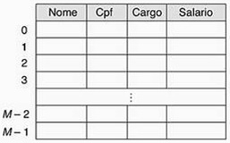
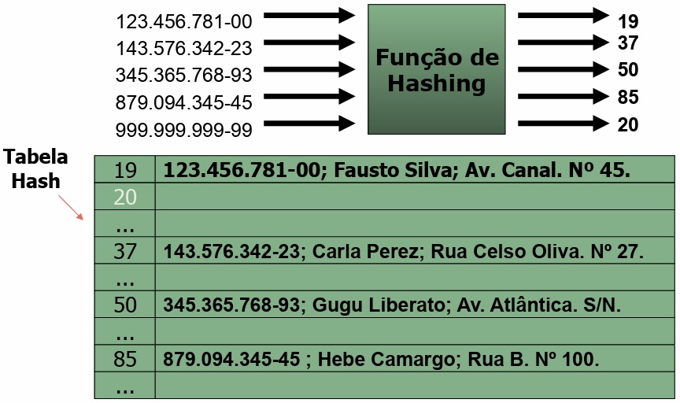
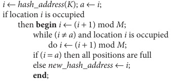
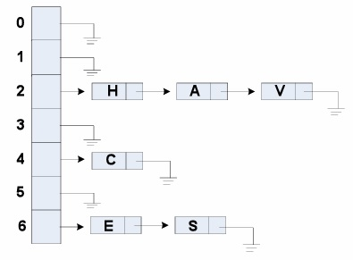
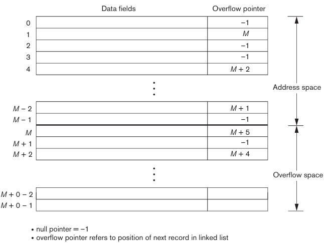

## [Tópico 09] - Estruturas de armazenamento (7/10)
###### *by Prof. Plinio Sa Leitao-Junior (INF/UFG)*

### <ins>CONTEÚDO</ins>

|_Item do conteúdo_|_Item do conteúdo_|
|-|-|
|1. Visão geral|8. Cabeçalho de arquivo e cabeçalho de bloco|
|2. Armazenamento físico|9. Alocação de blocos de arquivo no disco|
|3. Arquivo, bloco e registro|10. Acesso a registros|
|4. _Buffering_ de blocos|11. Organização de arquivo _vs._ Método de acesso|
|5. Registro de tamanho fixo|12. Organização de arquivos não ordenados (_heap_)|
|6. Registro de tamanho variável|13. Organização de arquivos sequenciais (ordenados)|
|7. Organização de registros em blocos (espalhada e não espalhada)|14. <ins>**ORGANIZAÇÃO DE ARQUIVOS _HASHING_ (1/4)**</ins>|

### 14. <ins>ORGANIZAÇÃO DE ARQUIVOS _HASHING_ (1/4)</ins>
 

<ins>**_HASHING_**</ins> é um <ins>conceito</ins> que está associado à: 
&nbsp;&nbsp;&nbsp;&nbsp;&nbsp;&nbsp;&#x267B; <ins>estratégia de busca [de dados]</ins>; e 
&nbsp;&nbsp;&nbsp;&nbsp;&nbsp;&nbsp;&#x267B; <ins>estratégia de organização</ins> [de dados].

 

&#x270D; Sobre a <ins>ESTRATÉGICA DE BUSCA</ins>:
- Em geral, é adequada para o <ins>predicado de busca</ins>:
  - &#x269E; **_atributo = valor_** &#x269F; 
- Onde:
  - **_atributo_** é um campo de uma estrutura do tipo registro [de arquivo]:
    - o campo é denominado <ins>campo de _hash_</ins> (ou **campo _hash_**);
    - se o campo for chave de arquivo, então é denominado <ins>chave de _hash_</ins> (ou **chave _hash_**).
  - **_valor_** é o dado que precisa ser localizado (buscado).

&#x270D; Sobre a <ins>ESTRATÉGIA DE ORGANIZAÇÃO</ins>:
- Os dados são dispostos em uma estrutura tabular:
  - a estrutura é denominada <ins>tabela de _hash_</ins></ins> (ou **tabela _hash_**).
 

&#x26BE; A <ins>estratégia de busca</ins> utiliza uma <ins>função **h**</ins>:
- A função **h** é denominada <ins>função de _hash_</ins> (ou **função _hash_**).
  - a <ins>entrada</ins> da função **h** é [o valor de] um dado;
  - a <ins>saída</ins> da função **h** é o endereço (a localização) desse dado:
      - o endereço (a localização) é <ins>um índice</ins> (uma posição relativa) na **tabela _hash_**. 
- A escolha da **função _hash_** é <ins>sensível para a eficiência</ins> da estratégia de busca.
 

> <ins>_Hashing_</ins> é comumente aplicado para dados em <ins>mémória principal</ins>:
>> Conhecido como <ins>**_Hashing_ INTERNO**</ins>.

> O presente tópico explora (estende) o emprego do <ins>_Hashing_</ins> para dados em <ins>memória secundária</ins>:
>> Conhecido como <ins>**_Hashing_ EXTERNO**</ins>.
 

#### &#x267B;&#x26BE;&#x270D; <ins>_HASHING_ INTERNO</ins>

Na figura abaixo (à esq.), a **tabela _hash_** é um _array_ de registros:
- Os endereços (índices) variam de **0** a **M-1**.
- Uma **função _hash_** [simples] é **h(K) = K mod M**:
  - a variável **K** denota um número inteiro derivado de um dado para a busca;
  - um valor não-inteiro para o **campo _hash_** é transformado para inteiro, antes de aplicar a função _mod_;
  - se o **campo _hash_** é <ins>CPF</ins>, então o valor de **K** é obtido a partir de uma sequência de números (ou seja, um CPF).
  - se o **campo _hash_** é <ins>Nome</ins>, então o valor de **K** é obtido a partir de uma sequência de letras (ou seja, um nome).

&nbsp;&nbsp;&nbsp;&nbsp;&nbsp;&nbsp;

A **função _hash_** transforma o valor de entrada em um índice (endereço), pela aplicação de operações aritméticas e/ou lógicas: 
&nbsp;&nbsp;&nbsp;&nbsp;&nbsp;&nbsp;&nbsp;&nbsp;&nbsp;&nbsp;&nbsp;&nbsp; **h : Input** &#x279C; **Address** 
&nbsp;&nbsp;&nbsp;&nbsp;&nbsp;&nbsp; **h** é a função de cálculo de endereço 
&nbsp;&nbsp;&nbsp;&nbsp;&nbsp;&nbsp; **Input** é o espaço definido pelos valores do **campo hash** (domínio de h)  
&nbsp;&nbsp;&nbsp;&nbsp;&nbsp;&nbsp; **Address** é o espaço de endereçamento (contradomínio de h) 

O cálculo da **função _hash_** deveria resultar em um <ins>endereço distinto</ins> (endereço único) na **tabela _hash_**, qualquer que seja o valor do **campo _hash_**:
- O número de valores possíveis [distintos] do **campo _hash_** (espaço do **campo _hash_**) é, em geral, [muito] superior ao número de endereços disponíveis na **tabela _hash_** (espaço de endereço).
- A **função _hash_** não garante que dados distintos [do **campo _hash_**] resulte em endereços distintos [da **tabela _hash_**}:

**COLISÃO.** 
Ocorre quando <ins>dois os mais valores</ins> do **campo _hash_** [presentes] na **tabela _hash_** <ins>compartilham o mesmo endereço</ins> na **tabela _hash_**: 
&#x270D; Ao inserir um registro, se o endereço para o novo registro [calculado a partir da **função _hash_**] já estiver ocupado por outro registro, então é necessária uma estratégia de <ins>tratamento de colisão</ins> (resolução de colisão).
 

> Em síntese, a <ins>**função _hash_**</ins> é a responsável por <ins>gerar um índice</ins> a partir de uma determinada entrada: 
>> <ins>Cenário ideal</ins>: A **função _hash_** fornece: 
>>> <ins>índices únicos</ins> para o conjunto de entradas possíveis; 
>>> <ins>índices sem colisões</ins>; 
>>> <ins>índices fáceis de computar</ins>; 
>>> <ins>índices uniformes</ins> (todos os locais da **tabela _hash_** sejam igualmente utilizados).

 

**TRATAMENTO DE COLISÃO POR <ins>ENDEREÇAMENTO ABERTO (SONDAGEM LINEAR)</ins>.** 
Se for detectada colisão ao tentar inserir um novo registro (o endereço calculado para o novo registro está ocupado): 
&#x270D; O novo registro será inserido no <ins>primeiro endereço desocupado</ins>, dentre os <ins>endereços subsequentes</ins> ao endereço calculado. 
&#x270D; Ou seja, ocorre uma <ins>busca linear por um endereço desocupado</ins>, a partir do endereço calculado (ver algoritmo abaixo).

&nbsp;&nbsp;&nbsp;&nbsp;&nbsp;&nbsp;

**TRATAMENTO DE COLISÃO POR <ins>ENCADEAMENTO</ins>.** 
É utilizada uma <ins>área de _overflow_</ins> para acomodar os novos registros (quando o endereço calculado estiver ocupado): 
&#x270D; Cada elemento da **tabela _hash_** terá um ponteiro para definir uma lista de registros na <ins>área de _overflow</ins>. 
&#x270D; Dessa forma, é possível ter uma <ins>lista [de registros] na área de _overflow_</ins>, para cada endereço da **tabela _hash_** (ver figura abaixo).

&nbsp;&nbsp;&nbsp;&nbsp;&nbsp;&nbsp;

**TRATAMENTO DE COLISÃO POR <ins>_HASHING_ MÚLTIPLO</ins>.** 
Uma <ins>segunda **função _hash_**</ins> é aplicada, se a <ins>primeira **função _hash_**</ins> resultar em colisão: 
&#x270D; Se ocorrer outra colisão: 
&nbsp;&nbsp;&nbsp;&nbsp;&nbsp;&nbsp;&#x26BE; aplica-se o endereçamento aberto; ou 
&nbsp;&nbsp;&nbsp;&nbsp;&nbsp;&nbsp;&#x26BE; aplica-se uma terceira **função _hash_** e então usa o endereçamento aberto (caso necessário).  
&#x270D; Na <ins>busca de dados</ins>, as várias **funções _hash_** são potencialmente empregadas, contudo na mesma sequência da <ins>inclusão de dados</ins>.

**<ins>IMPORTANTE</ins>.** 
Cada <ins>método de tratamento (resolução) de colisão</ins> requer seus <ins>próprios algoritmos</ins> para inserção, recuperação e exclusão de registros: 
&#x26BE; Algoritmos de encadeamento são os mais simples. 
&#x26BE; Algoritmos de exclusão para endereçamento aberto são mais complicados.

**<ins>SOBRE O CONCEITO _HASHING_</ins>.** 
&#x270D; Acesso rápido para recuperar um registro arbitrário. 
&#x270D; A **função _hash_** em geral <ins>não preserva a ordem</ins> de valores do **campo _hash_**: 
&nbsp;&nbsp;&nbsp;&nbsp;&nbsp;&nbsp;&#x26BE; &#8704; **Ki &#8712; _Input_** , **Kj &#8712; _Input_** , **Ki &#8800; Kj** 
&nbsp;&nbsp;&nbsp;&nbsp;&nbsp;&nbsp;&nbsp;&nbsp;&nbsp;&nbsp;&nbsp;&nbsp;&#x267B; **_Input_** é o espaço definido pelos valores do **campo hash**. 
&nbsp;&nbsp;&nbsp;&nbsp;&nbsp;&nbsp;&#x26BE; <ins>se **Ki > Kj**, não é garantido que **h(Ki) > h(Kj)**</ins> 
&nbsp;&nbsp;&nbsp;&nbsp;&nbsp;&nbsp;&#x26BE; algumas possibilidades (exemplos) para preservar a ordem</ins> de valores do **campo _hash_**: 
&nbsp;&nbsp;&nbsp;&nbsp;&nbsp;&nbsp;&nbsp;&nbsp;&nbsp;&nbsp;&nbsp;&nbsp;&#x267B; digitos mais significativos (três díditos à esquerda) de um campo monetário; 
&nbsp;&nbsp;&nbsp;&nbsp;&nbsp;&nbsp;&nbsp;&nbsp;&nbsp;&nbsp;&nbsp;&nbsp;&#x267B; campo auto-incremento.

#### Exercício

