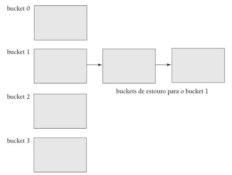

## [Tópico 10] - Estruturas de armazenamento (8/10)
###### *by Prof. Plinio Sa Leitao-Junior (INF/UFG)*

### <ins>CONTEÚDO</ins>

|_Item do conteúdo_|_Item do conteúdo_|
|-|-|
|1. Visão geral|8. Cabeçalho de arquivo e cabeçalho de bloco|
|2. Armazenamento físico|9. Alocação de blocos de arquivo no disco|
|3. Arquivo, bloco e registro|10. Acesso a registros|
|4. _Buffering_ de blocos|11. Organização de arquivo _vs._ Método de acesso|
|5. Registro de tamanho fixo|12. Organização de arquivos não ordenados (_heap_)|
|6. Registro de tamanho variável|13. Organização de arquivos sequenciais (ordenados)|
|7. Organização de registros em blocos (espalhada e não espalhada)|14. <ins>**ORGANIZAÇÃO DE ARQUIVOS _HASHING_ (2/4)**</ins>|

### 14. <ins>ORGANIZAÇÃO DE ARQUIVOS _HASHING_ (2/4)</ins>
 

Para a organização de dados baseada <ins>_hashing_ em memória secundária</ins> - **_HASHING_ EXTERNO** - utiliza-se o <ins>conceito _Bucket_</ins>:
- Um <ins>_bucket_</ins> é um bloco de disco, ou um _cluster_ de blocos de disco contíguos.
- A **função _hash_** <ins>**MAPEIA**</ins> um valor do **campo _hash_** para um <ins>número relativo de _bucket_</ins> (<ins>endereço lógico</ins>), em vez de atribuir um endereço absoluto (<ins>endereço físico</ins>) ao _bucket_:
- Uma tabela [no cabeçalho do arquivo] <ins>mapeia</ins> o endereço lógico do _bucket_ para o endereço físico do _bucket_.

#### &#x267B;&#x26BE;&#x270D; <ins>COLISÃO EM _HASHING_ EXTERNO</ins>

O <ins>conceito _Bucket_</ins> potencialmente ameniza o efeito de colisões:
- Se vários registros do arquivo têm o mesmo valor calculado pela **função _hash_**:
  - tais registros podem ser acomodados no mesmo _bucket_,
  - visto que tipicamente o tamanho do _bucket_ é superior ao tamanho de registro. 
- Em <ins>arquivos dinâmicos</ins>, a <ins>escolha da **função _hash_**</ins> e o <ins>dimensionamento de _buckets_</ins> poderiam considerar _buckets_ com 'espaço para expansão futura':
  - por exemplo, após a carga inicial do arquivo, os _buckets_ estariam de 70% a 85% preenchidos (cheios), média.
  - tal estratégia seria efetiva (suficiente)?

Se um _bucket_ torna-se <ins>cheio</ins>:
- A <ins>tratamento de colisão por encadeamento</ins> é o mais utilizado:
  - outras estratégias são mais dispendiosas. 

**ESTRATÉGIA 1.**
- <ins>**_Buckets_ de _overflow_**</ins> são alocados.
- Em um mesmo <ins>_bucket_ de _overflow_</ins>, há somente registros com o <ins>mesmo endereço lógico de _bucket_</ins>.
- Uma lista ligada de _buckets_ de _overflow_ é criada (_hashing_ fechado), conforme a figura abaixo.
- Cada ponteiro na lista ligada é um ponteiro de bloco (endereço físico de _bucket_).
- Há <ins>um único ponteiro</ins> por _bucket_ de _overflow_.

**ESTRATÉGIA 2.**
- Em um mesmo <ins>_bucket_ de _overflow_</ins>, pode haver registros com <ins>distintos endereços lógicos de _bucket_</ins>.
- Cada ponteiro na lista ligada é um ponteiro de registro (ver figura abaixo):
  -  endereço físico de _bucket_ + endereço de registro no _bucket_ (posição relativa do registro). 
- Há <ins>vários ponteiros</ins> por _bucket_ de _overflow_.

#### &#x267B;&#x26BE;&#x270D; <ins>OPERAÇÕES EM _HASHING_ EXTERNO</ins>

**BUSCA DE DADOS.** 
&#x267B; Se predicado é <ins>**_campo-hash = \<valor\>_**</ins>, a pesquisa usa a estrutura _hashing_. 
&nbsp;&nbsp;&nbsp;&nbsp;&nbsp;&nbsp;&#x26BE; a pesquisa potencialmente será <ins>mais eficente (tempo de execução)</ins> do que as buscas linear e binária. 
&#x267B; Caso contrário, <ins>o método e o custo da pesquisa</ins> são similares a àquelas em arquivos não ordenados.

**EXCLUSÃO DE DADOS.** 
&#x267B; Localizar o _bucket_, conforme descrito acima. 
&#x267B; Se o _bucket_ **NÃO POSSUIR** <ins>lista ligada de _buckets_ de _overflow_</ins>: 
&nbsp;&nbsp;&nbsp;&nbsp;&nbsp;&nbsp;&#x26BE; remover o registro do _bucket_ (caso exista). 
&#x267B; Se o _bucket_ **POSSUIR** <ins>lista ligada de _buckets_ de _overflow_</ins>: 
&nbsp;&nbsp;&nbsp;&nbsp;&nbsp;&nbsp;&#x26BE; se o registro <ins>estiver no _bucket_</ins>: 
&nbsp;&nbsp;&nbsp;&nbsp;&nbsp;&nbsp;&nbsp;&nbsp;&nbsp;&nbsp;&nbsp;&nbsp;&#x270D; remover o registro do _bucket_; e 
&nbsp;&nbsp;&nbsp;&nbsp;&nbsp;&nbsp;&nbsp;&nbsp;&nbsp;&nbsp;&nbsp;&nbsp;&#x270D; mover um dos registros da lista para o _bucket_, visando a substituir o registro excluído. 
&nbsp;&nbsp;&nbsp;&nbsp;&nbsp;&nbsp;&#x26BE; se o registro <ins>estiver na lista ligada de _buckets_ de _overflow_</ins>: 
&nbsp;&nbsp;&nbsp;&nbsp;&nbsp;&nbsp;&nbsp;&nbsp;&nbsp;&nbsp;&nbsp;&nbsp;&#x270D; remover o registro da lista; e 
&nbsp;&nbsp;&nbsp;&nbsp;&nbsp;&nbsp;&nbsp;&nbsp;&nbsp;&nbsp;&nbsp;&nbsp;&#x270D; monitorar as posições vazias na lista.

**INCLUSÃO DE DADOS.** 
&#x267B; Localizar o _bucket_, conforme descrito acima. 
&#x267B; Se o _bucket_ **POSSUIR** <ins>espaço na novos registros</ins>: 
&nbsp;&nbsp;&nbsp;&nbsp;&nbsp;&nbsp;&#x26BE; inserir o registro no _bucket_. 
&#x267B; Se o _bucket_ **NÃO POSSUIR** <ins>espaço na novos registros</ins>: 
&nbsp;&nbsp;&nbsp;&nbsp;&nbsp;&nbsp;&#x26BE; se **NÃO HOUVER** <ins>lista ligada de _buckets_ de _overflow_</ins>: 
&nbsp;&nbsp;&nbsp;&nbsp;&nbsp;&nbsp;&nbsp;&nbsp;&nbsp;&nbsp;&nbsp;&nbsp;&#x270D; criar <ins>lista ligada de _buckets_ de _overflow_</ins>. 
&nbsp;&nbsp;&nbsp;&nbsp;&nbsp;&nbsp;&#x26BE; inserir registro na <ins>lista ligada de _buckets_ de _overflow_</ins>.

**ALTERAÇÃO DE DADOS.** 
&#x267B; Localizar o _bucket_, conforme descrito acima. 
&#x267B; Se o **campo _hash_** **NÃO FOI MODIFICADO**: 
&nbsp;&nbsp;&nbsp;&nbsp;&nbsp;&nbsp;&#x26BE; modificar o registro; e 
&nbsp;&nbsp;&nbsp;&nbsp;&nbsp;&nbsp;&#x26BE; reescrever o registro no mesmo _bucket_ (ou na lista ligada de _buckets_ de _overflow_). 
&#x267B; Se o **campo _hash_** **FOI MODIFICADO**: 
&nbsp;&nbsp;&nbsp;&nbsp;&nbsp;&nbsp;&#x26BE; modificar o registro; e 
&nbsp;&nbsp;&nbsp;&nbsp;&nbsp;&nbsp;&#x26BE; possivelmente mover o registro para outro _bucket_: 
&nbsp;&nbsp;&nbsp;&nbsp;&nbsp;&nbsp;&nbsp;&nbsp;&nbsp;&nbsp;&nbsp;&nbsp;&#x270D; remover o registro anterior do arquivo; e 
&nbsp;&nbsp;&nbsp;&nbsp;&nbsp;&nbsp;&nbsp;&nbsp;&nbsp;&nbsp;&nbsp;&nbsp;&#x270D; incluir o registro modificado no arquivo.

#### &#x267B;&#x26BE;&#x270D; <ins>_HASHING_ EXTERNO ESTÁTICO _vs._ DINÂMICO</ins>

No <ins>_hashing_ externo **estático**</ins>:
- O número de _buckets_ é fixo.
- Tal pode ser <ins>uma séria desvantagem para arquivos dinâmicos</ins>:
  - **M** _buckets_ foram alocados e cada _bucket_ pode ter até **m** registros;
  - ou seja, o espaço alocado pode ter até **(m * M) registros**.
- Se o número **r** de registros for muito menor que **m * M**, ou seja, **r << (m * M)**:
  - haverá muito espaço [alocado mas] não utilizado.
- Se o número **r** de registros for maior que **m * M**, ou seja, **r >> (m * M)**:
  - haverá muitas colisões, e a recuperação será lenta devido aos _buckets_ de _overflow_.
- Possível solução:
  - alterar <ins>dinamicamente</ins> o número **M** de _buckets_ alocados; e
  - usar uma nova **função _hash_** [baseada no novo valor de **M**] para redistribuir registros.

No <ins>_hashing_ externo **estático**</ins>: 
&#x270D; Reorganizações <ins>periódicas</ins> [de todo o arquivo] são potencialmente necessárias: 
&nbsp;&nbsp;&nbsp;&nbsp;&nbsp;&nbsp;&#x26BE; <ins>qual a periodicidade</ins> para as reorganizações? 
&nbsp;&nbsp;&nbsp;&nbsp;&nbsp;&nbsp;&#x26BE; a cada reorganização, o valor de **M** poderá ser [manualmente] ajustado. 
&#x270D; Reorganizações podem consumir muito tempo para arquivos grandes.

No <ins>_hashing_ externo **dinâmico**</ins>: 
&#x270D; O número **M** de _buckets_ varia dinamicamente, à medida que o arquivo cresce ou encolhe. 
&#x270D; As variações no valor de **M** causam reorganizações mais localizadas (menor custo que reorganização completa).

#### &#x267B;&#x26BE;&#x270D; <ins>ESTRATÉGIAS PARA _HASHING_ EXTERNO DINÂMICO</ins>

Para lidar com o <ins>_hashing_ externo dinâmico</ins>: 
&#x270D; As estratégias <ins>_hashing_ extensível</ins>, <ins>_hashing_ linear</ins> e <ins>_hashing_ dinâmico</ins>. 
&#x270D; A estrutura de acesso é construída a partir da <ins>representação binária</ins> [do resultado] do cálculo da **função _hash_**: 
&nbsp;&nbsp;&nbsp;&nbsp;&nbsp;&nbsp;&#x26BE; uma sequência de bits, denominada **valor _hash_**; 
&nbsp;&nbsp;&nbsp;&nbsp;&nbsp;&nbsp;&#x26BE; os registros são distribuídos nos _buckets_, com base nos valores dos bits iniciais do **valor _hash_**.

#### Exercício
