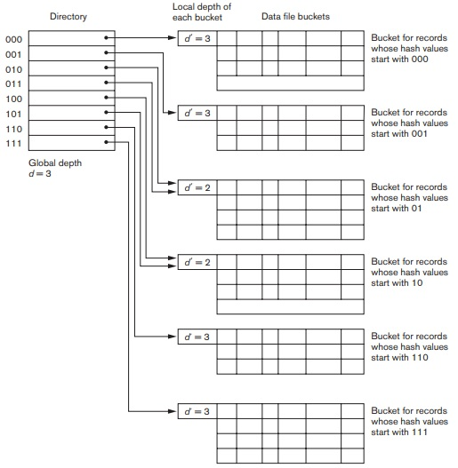
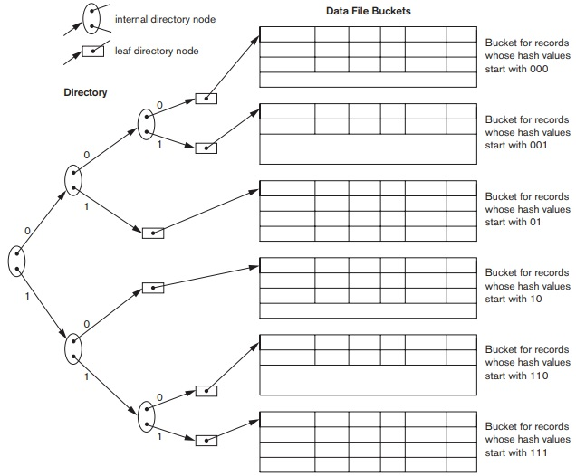

## [Tópico 11] - Estruturas de armazenamento (9/10)
###### *by Prof. Plinio Sa Leitao-Junior (INF/UFG)*

### <ins>CONTEÚDO</ins>

|_Item do conteúdo_|_Item do conteúdo_|
|-|-|
|1. Visão geral|8. Cabeçalho de arquivo e cabeçalho de bloco|
|2. Armazenamento físico|9. Alocação de blocos de arquivo no disco|
|3. Arquivo, bloco e registro|10. Acesso a registros|
|4. _Buffering_ de blocos|11. Organização de arquivo _vs._ Método de acesso|
|5. Registro de tamanho fixo|12. Organização de arquivos não ordenados (_heap_)|
|6. Registro de tamanho variável|13. Organização de arquivos sequenciais (ordenados)|
|7. Organização de registros em blocos (espalhada e não espalhada)|14. <ins>**ORGANIZAÇÃO DE ARQUIVOS _HASHING_ (3/4)**</ins>|

### 14. <ins>ORGANIZAÇÃO DE ARQUIVOS _HASHING_ (3/4)</ins>

Em <ins>_hashing_ externo **estático**</ins>: 
&#9888; O espaço de endereçamento é fixo. 
&#9888; Há dificuldade para expandir ou reduzir o arquivo.

Em <ins>_hashing_ externo **dinâmico**</ins>: 
&#9888; A estrutura de acesso é baseada na <ins>representação binária</ins> do resultado da **função _hash_**: 
&nbsp;&nbsp;&nbsp;&nbsp;&nbsp;&nbsp;&#x270D; o resultado da **função _hash_** é um número inteiro não negativo. 
&#9888; A representação binária <ins>orienta a distribuição de registros</ins> nos _buckets_. 
&#9888; Em geral, são utilizados os valores dos <ins>bits iniciais</ins> (menos significativos) da representação binária. 
&#9888; Exemplos de estratégias para _hashing_ externo **dinâmico**: 
&nbsp;&nbsp;&nbsp;&nbsp;&nbsp;&nbsp;&#x270D; <ins>_hashing_ extensível</ins>, <ins>_hashing_ linear</ins> e <ins>_hashing_ dinâmico</ins>.  

#### &#x267B;&#x26BE;&#x270D; <ins>TÉCNICA _HASHING_ EXTENSÍVEL</ins>

É mantido um <ins>**DIRETÓRIO**</ins>, com os <ins>endereços [físicos] dos _buckets_</ins> do arquivo: 
&#x270D; O diretório é um <ins>_array_</ins> que contém **<ins>2d</ins> endereços de _buckets_**: 
&nbsp;&nbsp;&nbsp;&nbsp;&nbsp;&nbsp;&#9888; por exemplo se d=3, então o arquivo possui até oito</ins> (23=8) _buckets_ de alocados para dados; 
&nbsp;&nbsp;&nbsp;&nbsp;&nbsp;&nbsp;&#9888; os três bits menos significativos da representação binária do valor da função hash ... 
&nbsp;&nbsp;&nbsp;&nbsp;&nbsp;&nbsp;&#9888; ... são usados para as entradas do diretório ... 
&nbsp;&nbsp;&nbsp;&nbsp;&nbsp;&nbsp;&#9888; ... a saber: 000, 001, 010, 011, 100, 101, 110 e 111. 
&#x270D; O <ins>fator **d**</ins> é denominado <ins>**profundidade global (_global depth_)** do diretório</ins>.

Em <ins>cada _bucket_</ins> de dados alocado: 
&#x270D; O <ins>fator **d\'**</ins> determina a <ins>**profundidade local (_local depth_)** do _bucket_</ins>. 
&#x270D; Noutras palavras, o <ins>fator **d\'**</ins> especifica o número de bits em que o conteúdo do _bucket_ se baseia.

A figura ilustra a estrutura de _hashing_ extensível. Atenção ao texto presente na figura.

#### &#x267B;&#x26BE;&#x270D; <ins>_HASHING_ EXTENSÍVEL - EXEMPLO</ins>

Considere o exemplo: 
&#9888; Cada _bucket_ pode acomodar <ins>até dois registros</ins>. 
&#9888; Abaixo está a ordem de inclusão de registros.

|Sequência de inclusão|Chave de _hash_|_Bits_ menos significativos da função _hash_|_Bits_ em ordem inversa|
|:-:|:-|:-:|:-:|
|01|João da Silva|**`{...11010}`**|01011...|
|02|Maria de Alencar|**`{...11001}`**|10011...|
|03|Ana de Paula|**`{...10101}`**|10101...|
|04|Pedro Soares|**`{...11011}`**|11011...|
|05|Glória Barbosa|**`{...11000}`**|00011...|
|06|Ricardo Afonso|**`{...11101}`**|10111...|

#### &#x267B; Inicialmente: a <ins>estrutura está vazia</ins>.

<table>
    <tbody>
       <tr>
            <td colspan=2><b>DIRETÓRIO (ENDEREÇAMENTO)</b></td>
            <td>---</td>
            <td colspan=4><b>DADOS (<i>BUCKETS</i>)</b></td>
       </tr>
       <tr>
            <td><b><i>binary</i></b></td>
            <td><b><i>bucket address</i></b></td>
            <td>---</td>
            <td><b><i>bucket address</i></b></td>
            <td><b><i>d'</i></b></td>
            <td><b><i>binary</i></b></td>
            <td><b>data</b></td>
       </tr>      
    </tbody>
</table>

#### &#x267B; Inserir: <ins>João da Silva</ins>; Binário da função _hash_ = <ins>01011....</ins> 
&#9888; O diretório foi iniciado com **d=1**, ou seja, duas entradas (**2d = 21**): 
&nbsp;&nbsp;&nbsp;&nbsp;&nbsp;&nbsp;&#x270D; as entradas são {0} e {1}. 
&#9888; Um _bucket_ no endereço A1A1A1A1 foi alocado. 
&#x26BE; Número de entradas no diretório = 2 (21) 
&#x26BE; Número de _buckets_ alocados = 1

<table>
    <tbody>
       <tr>
            <td colspan=2><b>DIRETÓRIO (d=1)</b></td>
            <td>---</td>
            <td colspan=4><b>DADOS (<i>BUCKETS</i>)</b></td>
       </tr>
       <tr>
            <td><b><i>binary</i></b></td>
            <td><b><i>bucket address</i></b></td>
            <td>---</td>
            <td><b><i>bucket address</i></b></td>
            <td><b><i>d'</i></b></td>
            <td><b><i>binary</i></b></td>
            <td><b>data</b></td>
       </tr>      
       <tr>
            <td><b><i>{0}</i></b></td>
            <td><b><i>A1A1A1A1</i></b></td>
            <td>---</td>
            <td><b><i>A1A1A1A1</i></b></td>
            <td><b><i>{1}</i></b></td>
            <td><b><i>{0}1011....</i></b></td>
            <td><b><i>João da Silva</i></b></td>
       </tr>   
       <tr>
            <td><b><i>{1}</i></b></td>
            <td><b><i>NULL</i></b></td>
            <td>---</td>
            <td><b><i></i></b></td>
            <td><b><i></i></b></td>
            <td><b><i></i></b></td>
            <td><b><i></i></b></td>
       </tr>  
    </tbody>
</table>

#### &#x267B; Inserir: <ins>Maria de Alencar</ins>; Binário da função _hash_ = <ins>10011...</ins> 
&#9888; Um _bucket_ no endereço C3C3C3C3C3 foi alocado. 
&#x26BE; Entradas no diretório = 2 (21) 
&#x26BE; _Buckets_ alocados = 2

<table>
    <tbody>
       <tr>
            <td colspan=2><b>DIRETÓRIO (d=1)</b></td>
            <td>---</td>
            <td colspan=4><b>DADOS (<i>BUCKETS</i>)</b></td>
       </tr>
       <tr>
            <td><b><i>binary</i></b></td>
            <td><b><i>bucket address</i></b></td>
            <td>---</td>
            <td><b><i>bucket address</i></b></td>
            <td><b><i>d'</i></b></td>
            <td><b><i>binary</i></b></td>
            <td><b>data</b></td>
       </tr>      
       <tr>
            <td><b><i>{0}</i></b></td>
            <td><b><i>A1A1A1A1</i></b></td>
            <td>---</td>
            <td><b><i>A1A1A1A1</i></b></td>
            <td><b><i>1</i></b></td>
            <td><b><i>{0}1011....</i></b></td>
            <td><b><i>João da Silva</i></b></td>
       </tr>   
       <tr>
            <td><b><i>{1}</i></b></td>
            <td><b><i>C3C3C3C3C3</i></b></td>
            <td>---</td>
            <td><b><i>C3C3C3C3C3</i></b></td>
            <td><b><i>1</i></b></td>
            <td><b><i>{1}0011...</i></b></td>
            <td><b><i>Maria de Alencar</i></b></td>
       </tr>  
    </tbody>
</table>

#### &#x267B; Inserir: <ins>Ana de Paula</ins>; Binário da função _hash_ = <ins>10101...</ins> 
&#9888; Nenhum _bucket_ foi alocado. 
&#x26BE; Entradas no diretório = 2 (21) 
&#x26BE; _Buckets_ alocados = 2

<table>
    <tbody>
       <tr>
            <td colspan=2><b>DIRETÓRIO (d=1)</b></td>
            <td>---</td>
            <td colspan=4><b>DADOS (<i>BUCKETS</i>)</b></td>
       </tr>
       <tr>
            <td><b><i>binary</i></b></td>
            <td><b><i>bucket address</i></b></td>
            <td>---</td>
            <td><b><i>bucket address</i></b></td>
            <td><b><i>d'</i></b></td>
            <td><b><i>binary</i></b></td>
            <td><b>data</b></td>
       </tr>      
       <tr>
            <td><b><i>{0}</i></b></td>
            <td><b><i>A1A1A1A1</i></b></td>
            <td>---</td>
            <td><b><i>A1A1A1A1</i></b></td>
            <td><b><i>1</i></b></td>
            <td><b><i>{0}1011....</i></b></td>
            <td><b><i>João da Silva</i></b></td>
       </tr>   
       <tr>
            <td><b><i>{1}</i></b></td>
            <td><b><i>C3C3C3C3C3</i></b></td>
            <td>---</td>
            <td rowspan=2><b><i>C3C3C3C3C3</i></b></td>
            <td rowspan=2><b><i>1</i></b></td>
            <td><b><i>{1}0011...</i></b></td>
            <td><b><i>Maria de Alencar</i></b></td>
       </tr>  
       <tr>
            <td><b><i></i></b></td>
            <td><b><i></i></b></td>
            <td>---</td>
            <td><b><i>{1}0101...</i></b></td>
            <td><b><i>Ana de Paula</i></b></td>
       </tr> 
    </tbody>
</table>

#### &#x267B; Inserir: <ins>Pedro Soares</ins>; Binário da função _hash_ = <ins>11011...</ins> 
&#9888; O tamanho do diretório foi duplicado: 
&nbsp;&nbsp;&nbsp;&nbsp;&nbsp;&nbsp;&#x270D; o **fator d** (profundidade global) foi modificado: **d=2**, ou seja, quatro entradas (**2d = 22**): 
&nbsp;&nbsp;&nbsp;&nbsp;&nbsp;&nbsp;&#x270D; as entradas são {00}, {01}, {10} e {11}. 
&#9888; Um _bucket_ no endereço D9D9D9D9 foi alocado. 
&#x26BE; Entradas no diretório = 4 (22) 
&#x26BE; _Buckets_ alocados = 3

<table>
    <tbody>
       <tr>
            <td colspan=2><b>DIRETÓRIO (d=2)</b></td>
            <td>---</td>
            <td colspan=4><b>DADOS (<i>BUCKETS</i>)</b></td>
       </tr>
       <tr>
            <td><b><i>binary</i></b></td>
            <td><b><i>bucket address</i></b></td>
            <td>---</td>
            <td><b><i>bucket address</i></b></td>
            <td><b><i>d'</i></b></td>
            <td><b><i>binary</i></b></td>
            <td><b>data</b></td>
       </tr>      
       <tr>
            <td><b><i>{00}</i></b></td>
            <td><b><i>A1A1A1A1</i></b></td>
            <td>---</td>
            <td><b><i>A1A1A1A1</i></b></td>
            <td><b><i>1</i></b></td>
            <td><b><i>{0}1011....</i></b></td>
            <td><b><i>João da Silva</i></b></td>
       </tr>   
       <tr>
            <td><b><i>{01}</i></b></td>
            <td><b><i>A1A1A1A1</i></b></td>
            <td>---</td>
            <td rowspan=2><b><i>C3C3C3C3C3</i></b></td>
            <td rowspan=2><b><i>2</i></b></td>
            <td><b><i>{10}011...</i></b></td>
            <td><b><i>Maria de Alencar</i></b></td>
       </tr>  
       <tr>
            <td><b><i>{10}</i></b></td>
            <td><b><i>C3C3C3C3C3</i></b></td>
            <td>---</td>
            <td><b><i>{10}101...</i></b></td>
            <td><b><i>Ana de Paula</i></b></td>
       </tr> 
           <tr>
            <td><b><i>{11}</i></b></td>
            <td><b><i>D9D9D9D9</i></b></td>
            <td>---</td>
            <td><b><i>D9D9D9D9</i></b></td>
            <td><b><i>2</i></b></td>
            <td><b><i>{11}011...</i></b></td>
            <td><b><i>Pedro Soares</i></b></td>
       </tr>  
    </tbody>
</table>

#### &#x267B; Inserir: <ins>Glória Barbosa</ins>; Binário da função _hash_ = <ins>00011...</ins> 
&#9888; Nenhum _bucket_ foi alocado. 
&#x26BE; Entradas no diretório = 4 (22) 
&#x26BE; _Buckets_ alocados = 3

<table>
    <tbody>
       <tr>
            <td colspan=2><b>DIRETÓRIO (d=2)</b></td>
            <td>---</td>
            <td colspan=4><b>DADOS (<i>BUCKETS</i>)</b></td>
       </tr>
       <tr>
            <td><b><i>binary</i></b></td>
            <td><b><i>bucket address</i></b></td>
            <td>---</td>
            <td><b><i>bucket address</i></b></td>
            <td><b><i>d'</i></b></td>
            <td><b><i>binary</i></b></td>
            <td><b>data</b></td>
       </tr>      
       <tr>
            <td><b><i>{00}</i></b></td>
            <td><b><i>A1A1A1A1</i></b></td>
            <td>---</td>
            <td rowspan=2><b><i>A1A1A1A1</i></b></td>
            <td rowspan=2><b><i>1</i></b></td>
            <td><b><i>{0}1011....</i></b></td>
            <td><b><i>João da Silva</i></b></td>
       </tr>   
        <tr>
            <td><b><i>{01}</i></b></td>
            <td><b><i>A1A1A1A1</i></b></td>
            <td>---</td>
            <td><b><i>{0}0011....</i></b></td>
            <td><b><i>Glória Barbosa</i></b></td>
       </tr>   
        <tr>
            <td><b><i>{10}</i></b></td>
            <td><b><i>C3C3C3C3C3</i></b></td>
            <td>---</td>
            <td rowspan=2><b><i>C3C3C3C3C3</i></b></td>
            <td rowspan=2><b><i>2</i></b></td>
            <td><b><i>{10}011...</i></b></td>
            <td><b><i>Maria de Alencar</i></b></td>
       </tr>  
       <tr>
            <td><b><i>{11}</i></b></td>
            <td><b><i>D9D9D9D9</i></b></td>
            <td>---</td>
            <td><b><i>{10}101...</i></b></td>
            <td><b><i>Ana de Paula</i></b></td>
       </tr> 
           <tr>
            <td><b><i></i></b></td>
            <td><b><i></i></b></td>
            <td>---</td>
            <td><b><i>D9D9D9D9</i></b></td>
            <td><b><i>2</i></b></td>
            <td><b><i>{11}011...</i></b></td>
            <td><b><i>Pedro Soares</i></b></td>
       </tr>  
    </tbody>
</table>

#### &#x267B; Inserir: <ins>Ricardo Afonso</ins>; Binário da função _hash_ = <ins>10111...</ins> 
&#9888; O tamanho do diretório foi duplicado: 
&nbsp;&nbsp;&nbsp;&nbsp;&nbsp;&nbsp;&#x270D; o **fator d** (profundidade global) foi modificado: **d=3**, ou seja, oito entradas (**2d = 23**): 
&nbsp;&nbsp;&nbsp;&nbsp;&nbsp;&nbsp;&#x270D; as entradas são {000}, {001}, {010}, {011}, {100}, {101}, {110} e {111}. 
&#9888; Um _bucket_ no endereço 7A7A7A7A foi alocado. 
&#x26BE; Entradas no diretório = 8 (23) 
&#x26BE; _Buckets_ alocados = 4

<table>
    <tbody>
       <tr>
            <td colspan=2><b>DIRETÓRIO (d=3)</b></td>
            <td>---</td>
            <td colspan=4><b>DADOS (<i>BUCKETS</i>)</b></td>
       </tr>
       <tr>
            <td><b><i>binary</i></b></td>
            <td><b><i>bucket address</i></b></td>
            <td>---</td>
            <td><b><i>bucket address</i></b></td>
            <td><b><i>d'</i></b></td>
            <td><b><i>binary</i></b></td>
            <td><b>data</b></td>
       </tr>      
       <tr>
            <td><b><i>{000}</i></b></td>
            <td><b><i>A1A1A1A1</i></b></td>
            <td>---</td>
            <td rowspan=2><b><i>A1A1A1A1</i></b></td>
            <td rowspan=2><b><i>1</i></b></td>
            <td><b><i>{0}1011....</i></b></td>
            <td><b><i>João da Silva</i></b></td>
       </tr>   
        <tr>
            <td><b><i>{001}</i></b></td>
            <td><b><i>A1A1A1A1</i></b></td>
            <td>---</td>
            <td><b><i>{0}0011....</i></b></td>
            <td><b><i>Glória Barbosa</i></b></td>
       </tr>   
       <tr>
            <td><b><i>{010}</i></b></td>
            <td><b><i>A1A1A1A1</i></b></td>
            <td>---</td>
            <td><b><i>7A7A7A7A</i></b></td>
            <td><b><i>3</i></b></td>
            <td><b><i>{100}11...</i></b></td>
            <td><b><i>Maria de Alencar</i></b></td>
       </tr>  
        <tr>
            <td><b><i>{011}</i></b></td>
            <td><b><i>A1A1A1A1</i></b></td>
            <td>---</td>
            <td rowspan=2><b><i>C3C3C3C3C3</i></b></td>
            <td rowspan=2><b><i>3</i></b></td>
            <td><b><i>{101}11...</i></b></td>
            <td><b><i>Ricardo Afonso</i></b></td>
       </tr>  
       <tr>
            <td><b><i>{100}</i></b></td>
            <td><b><i>7A7A7A7A</i></b></td>
            <td>---</td>
            <td><b><i>{101}01...</i></b></td>
            <td><b><i>Ana de Paula</i></b></td>
       </tr> 
       <tr>
            <td><b><i>{101}</i></b></td>
            <td><b><i>C3C3C3C3C3</i></b></td>
            <td>---</td>
            <td><b><i>D9D9D9D9</i></b></td>
            <td><b><i>2</i></b></td>
            <td><b><i>{11}011...</i></b></td>
            <td><b><i>Pedro Soares</i></b></td>
       </tr>  
       <tr>
            <td><b><i>{110}</i></b></td>
            <td><b><i>D9D9D9D9</i></b></td>
            <td>---</td>
            <td><b><i></i></b></td>
            <td><b><i></i></b></td>
            <td><b><i></i></b></td>
            <td><b><i></i></b></td>
       </tr>  
       <tr>
            <td><b><i>{111}</i></b></td>
            <td><b><i>D9D9D9D9</i></b></td>
            <td>---</td>
            <td><b><i></i></b></td>
            <td><b><i></i></b></td>
            <td><b><i></i></b></td>
            <td><b><i></i></b></td>
       </tr>  
    </tbody>
</table>

#### &#x267B;&#x26BE;&#x270D; <ins>_HASHING_ EXTENSÍVEL - CONCLUSÕES</ins>

O número de entradas (tamanho) do diretório pode aumentar ou diminuir: 
&#x267B; <ins>Aumentar significa duplicar</ins> o tamanho do diretório: 
&nbsp;&nbsp;&nbsp;&nbsp;&nbsp;&nbsp;&#x270D; ocorre ao tentar inserir um registro, mas: (i) o <ins>_bucket_</ins> está cheio; e (ii) <ins>d = d'</ins>; 
&nbsp;&nbsp;&nbsp;&nbsp;&nbsp;&nbsp;&#x270D; nesse caso, o **fator d** (profundidade global) é incrementado: **2d+1 = 2 * 2d**. 
&#x267B; <ins>Diminuir significa reduzir pela metade</ins> o tamanho do diretório: 
&nbsp;&nbsp;&nbsp;&nbsp;&nbsp;&nbsp;&#x270D; ocorre quando, para todos os _buckets_, <ins>d > d'</ins>; 
&nbsp;&nbsp;&nbsp;&nbsp;&nbsp;&nbsp;&#x270D; nesse caso, o **fator d** (profundidade global) é decrementado: **2d-1 = 2d / 2**.

Ao inserir um novo registro em um <ins>_bucket_ cheio</ins>, onde <ins>d = d'</ins>: 
&#x267B; Ocorre _overflow_ no _bucket_. 
&#x267B; Os valores são distribuídos em 2 _buckets_: 
&nbsp;&nbsp;&nbsp;&nbsp;&nbsp;&nbsp;&#x270D; se **d = 3** e o valor da **função _hash_** inicia com 111, 
&nbsp;&nbsp;&nbsp;&nbsp;&nbsp;&nbsp;&#x270D; os valores serão distribuídos em _buckets_ inciando com 1110 e 1111. 
&#x267B; O tamanho do diretório é dobrado (pois <ins>d = d'</ins>). 
&#x267B; Cada entrada no diretório é transformada em um par de entradas. 
&#x267B; Cada par de entradas terá o mesmo valor de ponteiro para _bucket_.

Nenhum _bucket_ é <ins>alocado previamente</ins> para crescimento futuro: 
&#x267B; Alocação _just-in-time_, alocação de _buckets_ conforme a demanda (no devido tempo, nem antes, nem depois). 
&#x267B; A reorganização é localizada na maioria dos casos: 
&nbsp;&nbsp;&nbsp;&nbsp;&nbsp;&nbsp;&#x270D; registros são distribuídos entre dois _buckets_ (devido à inclusão de registro); 
&nbsp;&nbsp;&nbsp;&nbsp;&nbsp;&nbsp;&#x270D; se um _bucket_ ficar vazio devido à exclusão de registro, este _bucket_ será liberado para o sistema operacional (ou seja, o _bucket_ será removido do arquivo); então, o diretório será atualizado; 
&nbsp;&nbsp;&nbsp;&nbsp;&nbsp;&nbsp;&#x270D; eventualmente, o diretório precisará ser duplicado, ou reduzido pela metade.

O diretório é acessado antes de acessar um _bucket_ de dados: 
&#x267B;  O tamanho máximo do diretório é **2k**, onde **k** é o número de bits do valor calculado pela **função _hash_**.

#### &#x267B;&#x26BE;&#x270D; <ins>TÉCNICA _HASHING_ DINÂMICO</ins>

Precursor da _Técnica Hashing Extensível_, porém difere do precursor pela estrutura do diretório: 
&#x267B; O _hashing_ dinâmico mantém um diretório estruturado em árvore com dois tipos de nós: 
■ Nós internos que possuem dois ponteiros, conforme a representação binária do valor calculado pela **função hash** — o ponteiro esquerdo correspondente ao bit 0 e o ponteiro direito ao bit 1. 
■ Nós folha que contêm um ponteiro para os _buckets_ de dados.

### Exercício

