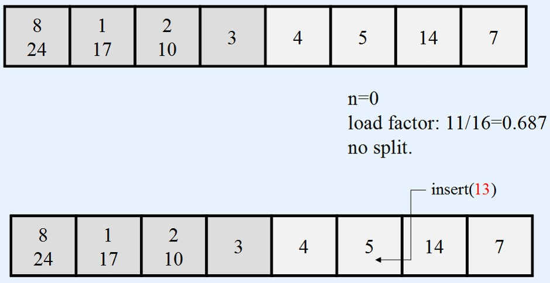

## [Tópico 12] - Estruturas de armazenamento (10/10)
###### *by Prof. Plinio Sa Leitao-Junior (INF/UFG)*

### <ins>CONTEÚDO</ins>

|_Item do conteúdo_|_Item do conteúdo_|
|-|-|
|1. Visão geral|8. Cabeçalho de arquivo e cabeçalho de bloco|
|2. Armazenamento físico|9. Alocação de blocos de arquivo no disco|
|3. Arquivo, bloco e registro|10. Acesso a registros|
|4. _Buffering_ de blocos|11. Organização de arquivo _vs._ Método de acesso|
|5. Registro de tamanho fixo|12. Organização de arquivos não ordenados (_heap_)|
|6. Registro de tamanho variável|13. Organização de arquivos sequenciais (ordenados)|
|7. Organização de registros em blocos (espalhada e não espalhada)|14. <ins>**ORGANIZAÇÃO DE ARQUIVOS _HASHING_ (4/4)**</ins>|

### 14. <ins>ORGANIZAÇÃO DE ARQUIVOS _HASHING_ (4/4)</ins>
 

#### &#x267B;&#x26BE;&#x270D; <ins>TÉCNICA _HASHING_ LINEAR</ins>

A <ins>técnica _hashing_ linear</ins> promove que o arquivo <ins>expanda e reduza dinamicamente</ins> o seu número de _buckets_, contudo sem ter uma estrutura de diretório (diferentemente da técnica _hashing_ extensível).

Inicialmente, o arquivo possui **M** <ins>_buckets_ primários</ins>, numerados &#8212; **0, 1, ..., M-1**.

O processo é dividido em várias fases: Fase **0**, Fase **1**, Fase **2**, …

Na <ins>**Fase j**</ins>, a localização de registros em _buckets_ é determinada por duas funções &#8212; **hj (K)** e **hj+1 (K)**: 
&nbsp;&nbsp;&nbsp;&nbsp;&nbsp;&nbsp;&nbsp;&nbsp;&nbsp;&nbsp;&nbsp;&nbsp;&#x26BE; hj (K) = K mod (2j * M) 
&nbsp;&nbsp;&nbsp;&nbsp;&nbsp;&nbsp;&nbsp;&nbsp;&nbsp;&nbsp;&nbsp;&nbsp;&#x26BE; hj+1 (K) = K mod (2j+1 * M)

Dessa forma, as funções aplicadas em cada fase são:

|Fase j|hj (K)|hj+1 (K)|
|-|-|-|
|Fase **0**|**h0 (K) = K mod (20 * M)**|**h1 (K) = K mod (21 * M)**|
|Fase **1**|**h1 (K) = K mod (21 * M)**|**h2 (K) = K mod (22 * M)**|
|Fase **2**|**h2 (K) = K mod (22 * M)**|**h3 (K) = K mod (23 * M)**|
|Fase **3**|**h3 (K) = K mod (23 * M)**|**h4 (K) = K mod (24 * M)**|
|..........|.................................................|.................................................|

 

&#x270D; <ins>DIVISÃO DE _BUCKET_:</ins> 

Dividir um _bucket_ significa: 
&#x267B; <ins>Criar</ins> um novo _bucket_. 
&#x267B; <ins>Redistribuir os registros</ins> entre dois _buckets_: 
&nbsp;&nbsp;&nbsp;&nbsp;&nbsp;&nbsp;&#x26BE; _bucket_ original e novo _bucket_.  
A <ins>divisão de _bucket_</ins> ocorre de acordo com <ins>regras específicas</ins>: 
&#x267B; Um _overflow_ ocorreu: 
&nbsp;&nbsp;&nbsp;&nbsp;&nbsp;&nbsp;&#x26BE; ao tentar inserir um novo registro em um _bucket_ cheio, 
&nbsp;&nbsp;&nbsp;&nbsp;&nbsp;&nbsp;&#x26BE; então ocorre: (i) a criação de novo _bucket_; e (ii) a redistribuição de registros entre o _bucket_ original e o novo _bucket_. 
&#x267B; Um <ins>fator de carga</ins> (_load factor_) foi excedido: 
&nbsp;&nbsp;&nbsp;&nbsp;&nbsp;&nbsp;&#x26BE; por exemplo, se o fator de carga do conjunto [completo] de _buckets_ alocados for 70%, 
&nbsp;&nbsp;&nbsp;&nbsp;&nbsp;&nbsp;&#x26BE; quando a ocupação de _buckets_ superar 70%, 
&nbsp;&nbsp;&nbsp;&nbsp;&nbsp;&nbsp;&#x26BE; então ocorre: (i) a criação de novo _bucket_; e (ii) a redistribuição de registros entre o _bucket_ original e o novo _bucket_. 
&#x267B; Ou outra regra.

 

&#x270D; <ins>FATOR **n**:</ins>

O <ins>**fator n**</ins> é um <ins>contador</ins>, que determina o <ins>número de _buckets_ criados</ins> durante a <ins>**Fase j**</ins>. 
&#x267B; Ao iniciar a <ins>**Fase j**</ins>: 
&nbsp;&nbsp;&nbsp;&nbsp;&nbsp;&nbsp;&#x26BE; **n = 0**. 
&#x267B; Se um <ins>um novo _bucket_ for criado</ins> durante a <ins>**Fase j**</ins>: 
&nbsp;&nbsp;&nbsp;&nbsp;&nbsp;&nbsp;&#x26BE; **n** é incrementado por 1 (um) &#8213; **n = n + 1**. 
&#x267B; IMPORTANTE: Ao aplicar **hj** ao valor <ins>**K**</ins> do **campo _hash_** do registro: 
&nbsp;&nbsp;&nbsp;&nbsp;&nbsp;&nbsp;&#x26BE; se **hj (K) < n**, 
&nbsp;&nbsp;&nbsp;&nbsp;&nbsp;&nbsp;&#x26BE; então o valor resultante de **hj+1 (K)** determina o _bucket_ para a inserção do registro, 
&nbsp;&nbsp;&nbsp;&nbsp;&nbsp;&nbsp;&nbsp;&nbsp;&nbsp;&nbsp;&nbsp;&nbsp;&#9745; ou seja, é empregada a função **hj+1 (K)**. 
&nbsp;&nbsp;&nbsp;&nbsp;&nbsp;&nbsp;&#x26BE; senão o valor resultante de **hj (K)** determina o _bucket_ para a inserção do registro. 
&nbsp;&nbsp;&nbsp;&nbsp;&nbsp;&nbsp;&nbsp;&nbsp;&nbsp;&nbsp;&nbsp;&nbsp;&#9745; ou seja, é empregada a função **hj (K)**. 

Observar o conteúdo da figura abaixo:

&nbsp;&nbsp;&nbsp;&nbsp;&nbsp;&nbsp;&nbsp;&nbsp;&nbsp;&nbsp;&nbsp;&nbsp;

#### &#x267B;&#x26BE;&#x270D; <ins>_HASHING_ LINEAR - EXEMPLO</ins>

Apresente o processo de inserção da seguinte sequência de chaves: 
&#x26BE; 3, 2, 4, 1, 8, 14, 5, 10, 7, 24, 17, 13, 15.

Parâmetros: 
&#x26BE; Regra para divisão de _buckets_: fator de carga (_load factor_) = 0.7 
&nbsp;&nbsp;&nbsp;&nbsp;&nbsp;&nbsp;&#9888; a divisão de _bucket_ ocorre quando **ocupação > 0.7**. 
&#x26BE; Inicialmente **M = 4** (M: tamanho da área primária) 
&#x26BE; Função _hash_: **hj (K) = K mod (2j * M)** , para j = 0, 1, 2, ... 
&#x26BE; Capacidade de _bucket_ = 02 registros.

#### &#x267B; FASE 0 &#8212; n = 0

Na figura abaixo: 
&#x270D; Quatro _buckets_ foram inicialmente alocados (M=4). 
&#x270D; O fator **n** denota o <ins>número de novo _buckets_ alocados</ins>: 
&nbsp;&nbsp;&nbsp;&nbsp;&nbsp;&nbsp;&#9888; **n** é inicializado com zero (**n=0**). 
&#x270D; Registros são <ins>inseridos e distribuídos</ins> entre os _buckets_ baseando-se na função **h0 (K) = K mod (20 * M)**: 
&nbsp;&nbsp;&nbsp;&nbsp;&nbsp;&nbsp;&#9888; são inseridos os registros com os valores 3, 2, 4, 1, 8; 
&nbsp;&nbsp;&nbsp;&nbsp;&nbsp;&nbsp;&#9888; a ocupação da estrutura é 62,5\% (5/8).

<table>
    <tbody>
       <tr>
            <td><b><i>Bucket</i></b></td>
            <td><b>4 ; 8</b></td>
            <td><b>1</b></td>
            <td><b>2</b></td>
            <td><b>3</b></td>
       </tr>      
       <tr>
            <td><b><i>Bucket id</i></b></td>
            <td><b>#0</b></td>
            <td><b>#1</b></td>
            <td><b>#2</b></td>
            <td><b>#3</b></td>
       </tr>      
    </tbody>
</table>

#### &#x267B; FASE 0 &#8212; n = 1

&#x270D; Ao inserir o registro com valor 14, a estrutura alcança 75% de ocupação (satisfaz regra para a divisão de _bucket_ &#8213; **ocupação > 0.7**): 
&nbsp;&nbsp;&nbsp;&nbsp;&nbsp;&nbsp;&#9888; um novo _bucket_ é criado (_bucket_ 4); 
&nbsp;&nbsp;&nbsp;&nbsp;&nbsp;&nbsp;&#9888; O fator **n** é incrementado &#8213; **n = 0 + 1 = 1**; 
&nbsp;&nbsp;&nbsp;&nbsp;&nbsp;&nbsp;&#9888; ocorre a redistribuição de registros entre _bucket_ original (_bucket_ 0) e novo _bucket_ (_bucket_ 4); 
&nbsp;&nbsp;&nbsp;&nbsp;&nbsp;&nbsp;&#9888; registros no _bucket_ 0 são redistribídos com a função **h1 (K) = K mod (21 * M) = K mod (2M)**.

<table>
    <tbody>
       <tr>
            <td><b></b></td>
            <td colspan=4><b>ANTES DA DIVISÃO (n=0)</b></td>
            <td>---</td>
            <td colspan=5><b>APÓS A DIVISÃO (n=1)</b></td>
       </tr>
       <tr>
            <td><b><i>Bucket</i></b></td>
            <td><b>4 ; 8</b></td>
            <td><b>1</b></td>
            <td><b>2 ; 14</b></td>
            <td><b>3</b></td>
            <td>---</td>
            <td><b>8</b></td>
            <td><b>1</b></td>
            <td><b>2 ; 14</b></td>
            <td><b>3</b></td>
            <td><b>4</b></td>
       </tr>      
       <tr>
            <td><b><i>Bucket id</i></b></td>
            <td><b>#0</b></td>
            <td><b>#1</b></td>
            <td><b>#2</b></td>
            <td><b>#3</b></td>
            <td>---</td>
            <td><b>#0</b></td>
            <td><b>#1</b></td>
            <td><b>#2</b></td>
            <td><b>#3</b></td>
            <td><b>#4</b></td>
       </tr>      
    </tbody>
</table>

&nbsp;&nbsp;&nbsp;&nbsp;&nbsp;&nbsp;&nbsp;&nbsp;&nbsp;&nbsp;&nbsp;&nbsp;

O registro com valor 5 é inserido: 
&#x270D; A estrutura passa a ter 70% de ocupação: 
&nbsp;&nbsp;&nbsp;&nbsp;&nbsp;&nbsp;&#9888; alcança o limite do fator de carga, 
&nbsp;&nbsp;&nbsp;&nbsp;&nbsp;&nbsp;&nbsp;&nbsp;&nbsp;&nbsp;&nbsp;&nbsp;&#9888; mas não há a divisão de _bucket_.

<table>
    <tbody>
       <tr>
            <td><b><i>Bucket</i></b></td>
            <td><b>8</b></td>
            <td><b>1 ; 5</b></td>
            <td><b>2 ; 14</b></td>
            <td><b>3</b></td>
            <td><b>4</b></td>
       </tr>      
       <tr>
            <td><b><i>Bucket id</i></b></td>
            <td><b>#0</b></td>
            <td><b>#1</b></td>
            <td><b>#2</b></td>
            <td><b>#3</b></td>
            <td><b>#4</b></td>
       </tr>      
    </tbody>
</table>

#### &#x267B; FASE 0 &#8212; n = 2

&#x270D; Ao inserir o registro com valor 10: 
&nbsp;&nbsp;&nbsp;&nbsp;&nbsp;&nbsp;&#9888; o _bucket_ 2 está cheio, 
&nbsp;&nbsp;&nbsp;&nbsp;&nbsp;&nbsp;&#9888; então o registro é inserido em _bucket_ de _overflow_; 
&nbsp;&nbsp;&nbsp;&nbsp;&nbsp;&nbsp;&#9888; a estrutura alcança 80% de ocupação (satisfaz regra para a divisão de _bucket_ &#8213; **ocupação > 0.7**): 
&nbsp;&nbsp;&nbsp;&nbsp;&nbsp;&nbsp;&#9888; um novo _bucket_ é criado (_bucket_ 5); 
&nbsp;&nbsp;&nbsp;&nbsp;&nbsp;&nbsp;&#9888; O fator **n** é incrementado &#8213; **n = 1 + 1 = 2**; 
&nbsp;&nbsp;&nbsp;&nbsp;&nbsp;&nbsp;&#9888; ocorre a redistribuição de registros entre _bucket_ original (_bucket_ 1) e novo _bucket_ (_bucket_ 5); 
&nbsp;&nbsp;&nbsp;&nbsp;&nbsp;&nbsp;&#9888; registros no _bucket_ 1 são redistribídos com a função **h1 (K) = K mod (21 * M) = K mod (2M)**; 
&nbsp;&nbsp;&nbsp;&nbsp;&nbsp;&nbsp;&#9888; após, a ocupação passa a ser 66,7\% (8/12).

<table>
    <tbody>
       <tr>
            <td><b></b></td>
            <td colspan=5><b>ANTES DA DIVISÃO (n=1)</b></td>
            <td>---</td>
            <td colspan=6><b>APÓS A DIVISÃO (n=2)</b></td>
       </tr>
       <tr>
            <td><b><i>Bucket</i></b></td>
            <td><b>8</b></td>
            <td><b>1 ; 5</b></td>
            <td><b>2 ; 14</b></td>
            <td><b>3</b></td>
            <td><b>4</b></td>
            <td>---</td>
            <td><b>8</b></td>
            <td><b>1</b></td>
            <td><b>2 ; 14</b></td>
            <td><b>3</b></td>
            <td><b>4</b></td>
            <td><b>5</b></td>
       </tr>      
       <tr>
            <td><b><i>Bucket Overflow</i></b></td>
            <td><b></b></td>
            <td><b></b></td>
            <td><b>10</b></td>
            <td><b></b></td>
            <td><b></b></td>
            <td>---</td>
            <td><b></b></td>
            <td><b></b></td>
            <td><b>10</b></td>
            <td><b></b></td>
            <td><b></b></td>
            <td><b></b></td>
       </tr>      
       <tr>
            <td><b><i>Bucket id</i></b></td>
            <td><b>#0</b></td>
            <td><b>#1</b></td>
            <td><b>#2</b></td>
            <td><b>#3</b></td>
            <td><b>#4</b></td>
            <td>---</td>
            <td><b>#0</b></td>
            <td><b>#1</b></td>
            <td><b>#2</b></td>
            <td><b>#3</b></td>
            <td><b>#4</b></td>
            <td><b>#5</b></td>
       </tr>      
    </tbody>
</table>

#### &#x267B; Demais inserções de registros ...

&nbsp;&nbsp;&nbsp;&nbsp;&nbsp;

&nbsp;&nbsp;&nbsp;&nbsp;&nbsp;

&nbsp;&nbsp;&nbsp;&nbsp;&nbsp;

&nbsp;&nbsp;&nbsp;&nbsp;&nbsp;

#### Em sintese ...

A divisão de _buckets_ pode ocorrer pela monitoração do fator de carga: 
&#x270D; Tal evita que haja a divisão de _buckets_ sempre que ocorrer um _overflow_. 
&#x270D; O fator de carga (_load factor_) pode ser calculado pela fórmula **lf = r/ (bfr * N)**: 
&nbsp;&nbsp;&nbsp;&nbsp;&nbsp;&nbsp;&#9888; **r** = número [corrente] de registros do arquivo, 
&nbsp;&nbsp;&nbsp;&nbsp;&nbsp;&nbsp;&#9888; **bfr** = número máximo de registros em um _bucket_, 
&nbsp;&nbsp;&nbsp;&nbsp;&nbsp;&nbsp;&#9888; **N** = número [corrente] de _buckets_. 
&#x270D; O Fator de carga pode ser usado para dividir ou recombinar _buckets_: 
&nbsp;&nbsp;&nbsp;&nbsp;&nbsp;&nbsp;&#9888; _buckets_ podem ser recombinados ... 
&nbsp;&nbsp;&nbsp;&nbsp;&nbsp;&nbsp;&#9888; se o fator de carga for reduzido abaixo de um certo limite, 
&nbsp;&nbsp;&nbsp;&nbsp;&nbsp;&nbsp;&#9888; nesse caso, o **fator n** é decrementado. 
&#x270D; Ou seja, a carga dos _buckets_ pode ser mantida em uma faixa de fator de carga.

Algoritmo de busca para <ins>_Hashing_ Linear</ins>:

function getBucketID (K, j, n)  
&nbsp;&nbsp;&nbsp;&nbsp;&nbsp;&nbsp;m ← hj (K) 
&nbsp;&nbsp;&nbsp;&nbsp;&nbsp;&nbsp;if m < n then m ← hj+1 (K) 
&nbsp;&nbsp;&nbsp;&nbsp;&nbsp;&nbsp;return m

Onde: 
&nbsp;&nbsp;&nbsp;&nbsp;&nbsp;&nbsp;**hj (K)** e **hj+1 (K)** são **funções _hash_** aplicadas durante a Fase j 
&nbsp;&nbsp;&nbsp;&nbsp;&nbsp;&nbsp;**n** é um número de _buckets_ criados na **Fase j** 
&nbsp;&nbsp;&nbsp;&nbsp;&nbsp;&nbsp;**m** é o resultado do cálculo de uma **função _hash_** para o valor K (**campo _hash_**).

