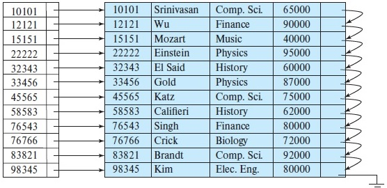
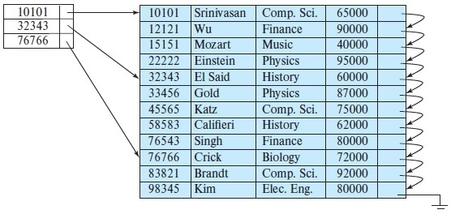

## [Tópico 13] - Estruturas de indexação (1/9)
###### *by Prof. Plinio Sa Leitao-Junior (INF/UFG)*

### <ins>CONTEÚDO</ins>

|_Item do conteúdo_|_Item do conteúdo_|
|-|-|
|1. <ins>**VISÃO GERAL**</ins>|4. Índice secundário|
|2. Índice primário|5. Índice multinível|
|3. Índice de agrupamento|6. Índice em árvore|

### 1. <ins>VISÃO GERAL</ins>

Considere a presença de um <ins>**ÍNDICE REMISSIVO**</ins>, para a <ins>busca por assunto</ins> em um livro: 
&#x267B; O índice apresenta vários assuntos em ordem alfabética, 
&nbsp;&nbsp;&nbsp;&nbsp;&nbsp;&nbsp;&#x26BE; ... apresenta também as páginas do livro (ponteiros) para cada assunto. 
&#x267B; O <ins>índice</ins> [remissivo] em geral está nas páginas finais do livro. 
&#x267B; Os <ins>dados</ins> estão nas páginas do livro anteriores ao índice [remissivo]. 
&#x267B; Os <ins>dados</ins> e o <ins>índice</ins> são <ins>estruturas independentes</ins>: 
&nbsp;&nbsp;&nbsp;&nbsp;&nbsp;&nbsp;&#x26BE; ... os <ins>dados</ins> e o <ins>índice</ins> estão em páginas distintas do livro. 
&#x267B; VANTAGEM DO ÍNDICE: Rapidez em certas operações sobre os dados: 
&nbsp;&nbsp;&nbsp;&nbsp;&nbsp;&nbsp;&#x26BE; ... agiliza o acesso ao dado. 
&#x267B; DESVANTAGEM DO ÍNDICE: Custo [elevado] para atualizar o índice: 
&nbsp;&nbsp;&nbsp;&nbsp;&nbsp;&nbsp;&#x26BE; ... alterações nos dados podem ocasionar modificações no índice; 
&nbsp;&nbsp;&nbsp;&nbsp;&nbsp;&nbsp;&#x26BE; ... exemplos??

No contexto de <ins>arquivos</ins> em sistemas computarizados:
- Índices são <ins>estruturas de acesso auxiliares e adicionais</ins> [aos dados], que são usadas para <ins>acelerar a recuperação de dados</ins>.
- Índices podem ocorrer em arquivos não ordenados, em arquivos sequenciais e em arquivos _hashing_.
- As estruturas de índice são <ins>arquivos adicionais</ins> em memória secundária:
  - fornecem caminhos de <ins>acesso secundário e indireto</ins> aos dados;
  - noutras palavras, os arquivos de índices proveem <ins>maneiras alternativas</ins> de acessar os dados, sem afetar o <ins>posicionamento físico dos registros</ins> no arquivo de dados [em memória secundária].

> QUESTÕES: 
>> Um arquivo de índice referencia (possui ponteiros para) um arquivo de dados? 
>> Um arquivo de índice referencia (possui ponteiros para) um arquivo de dados, e vice-versa?  
Dois ou mais arquivos de índice podem referenciar (possuir ponteiros para) um mesmo arquivo de dados?  
Um mesmo arquivo de índice pode referenciar (possuir ponteiros para) dois ou mais arquivos de dados? 
Um mesmo arquivo de índice pode referenciar (possuir ponteiros para) dois ou mais arquivos de dados, os quais são cópias entre si?  
Arquivos de índice são estruturados [e alocados] em blocos, similarmente aos arquivos de dados?  
O que significa a sentença '_o acesso aos dados via um arquivo de índice representa um acesso indireto aos dados_'?  
O acesso aos dados via o arquivo de índice requer que páginas do arquivo de índice estejam no _buffer pool_?

**CAMPO DE INDEXAÇÃO.** 
&#x270D; Campo usado para a construção do índice: 
&nbsp;&nbsp;&nbsp;&nbsp;&nbsp;&nbsp;&#x26BE; ... cada índice possui um campo de indexação; 
&nbsp;&nbsp;&nbsp;&nbsp;&nbsp;&nbsp;&#x26BE; ... no caso do índice remissivo, o campo de indexação é o campo <ins>'assunto'</ins>; 
&nbsp;&nbsp;&nbsp;&nbsp;&nbsp;&nbsp;&#x26BE; ... há outro índice usualmente presente em livros? 
&#x270D; Qualquer campo do arquivo pode ser um campo de indexação: 
&nbsp;&nbsp;&nbsp;&nbsp;&nbsp;&nbsp;&#x26BE; ... o campo de indexação pode ser composto por dois ou mais campos. 

**REGISTRO NO ARQUIVO DE ÍNDICE.** 
&#x270D; O arquivo de índice possui <ins>registros de tamanho fixo</ins>: 
&#x270D; Os registros do arquivo de índice segue o padrão: **_< K(i), X >_** 
&nbsp;&nbsp;&nbsp;&nbsp;&nbsp;&nbsp;&#x26BE; ... **_K(i)_** é um valor do campo de indexação, referente ao i-ésimo registro do arquivo; 
&nbsp;&nbsp;&nbsp;&nbsp;&nbsp;&nbsp;&#x26BE; ... **_X_** pode ser: 
&nbsp;&nbsp;&nbsp;&nbsp;&nbsp;&nbsp;&nbsp;&nbsp;&nbsp;&nbsp;&nbsp;&nbsp;&#10040; o endereço físico de um bloco (ou página) no arquivo de dados; 
&nbsp;&nbsp;&nbsp;&nbsp;&nbsp;&nbsp;&nbsp;&nbsp;&nbsp;&nbsp;&nbsp;&nbsp;OU 
&nbsp;&nbsp;&nbsp;&nbsp;&nbsp;&nbsp;&nbsp;&nbsp;&nbsp;&nbsp;&nbsp;&nbsp;&#10040; o endereço físico de registro de dados, composto por: 
&nbsp;&nbsp;&nbsp;&nbsp;&nbsp;&nbsp;&nbsp;&nbsp;&nbsp;&nbsp;&nbsp;&nbsp;&nbsp;&nbsp;&nbsp;&nbsp;&nbsp;&nbsp;&nbsp;um endereço físico de bloco; e 
&nbsp;&nbsp;&nbsp;&nbsp;&nbsp;&nbsp;&nbsp;&nbsp;&nbsp;&nbsp;&nbsp;&nbsp;&nbsp;&nbsp;&nbsp;&nbsp;&nbsp;&nbsp;&nbsp;um ID de registro (ou deslocamento) dentro do bloco; &nbsp;&nbsp;&nbsp;&nbsp;&nbsp;&nbsp;&nbsp;&nbsp;&nbsp;&nbsp;&nbsp;&nbsp;OU 
&nbsp;&nbsp;&nbsp;&nbsp;&nbsp;&nbsp;&nbsp;&nbsp;&nbsp;&nbsp;&nbsp;&nbsp;&#10040; um endereço lógico do bloco ou do registro dentro do arquivo, 
&nbsp;&nbsp;&nbsp;&nbsp;&nbsp;&nbsp;&nbsp;&nbsp;&nbsp;&nbsp;&nbsp;&nbsp;&nbsp;&nbsp;&nbsp;&nbsp;&nbsp;&nbsp;&nbsp;&nbsp;&nbsp;&nbsp;&nbsp;&nbsp; ... é um número relativo que seria mapeado para um endereço físico.

**ÍNDICE DENSO _vs._ ÍNDICE ESPARSO.** 
&#x270D; Em [arquivos de] <ins>índices densos</ins>, há uma entrada [de índice] para cada valor [do campo de pesquisa] no arquivo de dados (figura abaixo à esq.). 
&#x270D; Em <ins>índices esparsos</ins>, há uma entrada [de índice] apenas para alguns dos valores [do campo de pesquisa] no [arquivos de] arquivo de dados (figura abaixo à dir.). 
&#x270D; Por definição, arquivos de índice denso possuem maior número de registros em relação a arquivos de índice esparso: 
&nbsp;&nbsp;&nbsp;&nbsp;&nbsp;&nbsp;&#x26BE; ... então a busca via um índice esparso é mais rápida do que via um índice denso [para o mesmo arquivo de dados]?

&nbsp;&nbsp;&nbsp;&nbsp;&nbsp;&nbsp;&nbsp;&nbsp;&nbsp;&nbsp;&nbsp;&nbsp;

#### Exercício
