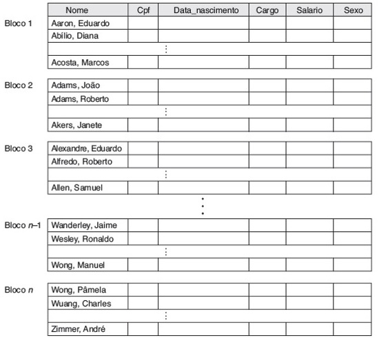
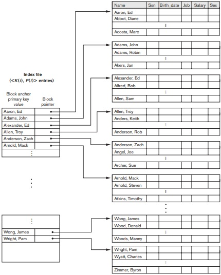

## [Tópico 14] - Estruturas de indexação (2/9)
###### *by Prof. Plinio Sa Leitao-Junior (INF/UFG)*

### <ins>CONTEÚDO</ins>

|_Item do conteúdo_|_Item do conteúdo_|
|-|-|
|1. Visão geral|4. Índice secundário|
|2. <ins>**ÍNDICE PRIMÁRIO**</ins>|5. Índice multinível|
|3. Índice de agrupamento|6. Índice em árvore|

### 2. <ins>ÍNDICE PRIMÁRIO</ins>

**IMPORTANTE.** 
Um índice primário pode ser criado para um arquivo de dados quando:
- O arquivo de dados é um <ins>arquivo ordenado</ins>.
- O <ins>campo de ordenação</ins> do arquivo de dados é também a <ins>chave de ordenação</ins> do arquivo:
  - qualquer valor do campo de ordenação é um valor único no arquivo.
- <ins>O campo de indexação do arquivo do índice é o campo de ordenação do arquivo de dados</ins>.

Um <ins>**índice primário**</ins> é um <ins>arquivo ordenado</ins>:
- É um arquivo com registros de comprimento fixo.
- Cada registro possui com dois campos:
  - um <ins>valor</ins> [com o mesmo domínio do campo] da <ins>chave de ordenação</ins> (chamado de chave primária do arquivo de dados);
  - um ponteiro para um bloco de disco (um endereço de bloco do arquivo de dados).
- Dessa forma, cada <ins>entrada (registro)</ins> na posição **i** (i-ésimo registro do arquivo):
  - **< K(i), P(i) >**, onde:
    - **_K(i)_** é um valor do campo de indexação,
    - **_P(i)_** é um endereço físico de um bloco (ou página) no arquivo de dados.

> Como criar um índice primário para o arquivo ilustrado abaixo ?

&nbsp;&nbsp;&nbsp;&nbsp;&nbsp;&nbsp;&nbsp;&nbsp;&nbsp;&nbsp;&nbsp;&nbsp;

Na figura acima, o campo _Name_ é a <ins>chave de ordenação</ins> do arquivo de dados: 
&#x267B; Observe o valor do campo _Name_ no <ins>registro âncora</ins> de cada bloco do arquivo: 
&nbsp;&nbsp;&nbsp;&nbsp;&nbsp;&nbsp;&#x26BE; ... (Aaron, Ed) 
&nbsp;&nbsp;&nbsp;&nbsp;&nbsp;&nbsp;&#x26BE; ... (Adams, John) 
&nbsp;&nbsp;&nbsp;&nbsp;&nbsp;&nbsp;&#x26BE; ... (Alexander, Ed) 
&#x267B; Seja **K(j)** o valor do atributo _Name_ para o registro âncora do bloco **j**: 
&nbsp;&nbsp;&nbsp;&nbsp;&nbsp;&nbsp;&#x26BE; ... Em qual bloco estará o registro em que **_Name = K_** , 
&nbsp;&nbsp;&nbsp;&nbsp;&nbsp;&nbsp;&#x26BE; ... se K(j) ≤ K < K(j + 1) ? 

A figura abaixo ilustra o <ins>índice primário</ins> (à esq.): 
&#x267B; Há uma entrada (um registro) no índice primário para cada bloco do arquivo de dados:  
&nbsp;&nbsp;&nbsp;&nbsp;&nbsp;&nbsp;&#x26BE; ... <K(1) = (Aaron, Ed), P(1) = address of block 1> 
&nbsp;&nbsp;&nbsp;&nbsp;&nbsp;&nbsp;&#x26BE; ... <K(2) = (Adams, John), P(2) = address of block 2> 
&nbsp;&nbsp;&nbsp;&nbsp;&nbsp;&nbsp;&#x26BE; ... <K(3) = (Alexander, Ed), P(3) = address of block 3> 
&#x267B; O índice primário é um índice denso ou um índice esparso??

&nbsp;&nbsp;&nbsp;&nbsp;&nbsp;&nbsp;&nbsp;&nbsp;&nbsp;&nbsp;&nbsp;&nbsp;

Tipicamente, o arquivo de índice primário <ins>ocupa menos espaço</ins> que o arquivo de dados: 
&#x267B; Há menos entradas de índice do que registros no arquivo de dados.  
&#x267B; Cada entrada de índice é usualmente menor em tamanho do que um registro de dados: 
&nbsp;&nbsp;&nbsp;&nbsp;&nbsp;&nbsp;&#x26BE; ... cada registro de índice tem apenas dois campos, 
&nbsp;&nbsp;&nbsp;&nbsp;&nbsp;&nbsp;&#x26BE; ... e tendem a ter tamanho curto (em relação ao registro de dados). 
&#x267B; Uma pesquisa binária no arquivo de índice requer menos acessos de bloco do que uma pesquisa binária no arquivo de dados?? 
&nbsp;&nbsp;&nbsp;&nbsp;&nbsp;&nbsp;&#x26BE; ... é possível ter busca binária em ambos os arquivos (índice e dados)?? 

Sobre o <ins>custo da busca</ins> por um registro de dados &#8212; predicado segundo o padrão **_Att = K_**: 
&#x267B; O atributo **_Att_** é a chave de ordenação do arquivo de dados. 
&#x267B; Em termos nominais, o custo da busca é composto por: 
&nbsp;&nbsp;&nbsp;&nbsp;&nbsp;&nbsp;&#x26BE; ... acesso via busca binária no arquivo de índice primário, e 
&nbsp;&nbsp;&nbsp;&nbsp;&nbsp;&nbsp;&#x26BE; ... se o registro existir, acesso direto pelo endereço de bloco no arquivo de dados. 
&#x267B; Custo da busca: **log2bi + 1** 
&nbsp;&nbsp;&nbsp;&nbsp;&nbsp;&nbsp;&#x26BE; ... **bi** é o número de blocos do arquivo de índice primário.

Sobre as operações de atualização (inserção, modificação e exclusão) de registros do arquivo de dados: 
&#x267B; A atualização de dados pode impactar o conteúdo do arquivo de índices: 
&nbsp;&nbsp;&nbsp;&nbsp;&nbsp;&nbsp;&#x26BE; ... por exemplo, se a operação alcançar o registro âncora de um ou mais blocos de dados. 
&#x267B; O arquivo de índice primário é um arquivo ordenado, então: 
&nbsp;&nbsp;&nbsp;&nbsp;&nbsp;&nbsp;&#x26BE; ... há custo inerente às operações de atualização de dados, 
&nbsp;&nbsp;&nbsp;&nbsp;&nbsp;&nbsp;&#x26BE; ... para manter a ordenação física do arquivo. 
&#x267B; Operação de <ins>inserção de registros</ins> de dados: 
&nbsp;&nbsp;&nbsp;&nbsp;&nbsp;&nbsp;&#x26BE; ... usar um arquivo _overflow_ não ordenado, para receber os novos registros, OU 
&nbsp;&nbsp;&nbsp;&nbsp;&nbsp;&nbsp;&#x26BE; ... usar uma lista vinculada de registros de _overflow_ para cada bloco no arquivo de dados. 
&#x267B; Operação de <ins>exclusão de registros</ins> de dados: 
&nbsp;&nbsp;&nbsp;&nbsp;&nbsp;&nbsp;&#x26BE; ... usar marcadores lógicos de exclusão. 
&#x267B; Operação de <ins>modificação de registros</ins> de dados: 
&nbsp;&nbsp;&nbsp;&nbsp;&nbsp;&nbsp;&#x26BE; ... se a operação alcançar algum registro âncora de bloco no arquivo de dados ... 
&#x267B; Reorganizações periódicas são requeridas.

#### Exercício

**1a. Questão)** Suponha que um arquivo ordenado possui r = 300.000 registros, que estão gravados em um disco com bloco de tamanho B = 4096 bytes. Os registros são de tamanho fixo R = 100 bytes, e a organização de registros em blocos é não espalhada. Determine:

(a) O fator de bloco **bfr** do arquivo. 
(b) O número mínimo de blocos **b** do arquivo. 
(c) O custo **c** da busca binária no arquivo.

[Uma solução](./topico-14solucao-01.md)

**2a. Questão)** Sobre o arquivo da questão anterior, suponha que há um índice primário: 
_(i)_ a chave de ordenação do arquivo de dados tem V = 9 bytes de comprimento, e 
_(ii)_ um ponteiro de bloco tem P = 6 bytes de comprimento. 
Determine:

(a) O tamanho **Ri** de cada entrada (registro) no arquivo de índice primário. 
(b) O fator de bloco **bfri** do arquivo de índice primário. 
(c) O número total de entradas (registros) **ri** no arquivo de índice primário. 
(d) O número de blocos **bi** do arquivo de índice primário. 
(e) O custo **ci** da busca binária no arquivo de índice primário. 
(f) O custo **cdados** para localizar um registro de dados, via busca binária no arquivo de índice primário. 
(g) Quantos bytes ocuparia a estrutura completa de índice primário? É possível ter essa estrutura em memória? 

[Uma solução](./topico-14solucao-02.md)
