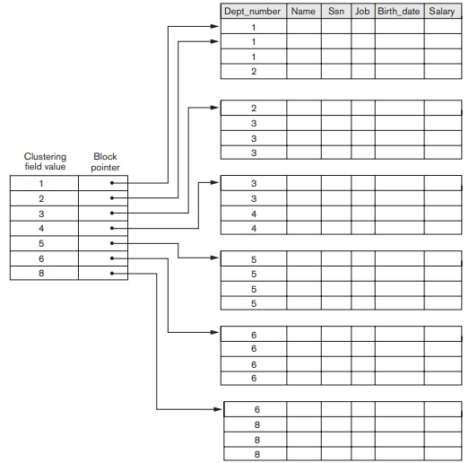
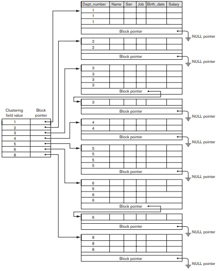

## [Tópico 15] - Estruturas de indexação (3/9)
###### *by Prof. Plinio Sa Leitao-Junior (INF/UFG)*

### <ins>CONTEÚDO</ins>

|_Item do conteúdo_|_Item do conteúdo_|
|-|-|
|1. Visão geral|4. Índice secundário|
|2. Índice primário|5. Índice multinível|
|3. <ins>**ÍNDICE DE AGRUPAMENTO**</ins>|6. Índice em árvore|

### 3. <ins>ÍNDICE DE AGRUPAMENTO (_CLUSTERING INDEX_)</ins>

**IMPORTANTE.** 
Um <ins>índice de agrupamento</ins> (_clustering index_) pode ser criado para um arquivo de dados quando:
- O arquivo de dados é um <ins>arquivo ordenado</ins>.
- O <ins>campo de ordenação</ins> do arquivo de dados <ins>não possui a restrição de valor único</ins> para cada registro:
  - o campo de ordenação não é chave de ordenação;
  - o campo de ordenação é também referenciado como <ins>campo de agrupamento</ins>;
  - ou seja, os registros do arquivo de dados estão fisicamente ordenados com respeito a um campo não-chave.
- <ins>O campo de indexação do arquivo do índice é o campo de ordenação do arquivo de dados</ins>.

Um <ins>**índice de agrupamento**</ins> é um <ins>arquivo ordenado</ins>:
- É um arquivo com registros de comprimento fixo.
- Cada registro possui com dois campos:
  - um <ins>valor</ins> [com o mesmo domínio] do campo de ordenação;
  - um ponteiro para um bloco de disco (um endereço de bloco do arquivo de dados).
- Dessa forma, cada <ins>entrada (registro)</ins> na posição **i** (i-ésimo registro do arquivo):
  - **< K(i), P(i) >**, onde:
    - **_K(i)_** é um valor do campo de indexação,
    - **_P(i)_** é um endereço físico de um bloco (ou página) no arquivo de dados.

A figura abaixo ressalta um <ins>índice de agrupamento</ins> (à esq.): 
&#x267B; O campo de ordenação (campo de agrupamento) é _Dept_number_. 
&#x267B; Há vários registros de dados (à dir.) para um mesmo valor de _Dept_number_. 
&#x267B; Há uma entrada no índice de agrupamento (à esq) para cada valor distinto do campo de agrupamento [no arquivo de dados]. 
&#x267B; Cada valor de ponteiro de bloco (à esq.): 
&nbsp;&nbsp;&nbsp;&nbsp;&nbsp;&nbsp;&#x26BE; ... referencia o <ins>primeiro bloco de dados</ins> (à dir.) que tem registro(s) com o valor do campo de agrupamento; 
&nbsp;&nbsp;&nbsp;&nbsp;&nbsp;&nbsp;&#x26BE; ... por exemplo, registros com _Dept_number = 2_ ocupam dois blocos, 
&nbsp;&nbsp;&nbsp;&nbsp;&nbsp;&nbsp;&nbsp;&nbsp;&nbsp;&nbsp;&nbsp;&nbsp;&nbsp;&nbsp;&nbsp;&nbsp;&nbsp;&nbsp; ... mas o ponteiro do índice referencia o primeiro desses blocos.

&nbsp;&nbsp;&nbsp;&nbsp;&nbsp;&nbsp;&nbsp;&nbsp;&nbsp;&nbsp;&nbsp;&nbsp;

> QUESTÕES: 
>> Como lidar com as atualizações de registros e ainda manter o arquivo de dados (e o arquivo de índice) ordenado?  
>> A estratégia na figura abaixo torna os algoritmos de inclusão e de exclusão de registros mais simples?  
>> O índice de agrupamento é um índice denso ou um índice esparso?

&nbsp;&nbsp;&nbsp;&nbsp;&nbsp;&nbsp;&nbsp;&nbsp;&nbsp;&nbsp;&nbsp;&nbsp;

#### Exercício

**1a. Questão)** Suponha que um arquivo ordenado possui r = 300.000 registros, que estão gravados em um disco com bloco de tamanho B = 4096 bytes. O arquivo está ordenado pelo campo CEP (Código de Endereçamento Postal), e há cerca 1000 CEPs distintos nos registros do arquivo (média de 300 registros por CEP, assumindo distribuição uniforme entre CEPs). Suponha que há um índice de agrupamento: 
&nbsp;&nbsp;&nbsp;&nbsp;&nbsp;&nbsp;_(i)_ a chave de ordenação do arquivo de dados tem V = 5 bytes de comprimento, e 
&nbsp;&nbsp;&nbsp;&nbsp;&nbsp;&nbsp;_(ii)_ um ponteiro de bloco tem P = 6 bytes de comprimento. 
Determine: 
(a) O tamanho **Ri** de cada entrada (registro) no arquivo de índice de agrupamento. 
(b) O fator de bloco **bfri** do arquivo de índice de agrupamento. 
(c) O número total de entradas (registros) **ri** no arquivo de índice de agrupamento. 
(d) O número de blocos **bi** do arquivo de índice de agrupamento. 
(e) O custo **ci** da busca binária no arquivo de índice de agrupamento. 
(f) O custo **cdados** para localizar os registros de dados, via busca binária no arquivo de índice de agrupamento. 
(g) Quantos bytes ocuparia a estrutura completa de índice de agrupamento? É possível ter essa estrutura em memória?  

[Uma solução](./topico-15solucao-01.md)
