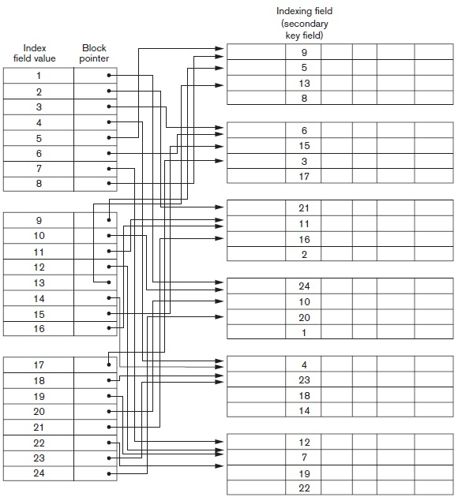

## [Tópico 16] - Estruturas de indexação (4/9)
###### *by Prof. Plinio Sa Leitao-Junior (INF/UFG)*

### <ins>CONTEÚDO</ins>

|_Item do conteúdo_|_Item do conteúdo_|
|-|-|
|1. Visão geral|4. <ins>**ÍNDICE SECUNDÁRIO (1/2)**</ins>|
|2. Índice primário|5. Índice multinível|
|3. Índice de agrupamento|6. Índice em árvore|

### 4. <ins>ÍNDICE SECUNDÁRIO (1/2)</ins>

**IMPORTANTE.** 
Sobre a criação de <ins>índices secundários</ins>, valem as seguintes observações:
- O termo _secundário_ denota que, possivelmente, o arquivo de dados <ins>possui algum método de acesso primário</ins>.
- O arquivo de dados pode ser um <ins>arquivo não ordenado</ins>, um <ins>arquivo sequencial</ins>, ou um <ins>arquivo _hashing_</ins>.
- O campo de indexação [do índice secundário] não é o campo de ordenação do arquivo de dados (caso este seja ordenado).
- O campo de indexação [do índice secundário] pode ser:
  - um <ins>campo com valor exclusivo</ins> no arquivo de dados (por exemplo, uma chave candidata); OU
  - um campo <ins>com valores possivelmente repetidos</ins> no arquivo de dados (por exemplo, um campo não-chave).
- Vários índices secundários podem ser criados para um mesmo arquivo de dados:
  - ... diferentemente dos índices primários e de agrupamento.

Um <ins>**índice secundário**</ins> é um <ins>arquivo ordenado</ins>:
- É um arquivo com registros de comprimento fixo.
- Cada registro possui com dois campos &#8213; **< K(i), P(i) >** &#8213; onde **i** refere-se ao i-ésimo registro do arquivode índice:
  - **K(i)** é um <ins>valor</ins> [com o mesmo domínio] do campo de indexação;
  - **P(i)** é um <ins>ponteiro</ins> para:
    - um bloco (ou seja, um endereço de bloco do arquivo de dados); OU
    - um registro (ou seja, um endereço de registro do arquivo de dados).

#### &#x267B;&#x26BE;&#x270D; <ins>ÍNDICE SECUNDÁRIO &#8213; CAMPO DE INDEXAÇÃO COM VALOR ÚNICO</ins>

O campo de indexação possui valor único entre os registros de dados:
- Tal corresponde na DDL da SQL a:
  - atributos com a restrição da cláusula UNIQUE; ou
  - atributo [ou composição de atributos] com a restrição da cláusula PRIMARY KEY.
- O ponteiro **P(i)** no i-ésimo registro do arquivo de índice é um <ins>ponteiro de bloco</ins>:
  - ... o bloco possui (armazena) o registro de dados da busca;
  - por que ponteiro de bloco, em vez de ponteiro de registro?
- O índice secundário é um <ins>índice denso</ins> (!?), conforme a figura abaixo (!?).
  - por que o índice secundário é um índice denso?
    - os registros do arquivo de dados não são ordenados fisicamente pelos valores do campo de ordenação,
    - ..... não é possível ter (usar) registros que são âncora de bloco, diferentemente de índices primários.

&nbsp;&nbsp;&nbsp;&nbsp;&nbsp;&nbsp;&nbsp;&nbsp;&nbsp;&nbsp;&nbsp;&nbsp;

#### Exercício

**1a. Questão)** Suponha um arquivo com r = 300.000 registros de tamanho fixo (R = 100 bytes), que estão gravados em um disco com bloco de tamanho B = 4096 bytes. Os registros estão distribuídos em 7500 blocos de disco. Suponha que há um índice secundário: 
&nbsp;&nbsp;&nbsp;&nbsp;&nbsp;&nbsp;_(i)_ a <ins>chave de indexação</ins> **K** do arquivo de índice tem 9 bytes de comprimento, e 
&nbsp;&nbsp;&nbsp;&nbsp;&nbsp;&nbsp;_(ii)_ o ponteiro de bloco **P** tem 6 bytes de comprimento. 
Considere uma busca por um <ins>registro existente</ins> no arquivo de dados, cujo predicado é **K = \<valor\>**. Determine: 

(a) O custo médio **c** da busca no arquivo de dados (busca linear). 
(b) O comprimento **Ri** do registro do arquivo de índice secundário. 
(c) O fator de bloco **bfri** do arquivo de índice secundário. 
(d) O número total de entradas (registros) **ri** no arquivo de índice secundário. 
(e) O número de blocos **bi** do arquivo de índice secundário. 
(f) O custo **ci** da busca binária no arquivo de índice secundário. 
(g) O custo **cdados** para localizar o registro de dados, via busca binária no arquivo de índice secundário. 
(h) Compare o custo da busca via o índice secundário com: 
&nbsp;&nbsp;&nbsp;&nbsp;&nbsp;&nbsp;_(i)_ busca linear no arquivo de dados; e 
&nbsp;&nbsp;&nbsp;&nbsp;&nbsp;&nbsp;_(ii)_ busca via o arquivo de índice primário (ver [Tópico 14](./topico-14.md)).

[Uma solução](./topico-16solucao-01.md)
