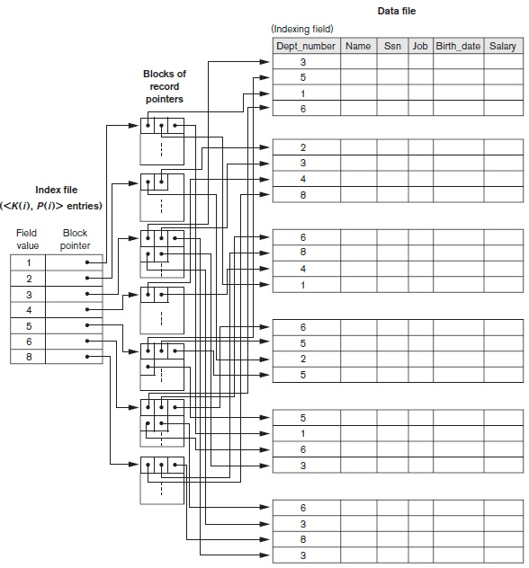

## [Tópico 17] - Estruturas de indexação (5/9)
###### *by Prof. Plinio Sa Leitao-Junior (INF/UFG)*

### <ins>CONTEÚDO</ins>

|_Item do conteúdo_|_Item do conteúdo_|
|-|-|
|1. Visão geral|4. <ins>**ÍNDICE SECUNDÁRIO (2/2)**</ins>|
|2. Índice primário|5. Índice multinível|
|3. Índice de agrupamento|6. Índice em árvore|

### 4. <ins>ÍNDICE SECUNDÁRIO (2/2)</ins>

#### &#x267B;&#x26BE;&#x270D; <ins>ÍNDICE SECUNDÁRIO &#8213; CAMPO DE INDEXAÇÃO COM VALOR NÃO-ÚNICO</ins>

Vários registros no arquivo de dados podem ter o mesmo valor para o campo de indexação. 
Opções de implementação:

&#9745;&#9745; **<ins>OPÇÃO 1:<ins>** ... Um índice denso ... 
&#9888; Ha <ins>uma entrada de índice para cada registro de dados</ins>, apesar do valor do campo de indexação permitir repetição. 
&nbsp;&nbsp;&nbsp;&nbsp;&nbsp;&nbsp; ... ponteiro de registro ... 
&#9888; A pesquisa binária é possível? Requer adaptação? 
 

&#9745;&#9745; **<ins>OPÇÃO 2:<ins>** ... Um índice com registro de tamanho variável ... 
&#9888; As entradas do índice são <ins>registros de comprimento variável</ins>, pois há um <ins>campo de repetição para ponteiros de dados</ins>: 
&nbsp;&nbsp;&nbsp;&nbsp;&nbsp;&nbsp; ... uma lista de ponteiros **\< P(i, 1), … , P(i, m) \>** no registro do índice para **K(i)** ... 
&nbsp;&nbsp;&nbsp;&nbsp;&nbsp;&nbsp; ... um ponteiro para cada bloco que contém um ou mais registros que têm esse valor do campo de indexação **K(i)**. 
&#9888; Pode ser considerado um índice denso ou esparso? 
&#9888; A pesquisa binária é possível? Requer adaptação? 
 

&#9745;&#9745; **<ins>OPÇÃO 3:<ins>** ... Nível extra de indireção ... Alternativa mais usual ... 
&#9888; Há uma [único] registro no arquivo de índice para cada valor [distinto] do campo de indexação, e esse registro possui um ponteiro para ... 
&nbsp;&nbsp;&nbsp;&nbsp;&nbsp;&nbsp; ... um bloco que tem ponteiros para cada dos registros que têm esse valor do campo de indexação ... 
&nbsp;&nbsp;&nbsp;&nbsp;&nbsp;&nbsp; ... ver figura abaixo. 
&#9888; O <ins>nível extra de indireção</ins> (coluna central de blocos na figura) possui blocos com ponteiros de registro. 
&#9888; A recuperação através do índice requer um [ou mais] (por que mais de um?) acessos de bloco adicionais devido ao nível extra. 
&#9888; Os algoritmos de pesquisa e de inserção de dados são simples. 
&#9888; O algoritmo de pesquisa binária é diretamente aplicável ao arquivo de índice (arquivo ordenado). 
&#9888; Descreva um algortmo para busca de intervalo: 
&nbsp;&nbsp;&nbsp;&nbsp;&nbsp;&nbsp; ... recuperação de registros onde V1 ≤ K ≤ V2; 
&nbsp;&nbsp;&nbsp;&nbsp;&nbsp;&nbsp; ... uma operação de união pode ser usada nos conjuntos de ponteiros de bloco, 
&nbsp;&nbsp;&nbsp;&nbsp;&nbsp;&nbsp;&nbsp;&nbsp;&nbsp;&nbsp;&nbsp;&nbsp; ... correspondentes às entradas de V1 a V2 no índice?

&nbsp;&nbsp;&nbsp;&nbsp;&nbsp;&nbsp;&nbsp;&nbsp;&nbsp;&nbsp;&nbsp;&nbsp;

#### Exercício

Seja um arquivo não ordenado com r = 30.000 registros, que estão gravados em um disco com bloco de tamanho B = 512 bytes. Suponha um índice secundário, cuja chave de indexação é o campo CEP (campo não-chave), onde sua implementação emprega um nível extra de indireção para armazenar ponteiros de registro (Opção 3). Suponha, também, que existam 1.000 valores distintos de CEP e que os registros do arquivo estejam distribuídos uniformemente entre esses valores. Sobre o índice secundário: 
&nbsp;&nbsp;&nbsp;&nbsp;&nbsp;&nbsp;_(i)_ a <ins>campo de indexação</ins> **CEP** tem 9 bytes de comprimento, e 
&nbsp;&nbsp;&nbsp;&nbsp;&nbsp;&nbsp;_(ii)_ o ponteiro de bloco **Pb** ocupa 6 bytes, ponteiro de registro **Pr** ocupa 7 bytes.

Seja uma busca por <ins>registros existentes</ins> no arquivo de dados, cujo predicado é **CEP = \<valor\>**. Determine: 
(a) O tamanho de registro **Ri** do [arquivo de] índice secundário. 
(b) O fator de bloco **bfri** do índice secundário. 
(c) Número de registros **ri** do índice secundário. 
(d) Número de blocos **bi** do índice secundário. 
(e) Núméro médio de registros **rk** por valor do campo de indexação do índice secundário. 
(f) Número de bytes **nind** no nível de indireção para cada valor do campo de indexação do índice secundário. 
(g) Número de blocos **bind** no nível de indireção do índice secundário. 
(h) Número de blocos do [arquivo de] índice secundário. 
(i) Custo **ci** da busca via o índice secundário, no pior caso. 

[Uma solução](./topico-17solucao-01.md)
