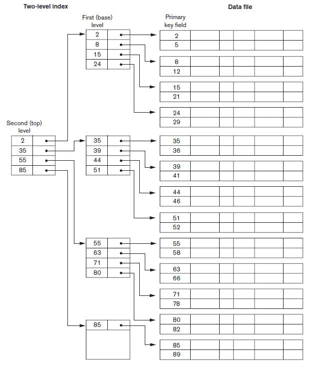

## [Tópico 18] - Estruturas de indexação (6/9)
###### *by Prof. Plinio Sa Leitao-Junior (INF/UFG)*

### <ins>CONTEÚDO</ins>

|_Item do conteúdo_|_Item do conteúdo_|
|-|-|
|1. Visão geral|4. Índice secundário|
|2. Índice primário|5. <ins>**ÍNDICE MULTINÍVEL**</ins>|
|3. Índice de agrupamento|6. Índice em árvore|

#### &#x270D;&#9745; <ins>REVISÃO</ins> &#8212; TIPO DE ÍNDICE BASEADO NAS PROPRIEDADES DO CAMPO DE INDEXAÇÃO

||campo de indexação **&#61;** campo de ordenação (a)|campo de indexação **&#8800;** campo de ordenação (a)|
|-|-|-|
|Campo de indexação **&#61;** campo chave|ÍNDICE PRIMÁRIO|ÍNDICE SECUNDÁRIO|
|Campo de indexação **&#61;** campo não-chave|ÍNDICE DE AGRUPAMENTO|ÍNDICE SECUNDÁRIO|

(a) Ordenação do arquivo de dados. 

#### &#x270D;&#9745; <ins>REVISÃO</ins> &#8212; PROPRIEDADES DE TIPOS DE ÍNDICE

|Tipo de índice|Número de entradas no arquivo de índice|Se denso ou esparso|Usa registro âncora? (a)|
|-|-|-|-|
|PRIMÁRIO|Número de blocos do arquivo de dados|esparso|sim|
|AGRUPAMENTO|Número de valores distintos do campo de indexação|esparso|sim (b) _ou_ não (c)|
|SECUNDÁRIO campo chave (d)|Número de registros do arquivo de dados|denso|não|
|SECUNDÁRIO campo não-chave (e)|Número de registros do arquivo de dados (f) _ou_ Número de valores distintos do campo de indexação (g)|denso (f) _ou_ esparso (g)|não|

(a) Registro âncora de cada bloco no arquivo de dados. 
(b) Se cada valor distinto do campo de ordenação é iniciado (alocado) em um novo bloco. 
(c) Se um mesmo bloco acomodar distintos valores do campo de ordenação. 
(d) Campo de indexação é campo chave. 
(e) Campo de indexação é campo não-chave. 
(f) Opção 1 no [Tópico 17](./topico-17.md). 
(g) Opções 2 e 3 no [Tópico 17](./topico-17.md). 

### 5. <ins>ÍNDICE MULTINÍVEL</ins>

Um <ins>índice múltinível</ins> pode ser pensado como <ins>índice sobre índice</ins> &#8213; vários índices organizados em <ins>níveis</ins>:
- O <ins>índice de 1o nível</ins> é o índice que estudamos até então, ou seja, um arquivo ordenado:
  - pode ser índice primário, índice de agrupamento ou índice secundário,
  - desde que: _(i)_ o índice tenha valores distintos para K(i); e _(ii)_ os registros do índice sejam de tamanho fixo.
- O <ins>índice de 2o nível</ins> indexa o índice de 1o nível:
  - o índice de 1o nível faria o papel do arquivo de dados (arquivo ordenado);
  - o índice de 2o nível similar a um índice primário.
- O <ins>índice de 3o nível</ins> indexa o índice de 2o nível:
  - o índice de 2o nível faria o papel do arquivo de dados (arquivo ordenado);
  - o índice de 3o nível similar a um índice primário.
- _and so on_ ...

O número de registros do <ins>índice de nível j </ins> (j>1) é o número de blocos do <ins>índice de nível j-1</ins>:
- Por ser similar a índice primário, o <ins>índice de nível j </ins> baseia-se no registro âncora de cada bloco do <ins>índice de nível j-1</ins>.
- Exemplos: ri2 = bi1 , ri3 = bi2 , ri4 = bi3 , _and so on_ ...
- Ver figura a seguir (no exemplo, o <ins>índice de 1o nível</ins> é um índice primário):
  - _That's a two-level primary index resembling **ISAM** (indexed sequential access method) organization_.

&nbsp;&nbsp;&nbsp;&nbsp;&nbsp;&nbsp;&nbsp;&nbsp;&nbsp;&nbsp;&nbsp;&nbsp;

#### Exercício

Seja o índice secundário do exercício presente no [Tópico 16](./topico-16.md), conforme os dados abaixo: 
&nbsp;&nbsp;&nbsp;&nbsp;&nbsp;&nbsp; Fator de bloco do índice &#8213; bfri = 273 entradas (registros) por bloco 
&nbsp;&nbsp;&nbsp;&nbsp;&nbsp;&nbsp; Número de blocos do índice &#8213; bi = 1.099 blocos 

Se o índice secundário for convertido para um índice multinível (o índice secundário seria índice de **1o** nível), determine: 
(a) O número de blocos de índice de **2o** nível. 
(b) O número de blocos de índice de **3o** nível. 
(c) A número de níveis **t** para o índice multinível. 
(d) O custo **cdados** para acessar um registro de dados via o índice multinível. 
(e) Compare com o custo de acesso ao registro de dados via o índice de único nível.

[Uma solução](./topico-18solucao-01.md)
