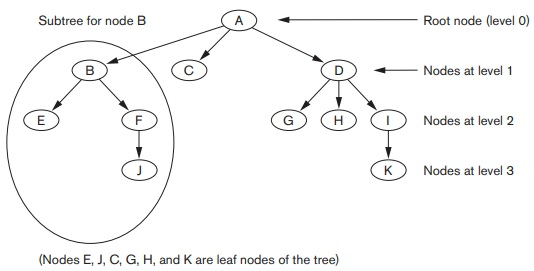
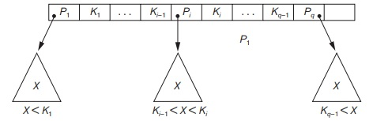
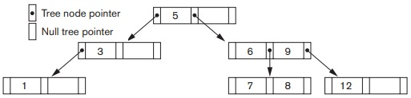

## [Tópico 19] - Estruturas de indexação (7/9)
###### *by Prof. Plinio Sa Leitao-Junior (INF/UFG)*

### <ins>CONTEÚDO</ins>

|_Item do conteúdo_|_Item do conteúdo_|
|-|-|
|1. Visão geral|4. Índice secundário|
|2. Índice primário|5. Índice multinível|
|3. Índice de agrupamento|6. <ins>**ÍNDICE EM ÁRVORE (1/3)**</ins>|

### 6. <ins>ÍNDICE EM ÁRVORE (1/3)</ins>

As estruturas orientadas por árvore são estudadas e empregadas em muitas das soluções baseadas em software.

#### &#9752; ESTRUTURAS EM ÁRVORE &#8212; <ins>BREVE TERMINOLOGIA</ins>

&#x270D; <ins>**Árvore**</ins> &#8212; Estrutura formada por nós: 
&nbsp;&nbsp;&nbsp;&nbsp;&nbsp;&nbsp; &#10004; define uma <ins>hierarquia</ins> ... desde o <ins>nó raiz</ins>, até os <ins>nós folhas</ins>. 
&#x270D; <ins>**Nó raiz**</ins> &#8212; Nó singular na árvore: 
&nbsp;&nbsp;&nbsp;&nbsp;&nbsp;&nbsp; &#10004; qualquer nó tem um <ins>nó pai</ins>, exceto o nó raiz. 
&#x270D; <ins>**Nós folhas**</ins> &#8212; Nós sem descendentes: 
&nbsp;&nbsp;&nbsp;&nbsp;&nbsp;&nbsp; &#10004; qualquer nó tem um ou mais <ins>nós filhos</ins>, exceto os nós folhas. 
&#x270D; <ins>**Nós internos**</ins> &#8212; Nós que possuem filhos: 
&nbsp;&nbsp;&nbsp;&nbsp;&nbsp;&nbsp; &#10004; qualquer nó é um nó interno, exceto os nós folhas. 
&#x270D; <ins>**Nível do nó**</ins> &#8212; O nível de um nó é sempre um a mais que o nível de seu pai: 
&nbsp;&nbsp;&nbsp;&nbsp;&nbsp;&nbsp; &#10004; o nível do nó raiz é 0 (zero). 
&#x270D; <ins>**Subárvode de um nó**</ins> &#8212; Uma subárvore de um nó consiste naquele nó e todos os seus descendentes: 
&nbsp;&nbsp;&nbsp;&nbsp;&nbsp;&nbsp; &#10004; seus nós filhos, os nós filhos de seus nós filhos e assim por diante. 
&#x270D; Os conceitos estão ilustrados na figura abaixo.

&nbsp;&nbsp;&nbsp;&nbsp;&nbsp;&nbsp;&nbsp;&nbsp;&nbsp;&nbsp;&nbsp;&nbsp;

#### &#9752; ESTRUTURAS EM ÁRVORE &#8212; <ins>ÁRVORE DE BUSCA</ins>

&#x26BE; <ins>Índices multiníveis</ins> definem uma estrutura hierarquica de busca: 
&nbsp;&nbsp;&nbsp;&nbsp;&nbsp;&nbsp;&#10004; Os valores dos campos de indexação (em cada nó &#8212; bloco) nos guiam para o próximo nó, 
&nbsp;&nbsp;&nbsp;&nbsp;&nbsp;&nbsp;&nbsp;&nbsp;&nbsp;&nbsp;&nbsp;&nbsp; ... até chegarmos ao bloco do arquivo de dados, que contém os registros pesquisados. 
&nbsp;&nbsp;&nbsp;&nbsp;&nbsp;&nbsp;&#10004; Seguindo um ponteiro, restringimos nossa pesquisa em cada nível [do índice] a uma subárvore, 
&nbsp;&nbsp;&nbsp;&nbsp;&nbsp;&nbsp;&nbsp;&nbsp;&nbsp;&nbsp;&nbsp;&nbsp; ... determinando um <ins>caminho</ins> até os blocos de dados. 
&nbsp;&nbsp;&nbsp;&nbsp;&nbsp;&nbsp;&#10004; <ins>**Índices multiníveis podem ser considerados como uma variação de uma árvore de busca**</ins>.

&#x270D; <ins>**Árvores de busca**</ins> são usadas para orientar a pesquisa de um registro, dado o valor de um dos campos do registro: 
&nbsp;&nbsp;&nbsp;&nbsp;&nbsp;&nbsp;&#10004; Uma <ins>árvore de busca de ordem **p**</ins> é uma árvore tal que cada nó contém, <ins>no máximo</ins>: 
&nbsp;&nbsp;&nbsp;&nbsp;&nbsp;&nbsp;&nbsp;&nbsp;&nbsp;&nbsp;&nbsp;&nbsp;&nbsp;&nbsp;&nbsp;&nbsp;&nbsp;&nbsp; **p − 1** valores de busca e 
&nbsp;&nbsp;&nbsp;&nbsp;&nbsp;&nbsp;&nbsp;&nbsp;&nbsp;&nbsp;&nbsp;&nbsp;&nbsp;&nbsp;&nbsp;&nbsp;&nbsp;&nbsp; **p** ponteiros, 
&nbsp;&nbsp;&nbsp;&nbsp;&nbsp;&nbsp;&#10004; A <ins>estrutura de cada nó</ins> é:  &nbsp;&nbsp;&nbsp;&nbsp;&nbsp;&nbsp;&nbsp;&nbsp;&nbsp;&nbsp;&nbsp;&nbsp;&nbsp;&nbsp;&nbsp;&nbsp;&nbsp;&nbsp; \< P1, K1, P2, K2, P3, K3, ... , Pq−1, Kq−1, Pq \>, onde **q &#8804; p**, 
&nbsp;&nbsp;&nbsp;&nbsp;&nbsp;&nbsp;&nbsp;&nbsp;&nbsp;&nbsp;&nbsp;&nbsp;&nbsp;&nbsp;&nbsp;&nbsp;&nbsp;&nbsp; **Pi** é um ponteiro para um nó filho (ou um ponteiro NULL), 
&nbsp;&nbsp;&nbsp;&nbsp;&nbsp;&nbsp;&nbsp;&nbsp;&nbsp;&nbsp;&nbsp;&nbsp;&nbsp;&nbsp;&nbsp;&nbsp;&nbsp;&nbsp; **Ki** é um valor de pesquisa de algum conjunto ordenado de valores, 
&nbsp;&nbsp;&nbsp;&nbsp;&nbsp;&nbsp;&nbsp;&nbsp;&nbsp;&nbsp;&nbsp;&nbsp;&nbsp;&nbsp;&nbsp;&nbsp;&nbsp;&nbsp;&nbsp;&nbsp;&nbsp;&nbsp;&nbsp;&nbsp;<ins>todos os valores de pesquisa **Ki** são considerados únicos</ins>. 
&nbsp;&nbsp;&nbsp;&nbsp;&nbsp;&nbsp;&#10004; <ins>Duas restrições</ins> são aplicadas à arvore de busca: 
&nbsp;&nbsp;&nbsp;&nbsp;&nbsp;&nbsp;&nbsp;&nbsp;&nbsp;&nbsp;&nbsp;&nbsp;&nbsp;&nbsp;&nbsp;&nbsp;&nbsp;&nbsp; <ins>**(i)**</ins> dentro do nó &#8212; K1 < K2 < ... < Kq−1 
&nbsp;&nbsp;&nbsp;&nbsp;&nbsp;&nbsp;&nbsp;&nbsp;&nbsp;&nbsp;&nbsp;&nbsp;&nbsp;&nbsp;&nbsp;&nbsp;&nbsp;&nbsp; <ins>**(ii)**</ins> para todos os valores **X** na subárvore apontada por **Pi**  (**1 &#8804; i &#8804; q**): 
&nbsp;&nbsp;&nbsp;&nbsp;&nbsp;&nbsp;&nbsp;&nbsp;&nbsp;&nbsp;&nbsp;&nbsp;&nbsp;&nbsp;&nbsp;&nbsp;&nbsp;&nbsp;&nbsp;&nbsp;&nbsp;&nbsp;&nbsp;&nbsp;se <ins>1 < i < q </ins>, então **Ki−1 < X < Ki** 
&nbsp;&nbsp;&nbsp;&nbsp;&nbsp;&nbsp;&nbsp;&nbsp;&nbsp;&nbsp;&nbsp;&nbsp;&nbsp;&nbsp;&nbsp;&nbsp;&nbsp;&nbsp;&nbsp;&nbsp;&nbsp;&nbsp;&nbsp;&nbsp;se <ins>i = 1 </ins>, então **X < Ki** 
&nbsp;&nbsp;&nbsp;&nbsp;&nbsp;&nbsp;&nbsp;&nbsp;&nbsp;&nbsp;&nbsp;&nbsp;&nbsp;&nbsp;&nbsp;&nbsp;&nbsp;&nbsp;&nbsp;&nbsp;&nbsp;&nbsp;&nbsp;&nbsp;se <ins>i = q </ins>, então **Ki−1 < X** 
&nbsp;&nbsp;&nbsp;&nbsp;&nbsp;&nbsp;&#10004; Ver figura abaixo: restrições (à esq.); árvore de busca de ordem p=3 (à dir).

&nbsp;&nbsp;&nbsp;&nbsp;

#### &#9752; ÁRVORE de BUSCA &#8212; <ins>REQUISITOS</ins>

**Minimizar o número de níveis na árvore.** 
&#x26BE; O nível de uma árvore de busca é considerado o <ins>maior nível de nó</ins>, dentre os nós da árvore: 
&nbsp;&nbsp;&nbsp;&nbsp;&nbsp;&nbsp; ... reduzir a profundidade da árvore, 
&nbsp;&nbsp;&nbsp;&nbsp;&nbsp;&nbsp; ... diminuir a distância entre o nó raiz e qualquer nó folha. 
&#x26BE; Essa redução evita que a árvore torne-se desbalanceada: 
&nbsp;&nbsp;&nbsp;&nbsp;&nbsp;&nbsp; ... nós folha em níveis distintos entre si. 
&#x26BE; O balanceamento da árvore torna a 'velocidade de pesquisa' uniforme: 
&nbsp;&nbsp;&nbsp;&nbsp;&nbsp;&nbsp; ... o tempo médio para encontrar qualquer chave aleatória seja aproximadamente o mesmo.

**Minimizar a necessidade de reestruturação (reorganização) da árvore.** 
&#x26BE; O emprego de algoritmos para que a árvore não precise de muita reestruturação à medida que os registros são inseridos e excluídos: 
&nbsp;&nbsp;&nbsp;&nbsp;&nbsp;&nbsp; ... nas inclusões, promover que nós estejam tão cheios quanto possível; 
&nbsp;&nbsp;&nbsp;&nbsp;&nbsp;&nbsp; ... nas exclusões, evitar nós com poucas chaves, ou mesmo vazios.

#### &#9752; ÁRVORE de BUSCA &#8212; <ins>ESTRUTURA EM MEMÓRIA SECUNDÁRIA</ins>

&#x26BE; Uma árvore de pesquisa é um mecanismo para pesquisar registros armazenados em um arquivo de disco. 
&#x26BE; Os valores na árvore podem ser os valores de um dos campos de indexação do arquivo: 
&nbsp;&nbsp;&nbsp;&nbsp;&nbsp;&nbsp; ... a árvore implementa um dos índices. 
&#x26BE; Cada valor na árvore está associado a um ponteiro para os dados: 
&nbsp;&nbsp;&nbsp;&nbsp;&nbsp;&nbsp; ... ponteiro de registro [ou de bloco] para o arquivo de dados. 
&#x26BE; A própria árvore de pesquisa pode ser armazenada em disco: 
&nbsp;&nbsp;&nbsp;&nbsp;&nbsp;&nbsp; ... cada nó da árvore é um bloco de disco. 
&#x26BE; Quando um novo registro é inserido no arquivo: 
&nbsp;&nbsp;&nbsp;&nbsp;&nbsp;&nbsp; ... um novo valor do campo de indexação é inserido na árvore, 
&nbsp;&nbsp;&nbsp;&nbsp;&nbsp;&nbsp; ... bem como um ponteiro para os dados.

