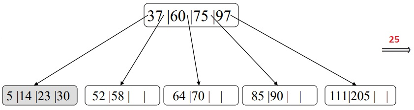

## [Tópico 20] - Estruturas de indexação (8/9)
###### *by Prof. Plinio Sa Leitao-Junior (INF/UFG)*

### <ins>CONTEÚDO</ins>

|_Item do conteúdo_|_Item do conteúdo_|
|-|-|
|1. Visão geral|4. Índice secundário|
|2. Índice primário|5. Índice multinível|
|3. Índice de agrupamento|6. <ins>**ÍNDICE EM ÁRVORE (2/3)**</ins>|

### 6. <ins>ÍNDICE EM ÁRVORE (2/3)</ins>

**`Árvores de Busca`** impõem restrições às estruturas tradicionais em árvore, tal como posto no [Tópico 19](./topico-19.md): 
&#10004; Por exemplo, ver a estrutura interna de cada nó da árvore de busca.

Contudo, <ins>novas restrições são necessárias</ins> para lidar com os desafios apresentados no [Tópico 19](./topico-19.md), a saber: 
&#9888; Minimizar o número de níveis na árvore (balanceamento!?). 
&#9888; Minimizar a necessidade de reestruturação (reorganização) da árvore.

### &#x270D;&#x270D;&#x270D; `ÍNDICE EM ÁRVORE` &#8212; <ins>`ÁRVORE B`</ins>

A **`Árvore B`** possui restrições adicionais às árvores de busca, visando a lidar com ambos os desafios acima: 
&#9745; Os algoritmos de inserção e exclusão, porém, tornam-se mais complexos. 
&#9745; A maioria das inserções e exclusões são processos simples, mas 
&nbsp;&nbsp;&nbsp;&nbsp;&nbsp;&nbsp;&nbsp;&nbsp;&nbsp;&nbsp;&nbsp;&nbsp; se tornam complicados apenas em circunstâncias especiais:, 
&nbsp;&nbsp;&nbsp;&nbsp;&nbsp;&nbsp;&nbsp;&nbsp;&nbsp;&nbsp;&nbsp;&nbsp; ..... uma inserção em um nó que já está cheio, ou 
&nbsp;&nbsp;&nbsp;&nbsp;&nbsp;&nbsp;&nbsp;&nbsp;&nbsp;&nbsp;&nbsp;&nbsp; ..... uma exclusão de um nó que o deixa menos da metade cheio.

&#9752;&#9752; Seja uma **`ÁRVORE B DE ORDEM p`**:

&#9918; Cada **<ins>NÓ (INTERNO e FOLHA)</ins>** possui a **`ESTRUTURA`**:

|P|Dados|P|Dados| ... | ... |P|Dados|P|
|-|-|-|-|-|-|-|-|-|
|P1|_&#8249;&#8249; K1 , Pr1 &#8250;&#8250;_|P2|_&#8249;&#8249; K2 , Pr2 &#8250;&#8250;_| ... | ... |Pq-1|_&#8249;&#8249; Kq-1 , Prq-1 &#8250;&#8250;_|Pq|

Onde: 
&nbsp;&nbsp;&nbsp;&nbsp;&nbsp;&nbsp;&nbsp;&nbsp;&nbsp;&nbsp;&nbsp;&nbsp;Como  árvore de ordem **p**, então **q &#8924; p** 
&nbsp;&nbsp;&nbsp;&nbsp;&nbsp;&nbsp;&nbsp;&nbsp;&nbsp;&nbsp;&nbsp;&nbsp;Cada **Pi** é um ponteiro de árvore: 
&nbsp;&nbsp;&nbsp;&nbsp;&nbsp;&nbsp;&nbsp;&nbsp;&nbsp;&nbsp;&nbsp;&nbsp;&nbsp;&nbsp;&nbsp;&nbsp;&nbsp;&nbsp;... um ponteiro para outro nó na árvore B. 
&nbsp;&nbsp;&nbsp;&nbsp;&nbsp;&nbsp;&nbsp;&nbsp;&nbsp;&nbsp;&nbsp;&nbsp;Cada **Pri** é um ponteiro de dados: 
&nbsp;&nbsp;&nbsp;&nbsp;&nbsp;&nbsp;&nbsp;&nbsp;&nbsp;&nbsp;&nbsp;&nbsp;&nbsp;&nbsp;&nbsp;&nbsp;&nbsp;&nbsp;... um ponteiro de dados (ponteiro de registro ou de bloco !?) cujo valor do <ins>campo-chave de pesquisa</ins> é igual a **Ki**.

&#9918; Cada **<ins>NÓ INTERNO</ins>** possui as **`RESTRIÇÕES`**:

&#9745; K1 < K2 < … < Kq−1. 
&#9745; &#8704; X : X &#8712; { valores do campo-chave de pesquisa na subárvore apontada por Pi } 

|Cenário|Restrição|
|-|-|
|i = 1|X < Ki|
|1 < i < q|Ki−1 < X < Ki|
|i = q|Ki−1 < X|

&nbsp;&nbsp;&nbsp;&nbsp;&nbsp;&nbsp; ... para i = 1: X < Ki 
&nbsp;&nbsp;&nbsp;&nbsp;&nbsp;&nbsp; ... para 1 < i < q: Ki−1 < X < Ki 
&nbsp;&nbsp;&nbsp;&nbsp;&nbsp;&nbsp; ... para i = q: Ki−1 < X

&#9745; Cada nó possui <ins>no máximo **p** ponteiros</ins> de árvore. 
&#9745; Cada nó, exceto os nós raiz e folhas, possui pelo menos ⎡(p/2)⎤ ponteiros de árvore: 
&nbsp;&nbsp;&nbsp;&nbsp;&nbsp;&nbsp; ... o nó raiz possui pelo menos dois ponteiros de árvore, a menos que seja o único nó na árvore. 
&#9745; Um nó com **q** ponteiros de árvore (**q &#8924; p**) possui **q &#8212; 1** valores de campo-chave de pesquisa: 
&nbsp;&nbsp;&nbsp;&nbsp;&nbsp;&nbsp; ...  e, portanto, possui **q &#8212; 1** ponteiros de dados. 
&#9745; Todos os nós folha estão no mesmo nível. 
&#9745; Os nós folhas têm a mesma estrutura dos nós internos. 
&#9745; Em nós folhas, todos os ponteiros de árvore Pi possuem valor NULO.

A estrutura e algumas das restrições da `Árvore B` (acima mencinadas) estão evidentes na figura abaixo:

&nbsp;&nbsp;&nbsp;&nbsp;&nbsp;&nbsp;&nbsp;&nbsp;&nbsp;&nbsp;&nbsp;&nbsp;

Um exemplo de uma `Árvore B de ordem 3` é exibido abaixo:

&nbsp;&nbsp;&nbsp;&nbsp;&nbsp;&nbsp;&nbsp;&nbsp;&nbsp;&nbsp;&nbsp;&nbsp;

Com respeito a `Árvore B` acima: 
&#9752; Os valores de pesquisa K na árvore são únicos? 
&#9752; Se usarmos uma Árvore B em um campo não-chave: 
&nbsp;&nbsp;&nbsp;&nbsp;&nbsp;&nbsp; ... os ponteiros de arquivo Pri apontariam para um bloco &#8212; ou um cluster de blocos ... 
&nbsp;&nbsp;&nbsp;&nbsp;&nbsp;&nbsp;&nbsp;&nbsp;&nbsp;&nbsp;&nbsp;&nbsp; ... o bloco apontado teria ponteiros para os registros que têm os mesmos valores de pesquisa ?  
&nbsp;&nbsp;&nbsp;&nbsp;&nbsp;&nbsp;&nbsp;&nbsp;&nbsp;&nbsp;&nbsp;&nbsp; o nível extra de indireção é semelhante à <ins>Opção 3</ins>, discutida no [Tópico 17](./topico-17.md).

#### &#x270D;&#x270D; `Breve algoritmo` de <ins>inserção de dados</ins> em uma <ins>Árvore B de ordem p </ins>: 
&#9745; A árvore começa com um único nó &#8212; o nó raiz que também é um nó folha &#8212; no nível 0 (zero). 
&#9752; Sobre **`nó raiz`**, dados são inseridos até que <ins>o nó raiz esteja CHEIO</ins>. 
&#9745; Ao tentar inserir outra entrada no nó raiz: 
&nbsp;&nbsp;&nbsp;&nbsp;&nbsp;&nbsp;&#8658; o nó raiz se divide em dois outros nós em nível 1, 
&nbsp;&nbsp;&nbsp;&nbsp;&nbsp;&nbsp;&#8658; apenas o valor do meio é mantido no nó raiz, 
&nbsp;&nbsp;&nbsp;&nbsp;&nbsp;&nbsp;&#8658; os demais valores são divididos igualmente entre os dois nós no nível 1; 
&nbsp;&nbsp;&nbsp;&nbsp;&nbsp;&nbsp;&#8658; no exemplo abaixo, uma Árvore B de ordem 5, 
&nbsp;&nbsp;&nbsp;&nbsp;&nbsp;&nbsp;&nbsp;&nbsp;&nbsp;&nbsp;&nbsp;&nbsp;... no máximo 4 entradas (valores) por nó. 

&nbsp;&nbsp;&nbsp;&nbsp;&nbsp;&nbsp;&nbsp;&nbsp;&nbsp;&nbsp;&nbsp;&nbsp;

&#9752; Sobre **`nó não-raiz`**, dados são inseridos até que <ins>um nó não-raiz esteja CHEIO</ins>. 
&#9745; Ao tentar inserir uma nova entrada neste nó não-raiz: 
&nbsp;&nbsp;&nbsp;&nbsp;&nbsp;&nbsp;&#8658; o nó é dividido em <ins>dois nós no mesmo nível</ins>, 
&nbsp;&nbsp;&nbsp;&nbsp;&nbsp;&nbsp;&#8658; a entrada do meio é movida para o nó pai, 
&nbsp;&nbsp;&nbsp;&nbsp;&nbsp;&nbsp;&#8658; junto com dois ponteiros para os dois nós [divididos]; 
&nbsp;&nbsp;&nbsp;&nbsp;&nbsp;&nbsp;&#8658; se o nó pai estiver cheio, ele também será dividido: 
&nbsp;&nbsp;&nbsp;&nbsp;&nbsp;&nbsp;&nbsp;&nbsp;&nbsp;&nbsp;&nbsp;&nbsp;... a divisão pode se propagar até o nó raiz, 
&nbsp;&nbsp;&nbsp;&nbsp;&nbsp;&nbsp;&nbsp;&nbsp;&nbsp;&nbsp;&nbsp;&nbsp;... criando um novo nível, se a raiz for dividida. 

&nbsp;&nbsp;&nbsp;&nbsp;&nbsp;&nbsp;&nbsp;&nbsp;&nbsp;&nbsp;&nbsp;&nbsp;

&nbsp;&nbsp;&nbsp;&nbsp;&nbsp;&nbsp;&nbsp;&nbsp;&nbsp;&nbsp;&nbsp;&nbsp;

&nbsp;&nbsp;&nbsp;&nbsp;&nbsp;&nbsp;&nbsp;&nbsp;&nbsp;&nbsp;&nbsp;&nbsp;

&nbsp;&nbsp;&nbsp;&nbsp;&nbsp;&nbsp;&nbsp;&nbsp;&nbsp;&nbsp;&nbsp;&nbsp;

&nbsp;&nbsp;&nbsp;&nbsp;&nbsp;&nbsp;&nbsp;&nbsp;&nbsp;&nbsp;&nbsp;&nbsp;

&nbsp;&nbsp;&nbsp;&nbsp;&nbsp;&nbsp;&nbsp;&nbsp;&nbsp;&nbsp;&nbsp;&nbsp;

### Exercício

Desenhe passo-a-passo a inserção de uma sequência de entradas &#8212; 8, 5, 1, 7, 3, 12, 9, 6 &#8212; em uma árvore B de ordem p = 3.

#### &#x270D;&#x270D; `Breve comentário` sobre <ins>exclusão de dados</ins> em uma <ins>Árvore B de ordem p </ins>: 
&#9745; Se a exclusão de dados ocasionar que um nó fique menos da metade cheio: 
&nbsp;&nbsp;&nbsp;&nbsp;&nbsp;&nbsp;&#8658; o nó será combinado com seus nós vizinhos, 
&nbsp;&nbsp;&nbsp;&nbsp;&nbsp;&nbsp;&#8658; e tal pode poderá se propagar até a raiz, 
&nbsp;&nbsp;&nbsp;&nbsp;&nbsp;&nbsp;&#8658; o que pode resultar em reduzir o número de níveis de árvore: 
&nbsp;&nbsp;&nbsp;&nbsp;&nbsp;&nbsp;&nbsp;&nbsp;&nbsp;&nbsp;&nbsp;&nbsp;... no exemplo abaixo, a entrada com valor 25 é removida.

&nbsp;&nbsp;&nbsp;&nbsp;&nbsp;&nbsp;&nbsp;&nbsp;&nbsp;&nbsp;&nbsp;&nbsp;

&nbsp;&nbsp;&nbsp;&nbsp;&nbsp;&nbsp;&nbsp;&nbsp;&nbsp;&nbsp;&nbsp;&nbsp;

&nbsp;&nbsp;&nbsp;&nbsp;&nbsp;&nbsp;&nbsp;&nbsp;&nbsp;&nbsp;&nbsp;&nbsp;

#### &#x270D;&#x270D; Outros Comentários

Segundo a bibliografia sugerida para a disciplina: 
&#9745; Foi demonstrado por análise e simulação que, após numerosas inserções e exclusões aleatórias em uma Árvore B, <ins>os nós estão aproximadamente 69% cheios</ins> quando o número de valores na árvore se estabiliza. 
&nbsp;&nbsp;&nbsp;&nbsp;&nbsp;&nbsp;&#8658; O mesmo foi observado em Árvores B+. 
&nbsp;&nbsp;&nbsp;&nbsp;&nbsp;&nbsp;&#8658; Em tal contexto, a divisão e a combinação de nós ocorrerão apenas raramente, 
&nbsp;&nbsp;&nbsp;&nbsp;&nbsp;&nbsp;&nbsp;&nbsp;&nbsp;&nbsp;&nbsp;&nbsp;... portanto a inserção e a exclusão se tornarão bastante eficientes. 
&#9745; Implementações de Árvore B podem ainda incluir em cada nó: 
&nbsp;&nbsp;&nbsp;&nbsp;&nbsp;&nbsp;**(i)** o número de entradas, e 
&nbsp;&nbsp;&nbsp;&nbsp;&nbsp;&nbsp;**(ii)** um ponteito para o nó pai; 
&nbsp;&nbsp;&nbsp;&nbsp;&nbsp;&nbsp;&nbsp;&nbsp;&nbsp;&nbsp;&nbsp;&nbsp;... ambas informações são úteis aos algoritmos que manipulam a árvore.

### Exercício

Suponha um índice baseado em Árvore B: 
&#x26BE; O campo de indexação é um campo-chave. 
&#x26BE; O campo de indexação não é o campo de ordenação (caso exista). 
&#x26BE; O campo de indexação ocupa 10 bytes. 
&#x26BE; O tamanho de bloco é B = 512 bytes. 
&#x26BE; A dimensão do nó é a mesma dimensão do bloco. 
&#x26BE; Um ponteiro de dados (ponteiro de registro) ocupa 7 (sete) bytes. 
&#x26BE; Um ponteiro de árvore (ponteiro de bloco) ocupa 6 (seis) bytes. 
&#x26BE; Cada nó da árvore está 69% cheio (suposição). 
Determine:

(a) A </ins>ordem **p**</ins> da árvore. 
(b) O <ins>número de entradas</ins> e <ins>número de ponteiros de árvore</ins> em cada nó, em média, segundo a suposição **69% cheio** para os nós da árvore. 
(c) O número total de entradas na árvore até o nível 3.

[Uma solução](./topico-20solucao-01.md)

#### &#x270D;&#x270D; `Breve comentário` sobre <ins>Árvore B como organização de arquivos de dados</ins>: 

&#9745; Registros completos [de dados] são armazenados nos nós da árvore B, em vez de apenas <chave de pesquisa, ponteiro de dados>: 
&nbsp;&nbsp;&nbsp;&nbsp;&nbsp;&nbsp;&#8658; **Contexto:** 
&nbsp;&nbsp;&nbsp;&nbsp;&nbsp;&nbsp;&nbsp;&nbsp;&nbsp;&nbsp;&nbsp;&nbsp;... arquivos com número relativamente pequeno de registros, 
&nbsp;&nbsp;&nbsp;&nbsp;&nbsp;&nbsp;&nbsp;&nbsp;&nbsp;&nbsp;&nbsp;&nbsp;... e registros de tamanho reduzido, 
&nbsp;&nbsp;&nbsp;&nbsp;&nbsp;&nbsp;&nbsp;&nbsp;&nbsp;&nbsp;&nbsp;&nbsp;... para evitar o aumento do número de níveis da árvore,  
&nbsp;&nbsp;&nbsp;&nbsp;&nbsp;&nbsp;&nbsp;&nbsp;&nbsp;&nbsp;&nbsp;&nbsp;... que impactaria à eficiência de acesso.
