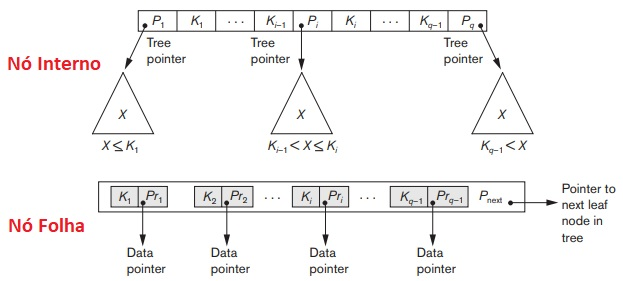

## [Tópico 21] - Estruturas de indexação (9/9)
###### *by Prof. Plinio Sa Leitao-Junior (INF/UFG)*

### <ins>CONTEÚDO</ins>

|_Item do conteúdo_|_Item do conteúdo_|
|-|-|
|1. Visão geral|4. Índice secundário|
|2. Índice primário|5. Índice multinível|
|3. Índice de agrupamento|6. <ins>**ÍNDICE EM ÁRVORE (3/3)**</ins>|

### 6. <ins>ÍNDICE EM ÁRVORE (3/3)</ins>

&#x270D;&#x270D; Implementações de um <ins>índice multinível dinâmico</ins>: 
&#10004; **`Árvore B`**: 
&nbsp;&nbsp;&nbsp;&nbsp;&nbsp;&nbsp; ... cada valor do campo de indexação (campo de pesquisa) aparece uma única vez na árvore, em algum nível da árvore, 
&nbsp;&nbsp;&nbsp;&nbsp;&nbsp;&nbsp; ... ponteiros de dados estão dispersos em em todos os nós da árvore. 
&#10004; **`Árvore B+`:** 
&nbsp;&nbsp;&nbsp;&nbsp;&nbsp;&nbsp; ... os nós folha possuem uma entrada para cada valor do campo de indexação (campo de pesquisa), 
&nbsp;&nbsp;&nbsp;&nbsp;&nbsp;&nbsp; ... ponteiros de dados são armazenados apenas nos nós folhas da árvore. 
&#10004; Em ambas as árvores (`B e B+`): 
&nbsp;&nbsp;&nbsp;&nbsp;&nbsp;&nbsp; ... se o campo de indexação (campo de pesquisa) for campo não-chave, 
&nbsp;&nbsp;&nbsp;&nbsp;&nbsp;&nbsp; ... o ponteiro de dados aponta para um bloco que contém ponteiros para os registros de dados, 
&nbsp;&nbsp;&nbsp;&nbsp;&nbsp;&nbsp; ... e tal caracteriza um nível extra de indireção.

### &#x270D;&#x270D;&#x270D; `ÍNDICE EM ÁRVORE` &#8212; <ins>`ÁRVORE B+`</ins>

#### &#9918;&#9918;&#9918; <ins>`NÓS INTERNOS`</ins> &#8212; Árvore B+:

&#10004; A **ESTRUTURA** dos <ins>nós internos</ins> é:

|P|Dados|P|Dados| ... | ... |P|Dados|P|
|-|-|-|-|-|-|-|-|-|
|P1|_&#8249;&#8249; K1&#8250;&#8250;_|P2|_&#8249;&#8249; K2&#8250;&#8250;_| ... | ... |Pq-1|_&#8249;&#8249; Kq-1&#8250;&#8250;_|Pq|

&nbsp;&nbsp;&nbsp;&nbsp;&nbsp;&nbsp;Onde: 
&nbsp;&nbsp;&nbsp;&nbsp;&nbsp;&nbsp;&nbsp;&nbsp;&nbsp;&nbsp;&nbsp;&nbsp;**q &#8924; p** (**p** é o número máximo de ponteiros), 
&nbsp;&nbsp;&nbsp;&nbsp;&nbsp;&nbsp;&nbsp;&nbsp;&nbsp;&nbsp;&nbsp;&nbsp;**Pi** é um ponteiro de árvore, 
&nbsp;&nbsp;&nbsp;&nbsp;&nbsp;&nbsp;&nbsp;&nbsp;&nbsp;&nbsp;&nbsp;&nbsp;ou seja, não há ponteiro de dados nos nós internos. 
&#10004; Os valores do campo de indexação (campo de pesquisa) são ordenados: K1 < K2 < … < Kq−1. 
&#10004; &#9745; &#8704; X : X &#8712; { valores do campo-chave de pesquisa na subárvore apontada por Pi } 

|Cenário|Restrição|
|-|-|
|i = 1|X ≤ Ki|
|1 < i < q|Ki−1 < X ≤ Ki|
|i = q|Ki−1 < X|

&nbsp;&nbsp;&nbsp;&nbsp;&nbsp;&nbsp; ... para i = 1: X < Ki 
&nbsp;&nbsp;&nbsp;&nbsp;&nbsp;&nbsp; ... para 1 < i < q: Ki−1 < X < Ki 
&nbsp;&nbsp;&nbsp;&nbsp;&nbsp;&nbsp; ... para i = q: Ki−1 < X

&#10004; Cada nó interno possui, <ins>no máximo</ins>, **p** ponteiros de árvore. 
&#10004; Cada nó interno possui, <ins>no mínimo</ins>, **⎡(p/2)⎤** ponteiros de árvore, exceto o nó raiz. 
&#10004; Se o nó raiz for um nó interno, o nó raiz terá, <ins>no mínimo</ins>, três ponteiros de árvore. 
&#10004; Um nó interno com **q** ponteiros de árvore (q ≤ p) possui **q − 1** valores do campo de indexação (campo de pesquisa).

#### &#9918;&#9918;&#9918; <ins>`NÓS FOLHAS`</ins> &#8212; Árvore B+:

&#10004; A **ESTRUTURA** dos <ins>nós folhas</ins> é:

|Dados|Dados| ... | ... |Dados|P|
|-|-|-|-|-|-|
|_&#8249;&#8249; K1 , Pr1 &#8250;&#8250;_|_&#8249;&#8249; K2 , Pr2 &#8250;&#8250;_| ... | ... |_&#8249;&#8249; Kq-1 , Prq-1 &#8250;&#8250;_|Pnext|

&nbsp;&nbsp;&nbsp;&nbsp;&nbsp;&nbsp;Onde: 
&nbsp;&nbsp;&nbsp;&nbsp;&nbsp;&nbsp;&nbsp;&nbsp;&nbsp;&nbsp;&nbsp;&nbsp;**q &#8924; p**, 
&nbsp;&nbsp;&nbsp;&nbsp;&nbsp;&nbsp;&nbsp;&nbsp;&nbsp;&nbsp;&nbsp;&nbsp;**Pri** é um ponteiro de dados, 
&nbsp;&nbsp;&nbsp;&nbsp;&nbsp;&nbsp;&nbsp;&nbsp;&nbsp;&nbsp;&nbsp;&nbsp;ou seja, os ponteiros de dados estão somente nos nós folhas, 
&nbsp;&nbsp;&nbsp;&nbsp;&nbsp;&nbsp;&nbsp;&nbsp;&nbsp;&nbsp;&nbsp;&nbsp;**Pnext** é um ponteiro de árvore que aponta para o próximo nó folha, 
&nbsp;&nbsp;&nbsp;&nbsp;&nbsp;&nbsp;&nbsp;&nbsp;&nbsp;&nbsp;&nbsp;&nbsp;ou seja, <ins>os nós folhas formam uma lista de nós</ins>, com todos os valores do campo de indexação, 
&nbsp;&nbsp;&nbsp;&nbsp;&nbsp;&nbsp;&nbsp;&nbsp;&nbsp;&nbsp;&nbsp;&nbsp;um ponteiro para o nó folha anterior (**Pprevious**) também pode ser incluído em cada nó folha. 
&#10004; Os valores do campo de indexação (campo de pesquisa) são ordenados: K1 ≤ K2, ..., Kq−1, q ≤ p. 
&#10004; Cada nó folha tem, <ins>no mínimo</ins>, ⎡(p/2)⎤ values do campo de indexação. 
&#10004; Todos os nós folha estão no mesmo nível.

A Figura abaixo ilustra a estrutura de ambos os tipos de nó (interno e folha).

&nbsp;&nbsp;&nbsp;&nbsp;&nbsp;&nbsp;&nbsp;&nbsp;&nbsp;&nbsp;&nbsp;&nbsp;

A Figura abaixo exemplifica uma Árvore B+: 
&#9888; Observe que **p = 4**. 
&#9888; Considere a área de dados dividida em vários blocos.

&nbsp;&nbsp;&nbsp;&nbsp;&nbsp;&nbsp;&nbsp;&nbsp;&nbsp;&nbsp;&nbsp;&nbsp;

O custo da busca está associado ao número de níveis da Árvore B+: 
&#9888; O custo é limitado a **⌈ log⌈ p∕2 ⌉ N ⌉** blocos acessados, 
&nbsp;&nbsp;&nbsp;&nbsp;&nbsp;&nbsp;&nbsp;&nbsp;&nbsp;&nbsp;&nbsp;&nbsp;N é o número de entradas no índice.

### Exercício

Em uma Árvore B+, considere: 
&#x270D; **p** &#8212; o número máximo de ponteiros de árvore nos nós internos; 
&#x270D; **pfolha** &#8212; o número máximo de ponteiros de dados nos nós folhas. 
Sejam: o tamanho do bloco B = 512 bytes, o tamanho do campo de indexação (campo de pesquisa) V = 9 bytes, o tamanho do ponteiro de registro Pr = 7 bytes, o tamanho do ponteiro de bloco (o ponteiro da árvore) P = 6 bytes.

(a) Calcule a ordem **p** para os nós internos.

(b) Calcule a ordem **pfolha** para os nós folhas.

(c) Podemos considerar informações adicionais para cada nó? Por exemplo, tipo de nó (interno ou folha), número de entradas atuais **q** no nó, ponteiros para os nós pai e irmãos imediatos, etc. A presença dessas informações podem impactar nos cálculos acima &#8212; (a) e (b) ?

[Uma solução](./topico-21solucao-01.md)

### Exercício

Assuma que, em média, cada nó da árvore acima está 69% cheio.

(d) Determine o <ins>número de entradas</ins> nos nós internos e nos nós folhas (nível 3). 

(e) O número total de entradas do índice na Árvore B+ até o nível 3 (nível folha).

(f) É correto afirmar que a Árvore B tende a acomodar menos número de chaves, para um determinado número de níveis de índice, em relação a Árvore B+? Justifique.

[Uma solução](./topico-21solucao-02.md)
