## [Tópico 22] - Processamento de Transações
###### *by Prof. Plinio Sa Leitao-Junior (INF/UFG)*

### <ins>CONTEÚDO</ins>

|_Item do conteúdo_|_Item do conteúdo_|
|-|-|
|1. <ins>**VISÃO GERAL**</ins>|5. Bloqueio de itens do banco de dados|
|2. Escalonamento|6. Concorrência baseada em bloqueio|
|3. Escalonamento quanto à recuperação|7. _Deadlock_ e _starvation_|
|4. Escalonamento quanto à serialização|8. Concorrência baseada em _timestamp_|

<hr style="border:2px solid blue">

### 1. <ins>VISÃO GERAL</ins>

#### &#10004; <ins>`TRANSAÇÃO DE BD — Conceito`</ins><br>
&#9918; Representa um mecanismo para <ins>descrever e caracterizar unidades lógicas de processamento</ins> em sistemas banco de dados.<br>
&#9918; É uma unidade de execução de programa que acessa e possivelmente atualiza vários itens de dados.

#### &#10004; <ins>`TRANSAÇÃO DE BD — Descrição`</ins><br>
&#9918; É delimitada, de forma implícita ou explícita, por instruções do tipo `início de transação` e `final de transação`.<br>
&#9918; É escrita em linguagem de manipulação de dados de alto nível (normalmente SQL) ou linguagem de programação (por exemplo, C++ ou Java, via JDBC/ODBC).

#### &#10004; <ins>`TRANSAÇÃO DE BD — Exemplo`</ins><br>

**`Script para SQL SERVER`**
```
DROP TABLE IF EXISTS CONTA_CORRENTE;
CREATE TABLE CONTA_CORRENTE (numConta char(6), saldoConta money);
BEGIN TRANSACTION;
INSERT INTO CONTA_CORRENTE VALUES ('029820', 10000.00);
INSERT INTO CONTA_CORRENTE VALUES ('407302', 10000.00);
COMMIT TRANSACTION;
SELECT * FROM CONTA_CORRENTE;

declare @contaDe char(6), @contaPara char(6), @Valor money;
set @contaDe= '029820';
set @contaPara= '407302';
set @Valor= 1200.99;
BEGIN TRANSACTION;
UPDATE CONTA_CORRENTE
  set saldoConta= saldoConta - @Valor
  where numConta = @contaDe;
UPDATE CONTA_CORRENTE
  set saldoConta= saldoConta + @Valor
  where numConta = @contaPara;
COMMIT;
SELECT * FROM CONTA_CORRENTE;
```
<hr style="border:2px solid blue">

#### Exercício:<br>

✍ Pesquisar sobre BEGIN TRANSACTION, COMMIT TRANSACTION, ROLLBACK TRANSACTION, SAVE TRANSACTION.

<hr style="border:2px solid blue">

#### &#10004; <ins>`TRANSAÇÃO DE BD — Outros exemplos`</ins><br>

```
START TRANSACTION;
  UPDATE TABELA SET Valor = Valor - 200 WHERE Chave = 1234;
  UPDATE TABELA SET Valor = Valor + 200 WHERE Chave = 2345;
IF ERRORS = 0 COMMIT;
IF ERRORS <> 0 ROLLBACK;
```

**`Script para PostgreSQL`**
```
DROP TABLE IF EXISTS TABELA;
CREATE TABLE TABELA (Valor INT);
BEGIN WORK;
INSERT INTO TABELA VALUES (1);
INSERT INTO TABELA VALUES (2);
COMMIT WORK;
SELECT * FROM TABELA;

BEGIN TRANSACTION;
UPDATE TABELA SET Valor = 100 WHERE Valor = 1;
SAVEPOINT Save1;
UPDATE TABELA SET Valor = 200 WHERE Valor = 2;
ROLLBACK TO Save1;
END TRANSACTION;
SELECT * FROM TABELA;
```

#### &#10004; <ins>`TRANSAÇÃO DE BD — Modelo para processamento`</ins><br>

Para lidar com (simplificar) o estudo de processamento de transações de banco de dados, basicamente duas operações são distinguíveis:

&#9888; **`read_item(X).`** Lê o item de banco de dados denominado X, copiando-o para uma variável [de programa] denominada X.<br>
&#9888; **`write_item(X).`** Grava o valor da variável [de programa] X no item do banco de dados denominado X.<br>
&nbsp;&nbsp;&nbsp;&nbsp;Onde:<br>
&nbsp;&nbsp;&nbsp;&nbsp;... o banco de dados é representado como uma coleção de itens de dados nomeados (X, Y, Z, ...),<br>
&nbsp;&nbsp;&nbsp;&nbsp;... um item de dado possui uma granularidade (tamanho): registro, bloco, valor de um campo, etc.,<br>
&nbsp;&nbsp;&nbsp;&nbsp;... os conceitos de processamento de transações são independentes da granularidade (se aplicam a itens de dados em geral).

Sobre a transação do primeiro exemplo:

|Sequência|Instrução|Comentário|
|-|-|-|
|1|**read_item(X)**|Lê X, que representa o saldo da conta 029820|
|2|**X = X - 1200**|No _buffer_ da transação, decrementa 1200 reais do saldo da conta|
|3|**write_item(X)**|Grava X, visando a atualizar o banco de dados|
|4|**read_item(Y)**|Lê Y, que representa o saldo da conta 407302|
|5|**Y = Y + 1200**|No _buffer_ da transação, incrementa 1200 reais ao saldo da conta|
|6|**write_item(Y)**|Grava Y, visando a atualizar o banco de dados|

Sobre o **read_item(X)**:<br>
&#9888; Encontra o endereço do bloco de disco que contém o item X.<br>
&#9888; Copia esse bloco de disco para um _buffer_ na memória principal:<br>
&nbsp;&nbsp;&nbsp;&nbsp;... se esse bloco de disco ainda não estiver em algum _buffer_ da memória principal,<br>
&nbsp;&nbsp;&nbsp;&nbsp;... o tamanho do _buffer_ é igual ao tamanho do bloco do disco.<br>
&#9888; Copia o item X do _buffer_ para a variável chamada X.<br>

Sobre o **write_item(X)**:<br>
&#9888; Encontra o endereço do bloco de disco que contém o item X.<br>
&#9888; Copia esse bloco de disco para um _buffer_ na memória principal:<br>
&nbsp;&nbsp;&nbsp;&nbsp;... se esse bloco de disco ainda não estiver em algum _buffer_ da memória principal.<br>
&#9888; Copia o item X da variável denominada X para seu local correto no _buffer_.<br>
&#9888; Armazena o bloco de disco atualizado do _buffer_ de volta no disco (imediatamente ou posteriormente).<br>

#### &#10004; <ins>`TRANSAÇÃO DE BD — Vale relembrar`</ins><br>

&#9888; A decisão sobre quando armazenar um bloco de disco modificado, cujo conteúdo está em um _buffer_ [de memória principal], é tomada pelo subsistema de recuperação do SGBD em cooperação com o sistema operacional.<br>
&#9888; O SGBD gerenciará um número de _buffers_ [de dados] na memória principal (_cache_ de banco de dados).<br>
&#9888; Cada _buffer_ tipicamente suporta o conteúdo de um bloco de disco:<br>
&nbsp;&nbsp;&nbsp;&nbsp;... e contém alguns dos itens do banco de dados que estão sendo processados.<br>
&#9888; Quando esses buffers estão todos ocupados, e algum(ns) bloco(s) precisa(m) ser copiado(s) para a memória:<br>
&nbsp;&nbsp;&nbsp;&nbsp;... alguma política de substituição de buffer é utilizada,<br>
&nbsp;&nbsp;&nbsp;&nbsp;... se o buffer escolhido para substituição tiver sido modificado, ele deve ser escrito de volta para o disco antes que seja reusado.

#### &#10004; <ins>`TRANSAÇÃO DE BD — Concorrência`</ins><br>

Seja a figura abaixo, sobre **processamento intercalado** _versus_ **processamento paralelo** de <ins>TRANSAÇÕES SIMULTÂNEAS</ins>:<br>
&#9888; Transações simultâneas referem-se às <ins>transações que intersectam-se em seus períodos de execução</ins>.

&nbsp;&nbsp;&nbsp;&nbsp;&nbsp;&nbsp;&nbsp;&nbsp;&nbsp;&nbsp;&nbsp;&nbsp;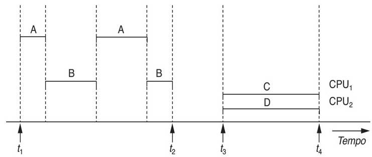

&#9888; Exemplo ... Reservas de passagens aéreas:<br>
&nbsp;&nbsp;&nbsp;&nbsp;... A transação **T1** transfere N reservas,<br>
&nbsp;&nbsp;&nbsp;&nbsp;&nbsp;&nbsp;&nbsp;&nbsp;&nbsp;&nbsp;&nbsp;&nbsp;... de um voo cujos assentos reservados é armazenado no item X,<br>
&nbsp;&nbsp;&nbsp;&nbsp;&nbsp;&nbsp;&nbsp;&nbsp;&nbsp;&nbsp;&nbsp;&nbsp;... para outro voo cujos reservados é armazenado em Y.<br>
&nbsp;&nbsp;&nbsp;&nbsp;... A transação **T2** reserva M assentos no primeiro vôo (X).

|T1|T2|
|-|-|
|read_item(X)|read_item(X)|
|X = X – N|X = X + M|
|write_item(X)|write_item(X)|
|read_item(Y)||
|Y = Y + N||
|write_item(Y)||

<br>

&#9888; <ins>**`ESCALONAMENTO SERIAL` de Transações**</ins>

|Instante<br>(tempo)|T1|T2|T1 seguida por T2<br>OU<br>T2 seguida por T1|T1|T2|
|-|-|-|-|-|-|
|1|read_item(X)||||read_item(X)|
|2|X = X – N||||X = X + M|
|3|write_item(X)||||write_item(X)|
|4|read_item(Y)|||read_item(X)||
|5|Y = Y + N|||X = X – N||
|6|write_item(Y)|||write_item(X)||
|7||read_item(X)||read_item(Y)||
|8||X = X + M||Y = Y + N||
|9||write_item(X)||write_item(Y)||

<br>

```diff
@@ Se duas ou mais transações, @@
+ que acessam os mesmos itens do banco de dados,
+ são executadas SIMULTANEAMENTE de forma NÃO-SERIAL:
-
- PROBLEMAS PODEM OCORRER,
- DEVIDO A INTERFERÊNCIAS DESSAS TRANSAÇÕES ENTRE SI.
-
```

<br>

&#9888; <ins>**`ESCALONAMENTO NÃO SERIAL de Transações` — O Problema da Atualização Perdida** </ins>

&#9918; Uma transação <ins>_sobrepõe_</ins> a atualizadção de dados de outra transação:<br>
&nbsp;&nbsp;&nbsp;&nbsp;... na figura abaixo, T2 lê o valor de X (via _read_item_),<br>
&nbsp;&nbsp;&nbsp;&nbsp;... mas antes que T1 alterasse X no banco de dados (via _write_item_),<br>
&nbsp;&nbsp;&nbsp;&nbsp;... então, o valor atualizado resultante de T1 é perdido, e<br>
&nbsp;&nbsp;&nbsp;&nbsp;... o valor final do item X estará incorreto (ao final de T1 e T2).

&nbsp;&nbsp;&nbsp;&nbsp;&nbsp;&nbsp;&nbsp;&nbsp;&nbsp;&nbsp;&nbsp;&nbsp;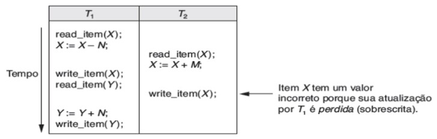

&#9888; <ins>**`ESCALONAMENTO NÃO SERIAL de Transações` — O Problema da Leitura Suja** </ins>

&#9918; Uma transação atualiza um item de dados, mas falha em seguida:<br>
&nbsp;&nbsp;&nbsp;&nbsp;... na figura abaixo, a transação T1 falhou após atualizar X,<br>
&nbsp;&nbsp;&nbsp;&nbsp;... então a atualização de X deve ser 'revertida', antes da conclusão de T1,<br>
&nbsp;&nbsp;&nbsp;&nbsp;... T2 necessitaria aguardar o final de T1, para então ler X.

&nbsp;&nbsp;&nbsp;&nbsp;&nbsp;&nbsp;&nbsp;&nbsp;&nbsp;&nbsp;&nbsp;&nbsp;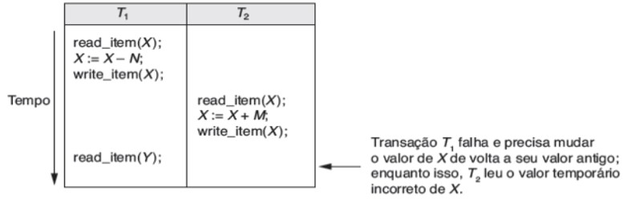

&#9888; <ins>**`ESCALONAMENTO NÃO SERIAL de Transações` — O Problema do Resumo Incorreto** </ins>

&#9918; Se uma transação estiver computando uma função agregada (soma, valor médio, etc.), enquanto outras transações estão atualizando alguns dos itens de dados envolvidos no processamento da função agregada, o cálculo da função pode usar alguns valores antes dessas atualizações e outros após essas atualizações:<br>
&nbsp;&nbsp;&nbsp;&nbsp;... na figura abaixo, o cálculo do número total de reservas em todos os voos.

&nbsp;&nbsp;&nbsp;&nbsp;&nbsp;&nbsp;&nbsp;&nbsp;&nbsp;&nbsp;&nbsp;&nbsp;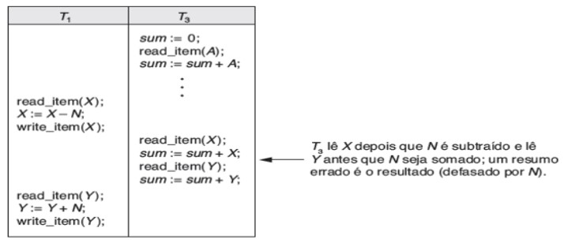

&#9888; <ins>**`ESCALONAMENTO NÃO SERIAL de Transações` — O Problema da Leitura "Irrepetível"** </ins>

&#9918; Uma transação lê o mesmo item duas vezes, e o item é alterado por outra transação entre as duas leituras:<br>
&nbsp;&nbsp;&nbsp;&nbsp;... na figura abaixo, o cliente pergunta sobre a disponibilidade de assentos em vários voos,<br>
&nbsp;&nbsp;&nbsp;&nbsp;... então, após a decisão do cliente, a reserva não pode ser confirmada,<br>
&nbsp;&nbsp;&nbsp;&nbsp;... pois há um valor diferente para o item (o voo selecionado).

<br>

```diff
@@ Dessa forma, @@
+ 
+ estratégias de CONTROLE DE CONCORRÊNCIA DE TRANSAÇÕES são necessárias ...
+
```

<hr style="border:2px solid blue">

#### Exercício:<br>
✍ Pesquisar sobre níveis de isolamento entre transações:<br>
&nbsp;&nbsp;&nbsp;&nbsp;... SERIALIZABLE, REPEATABLE READS, READ COMMITTED, READ UNCOMMITTED.

<hr style="border:2px solid blue">

#### &#10004; <ins>`TRANSAÇÃO DE BD — Propriedades ACID`</ins><br>

|Sigla|Propriedade|Responsabilidade|
|-|-|-|
|**A**|Atomicidade|Subsistema de recuperação de transações|
|**C**|Consistência|Projetista de BD (e DBA)<br>Subsistema de recuperação de transações<br>Programadores de aplicação de BD ??|
|**I**|Isolamento|Subsistema de controle de concorrência|
|**D**|Durabilidade|Subsistema de recuperação de transações|

&#9888; **`Atomicidade`**<br>
&nbsp;&nbsp;&nbsp;&nbsp;Uma transação é um átomo: uma unidade atômica de processamento.<br>
&nbsp;&nbsp;&nbsp;&nbsp;... Se uma transação não for concluída por algum motivo,<br>
&nbsp;&nbsp;&nbsp;&nbsp;... esta deverá ser desfeita (eliminar os seus efeitos no banco de dados),<br>
&nbsp;&nbsp;&nbsp;&nbsp;... ou seja, o princípio do tudo ou nada.

&#9888; **`Consistência`**<br>
&nbsp;&nbsp;&nbsp;&nbsp;Uma transação sempre conduz o BD de um estado consistente para outro estado também consistente.<br>
&nbsp;&nbsp;&nbsp;&nbsp;... Um estado consistente do banco de dados satisfaz as restrições especificadas no esquema.<br>
&nbsp;&nbsp;&nbsp;&nbsp;... Se uma transação for completamente executada do início ao fim,<br>
&nbsp;&nbsp;&nbsp;&nbsp;... sem interferência de outras transações,<br>
&nbsp;&nbsp;&nbsp;&nbsp;... deverá levar o banco de dados de um estado consistente para outro estado consistente.<br>

&#9888; **`Isolamento`**<br>
&nbsp;&nbsp;&nbsp;&nbsp;A execução de uma transação deve ser 'isolada' de outras transações simultâneas.<br>
&nbsp;&nbsp;&nbsp;&nbsp;... Uma transação deve parecer que está sendo executada isoladamente de outras transações,<br>
&nbsp;&nbsp;&nbsp;&nbsp;... mesmo que muitas transações estejam sendo executadas simultaneamente.

&#9888; **`Durabilidade`**<br>
&nbsp;&nbsp;&nbsp;&nbsp;As alterações aplicadas ao banco de dados por uma transação confirmada,<br>
&nbsp;&nbsp;&nbsp;&nbsp;... ou seja, a transação executou com sucesso,<br>
&nbsp;&nbsp;&nbsp;&nbsp;... devem persistir no banco de dados.<br>
&nbsp;&nbsp;&nbsp;&nbsp;... Essas alterações não devem ser perdidas devido a qualquer falha posterior de outras transações.

<hr style="border:2px solid blue">

&#9918; **Para refletir &#8756; `ESCALONAMENTO`**

&nbsp;&nbsp;&nbsp;&nbsp;&nbsp;&nbsp;&nbsp;&nbsp;&nbsp;&nbsp;&nbsp;&nbsp;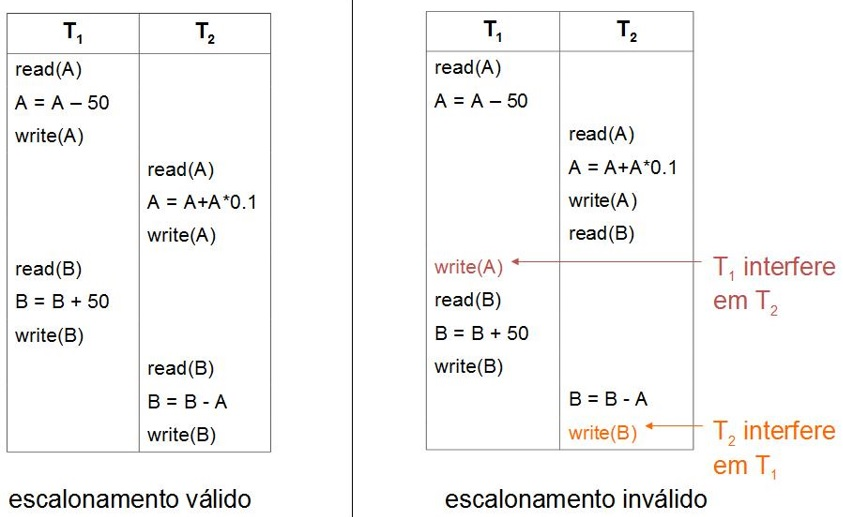

<hr style="border:2px solid blue">

#### &#10004; <ins>`TRANSAÇÃO DE BD — Transições de Estado`</ins><br>

&nbsp;&nbsp;&nbsp;&nbsp;&nbsp;&nbsp;&nbsp;&nbsp;&nbsp;&nbsp;&nbsp;&nbsp;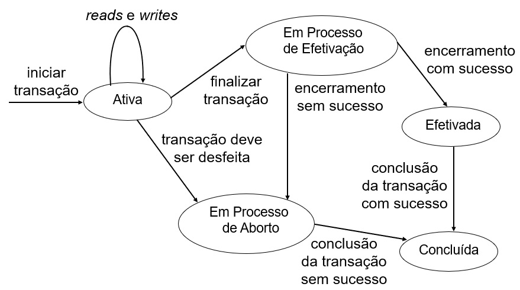

<hr style="border:2px solid blue">

&nbsp;&nbsp;&nbsp;&nbsp;&nbsp;&nbsp;&nbsp;&nbsp;&nbsp;&nbsp;&nbsp;&nbsp;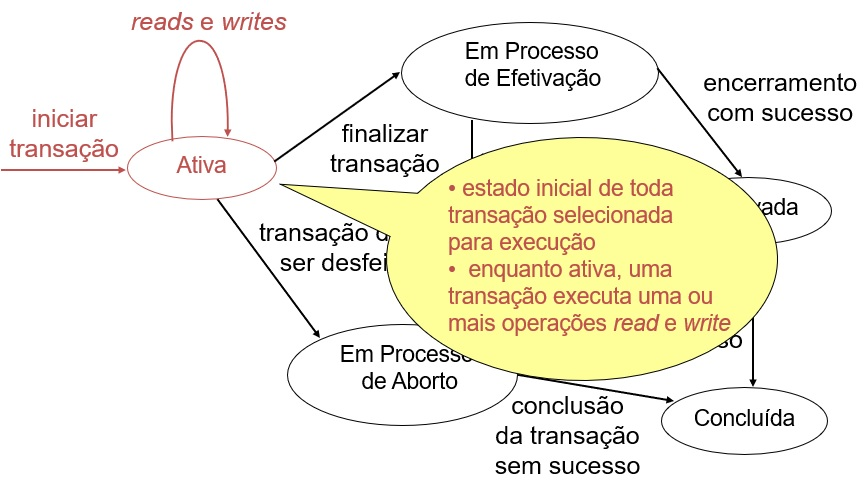

<hr style="border:2px solid blue">

&nbsp;&nbsp;&nbsp;&nbsp;&nbsp;&nbsp;&nbsp;&nbsp;&nbsp;&nbsp;&nbsp;&nbsp;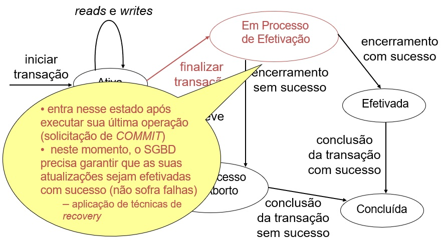

<hr style="border:2px solid blue">

&nbsp;&nbsp;&nbsp;&nbsp;&nbsp;&nbsp;&nbsp;&nbsp;&nbsp;&nbsp;&nbsp;&nbsp;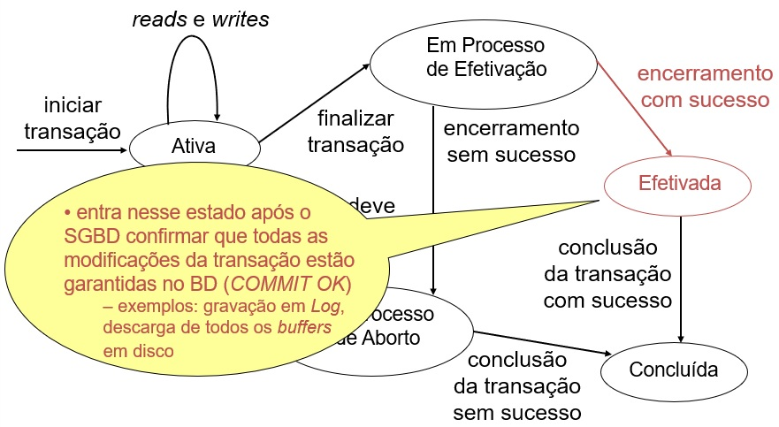

<hr style="border:2px solid blue">

&nbsp;&nbsp;&nbsp;&nbsp;&nbsp;&nbsp;&nbsp;&nbsp;&nbsp;&nbsp;&nbsp;&nbsp;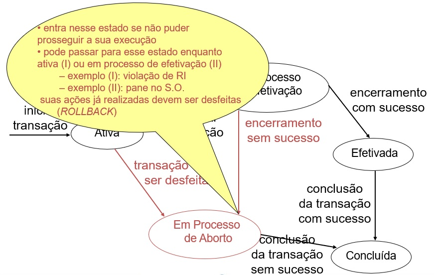

<hr style="border:2px solid blue">

&nbsp;&nbsp;&nbsp;&nbsp;&nbsp;&nbsp;&nbsp;&nbsp;&nbsp;&nbsp;&nbsp;&nbsp;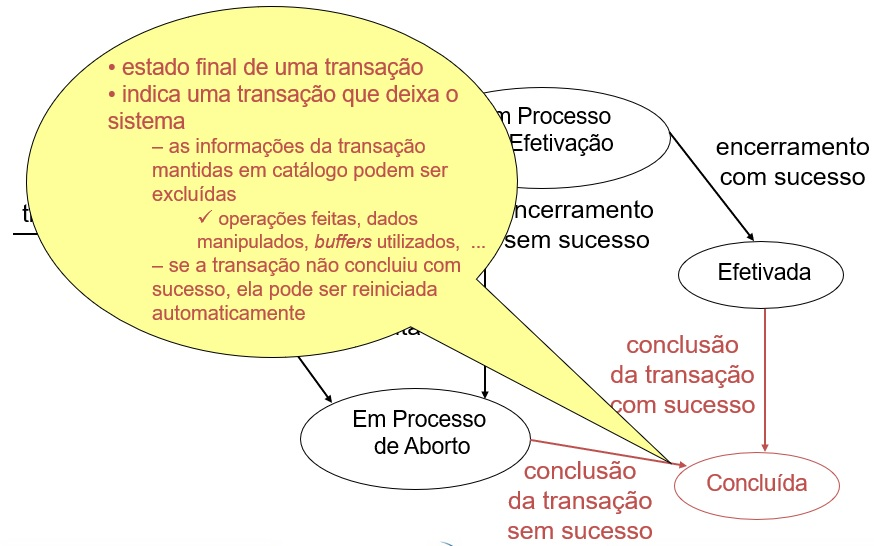

<hr style="border:2px solid blue">

#### Exercício:<br>

✍ Pesquisar sobre ESCALONAMENTO DE TRANSAÇÕES:<br><be>
&nbsp;&nbsp;&nbsp;&nbsp;&nbsp;&nbsp;&nbsp;&nbsp;&nbsp;&nbsp;&nbsp;&nbsp;... escalonamentos que preservam a <ins>recuperação de transações</ins> ,<br>
&nbsp;&nbsp;&nbsp;&nbsp;&nbsp;&nbsp;&nbsp;&nbsp;&nbsp;&nbsp;&nbsp;&nbsp;... escalonamentos que preservam a <ins>serialização de transações</ins> .

<hr style="border:2px solid blue">
