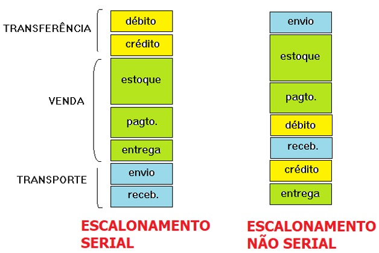
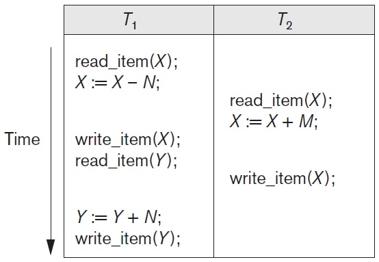
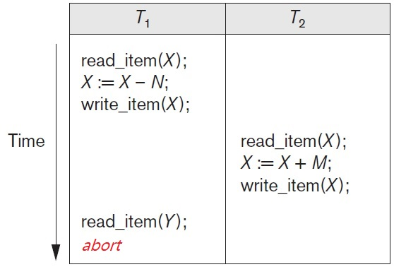
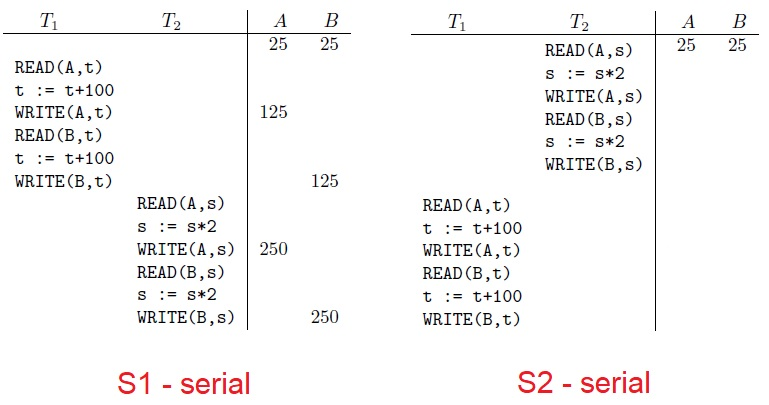
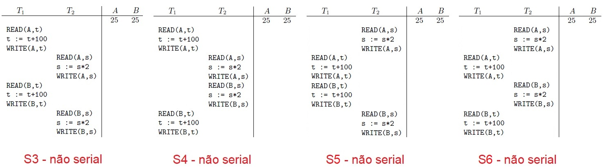

## [Tópico 23] - Processamento de Transações
###### *by Prof. Plinio Sa Leitao-Junior (INF/UFG)*

### <ins>CONTEÚDO</ins>

|_Item do conteúdo_|_Item do conteúdo_|
|-|-|
|1. Visão geral|5. Bloqueio de itens do banco de dados|
|2. <ins>**ESCALONAMENTO**</ins>|6. Concorrência baseada em bloqueio|
|3. Escalonamento quanto à recuperação|7. _Deadlock_ e _starvation_|
|4. Escalonamento quanto à serialização|8. Concorrência baseada em _timestamp_|

### 2. <ins>ESCALONAMENTO</ins>

Relembrando ... transações executadas simultaneamente são aquelas que intersectam-se em seus períodos de execução.

Quando **n** transações (n>1) são executadas simultaneamente, a <ins>ordem de execução das operações</ins> de todas as **n** transações é conhecida como <ins>escalonamento (_schedule_)</ins>: 
&#x270D; Na figura abaixo, três transações são executadas de forma serial (à esquerda) e de forma não serial (à direita): 
&nbsp;&nbsp;&nbsp;&nbsp;&nbsp;&nbsp; ... no escalonamento não serial, observe que a <ins>ordem de execução das operações</ins> de cada transação é preservada.

&nbsp;&nbsp;&nbsp;&nbsp;&nbsp;&nbsp;&nbsp;&nbsp;&nbsp;&nbsp;&nbsp;&nbsp;

#### FORMALMENTE ...

Um <ins>Escalonamento S</ins> de **n** transações **T1, T2,…, Tn** é uma ordenação das operações das transações: 
&#9918; `Escalonamento não serial:` 
&nbsp;&nbsp;&nbsp;&nbsp;&nbsp;&nbsp; ... as operações das transações distintas em **S** são executadas de forma intercalada. 
&#9918; `Preservação da ordem das operações:` 
&nbsp;&nbsp;&nbsp;&nbsp;&nbsp;&nbsp; ... a execução das operações de **Ti** em **S** deve ocorrer na mesma ordem em que sucedem em **Ti**, 
&nbsp;&nbsp;&nbsp;&nbsp;&nbsp;&nbsp; ... independente se **S** é um escalonamento serial ou não serial. 
&#9918; `Ordenação total das operações:` 
&nbsp;&nbsp;&nbsp;&nbsp;&nbsp;&nbsp; ... para quaisquer duas operações em **S**, a execução de uma deve ocorrer antes da outra. 

#### MODELO SIMPLIFICADO ...

Modelo pedagógico para o escalonamento de transações: 
&#9752; `Operações de relevo`: 
&nbsp;&nbsp;&nbsp;&nbsp;&nbsp;&nbsp; ... **b** &#8212; begin_transaction 
&nbsp;&nbsp;&nbsp;&nbsp;&nbsp;&nbsp; ... **r** &#8212; read_item 
&nbsp;&nbsp;&nbsp;&nbsp;&nbsp;&nbsp; ... **w** &#8212; write_item 
&nbsp;&nbsp;&nbsp;&nbsp;&nbsp;&nbsp; ... **e** &#8212; end_transaction 
&nbsp;&nbsp;&nbsp;&nbsp;&nbsp;&nbsp; ... **c** &#8212; commit 
&nbsp;&nbsp;&nbsp;&nbsp;&nbsp;&nbsp; ... **a** &#8212; abort 
&#9752; `Exemplo: Escalonamento Sa`  (figura à esquerda): 
&nbsp;&nbsp;&nbsp;&nbsp;&nbsp;&nbsp; ... **Sa** : r1(X); r2(X); w1(X); r1(Y); w2(X); w1(Y); 
&#9752; `Exemplo: Escalonamento Sb`  (figura à direita): 
&nbsp;&nbsp;&nbsp;&nbsp;&nbsp;&nbsp; ... **Sb** : r1(X); w1(X); r2(X); w2(X); r1(Y); a1;

&nbsp;&nbsp;&nbsp;&nbsp;&nbsp;&nbsp;&nbsp;&nbsp;&nbsp;&nbsp;&nbsp;&nbsp;&nbsp;&nbsp;&nbsp;&nbsp;&nbsp;&nbsp;

#### OPERAÇÕES CONFLITANTES ...

Duas operações são ditas conflitantes se: 
&nbsp;&nbsp;&nbsp;&nbsp;&nbsp;&#10004; pertencerem a transações diferentes; E 
&nbsp;&nbsp;&nbsp;&nbsp;&nbsp;&#10004; acessam o mesmo item X; E 
&nbsp;&nbsp;&nbsp;&nbsp;&nbsp;&#10004; pelo menos uma das operações for _write_item(X)_. 
&#x270D; `Exemplos:` 
&nbsp;&nbsp;&nbsp;&nbsp;&nbsp;&nbsp;&nbsp;&nbsp;&nbsp;&nbsp; ... r1(X) e w2(X) SÃO conflitantes; 
&nbsp;&nbsp;&nbsp;&nbsp;&nbsp;&nbsp;&nbsp;&nbsp;&nbsp;&nbsp; ... w1(X) e r2(X) SÃO conflitantes; 
&nbsp;&nbsp;&nbsp;&nbsp;&nbsp;&nbsp;&nbsp;&nbsp;&nbsp;&nbsp; ... w1(X) e w2(X) SÃO conflitantes; 
&nbsp;&nbsp;&nbsp;&nbsp;&nbsp;&nbsp;&nbsp;&nbsp;&nbsp;&nbsp; ... r1(X) e w2(Y) NÃO SÃO conflitantes; 
&nbsp;&nbsp;&nbsp;&nbsp;&nbsp;&nbsp;&nbsp;&nbsp;&nbsp;&nbsp; ... r1(X) e r2(X) NÃO SÃO conflitantes; 
&nbsp;&nbsp;&nbsp;&nbsp;&nbsp;&nbsp;&nbsp;&nbsp;&nbsp;&nbsp; ... r1(X) e w1(X) NÃO SÃO conflitantes. 
&#x270D; Noutras palavras, duas operações são conflitantes <ins>se a alteração de sua ordem _puder ocasionar_ um resultado diferente<ins>:

|Sequência 1|Sequência 2|Observação|
|-|-|-|
|r1(X); w2(X)|w2(X); r1(X)|CONFLITO read-write|
|w1(X); w2(X)|w2(X); w1(X)|CONFLITO write-write|
|r1(X); r2(X)|r2(X); r1(X)|NÃO HÁ CONFLITO|

<!-- a normal html comment 
#### ESCALONAMENTO COMPLETO ...

Um aspecto teórico ... qualquer escalonamento **S** de **n** transações T1, T2, …, Tn é dito <ins>escalonamento completo</ins>, SE:  
&#10004; ... as operações em **S** são exatamente as mesmas operações que compõem T1, T2, …, Tn, incluindo a operação final (confirmação ou aborto) de cada transação; E 
&#10004; ... para qualquer par de operações da mesma transação Ti, sua ordem relativa de aparecimento em **S** é a mesma que sua ordem de aparecimento em Ti; E 
&#10004; ... para quaisquer duas operações conflitantes, uma delas deverá ocorrer [explicitamente] antes da outra em S.
-->

#### Exercícios

Sejam duas transações, T1 e T2, e os escalonamentos S1, S2, S3, S4, S5 e S6, conforme as figuras a seguir.

1. Complemente em S2 os valores dos itens de dados A e B. Compare o estado final do banco de dados entre S1 e S2.

&nbsp;&nbsp;&nbsp;&nbsp;&nbsp;&nbsp;&nbsp;&nbsp;&nbsp;&nbsp;&nbsp;&nbsp;

2. Complemente em S3, S4, S5 e S6 os valores dos itens de dados A e B. Compare o estado final do banco de dados entre S1, S2, S3, S4, S5 e S6.

&nbsp;&nbsp;&nbsp;&nbsp;&nbsp;&nbsp;&nbsp;&nbsp;&nbsp;&nbsp;&nbsp;&nbsp;

3. Sobre o estado final do banco de dados:
   1. O estado final dos escalonamentos não-seriais coincide com o estado final dos escalonamentos seriais?
   1. As não-coincidências ocorrem em escalonamentos não seriais em que há interferências indevidas entre as transações?

4. Para qualquer escalonamento não-serial **S** de **n** transações T1, T2, …, Tn, se o estado final após a execução de **S** for o mesmo estado final de pelo menos um escalonamento serial dessas transações, é possível afirmar que as coincidências identificadas ocorrerão para qualquer estado inicial de banco de dados?
