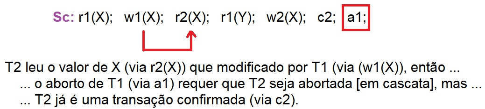

## [Tópico 24] - Processamento de Transações
###### *by Prof. Plinio Sa Leitao-Junior (INF/UFG)*

### <ins>CONTEÚDO</ins>

|_Item do conteúdo_|_Item do conteúdo_|
|-|-|
|1. Visão geral|5. Bloqueio de itens do banco de dados|
|2. Escalonamento|6. Concorrência baseada em bloqueio|
|3. <ins>**ESCALONAMENTO QUANTO À RECUPERAÇÃO**</ins>|7. _Deadlock_ e _starvation_|
|4. Escalonamento quanto à serialização|8. Concorrência baseada em _timestamp_|

<hr style="border:2px solid blue">

### 3. <ins>ESCALONAMENTO QUANTO À RECUPERAÇÃO</ins>

Segundo a propriedade DURABIDADE para transações de banco de dados (ver [Tópico 22](./topico-22.md)):<br>
&nbsp;&nbsp;&nbsp;&nbsp;... "as alterações aplicadas ao banco de dados por uma transação confirmada,<br>
&nbsp;&nbsp;&nbsp;&nbsp;... ou seja, a transação executou com sucesso, devem persistir no banco de dados".<br>

```diff
@@ ENTÃO, qualquer escalonamento [decidido pelo SGBD] deve garantir essa propriedade.@@
+ Os escalonamentos que, teoricamente, atendem a esse critério são chamados de escalonamentos RECUPERÁVEIS.
- Se um transação confirmada necessitar ser revertida, o escalonamento é NÃO-RECUPERÁVEL.

+ Em um escalonamento recuperável, nenhuma transação confirmada precisa ser revertida ??

! Assim, é fundamental caracterizar os escalonamentos para os quais a recuperação é possível ...
# ... pois escalonamentos não-recuperáveis não devem ser permitidos (escolhidos) pelo SGBD.

@@ IMPORTANTE 1: há escalonamentos recuperáveis para os quais a recuperação é relativamente simples ...@@
@@               há escalonamentos recuperáveis onde o processo de recuperação é mais complexo.@@
@@ IMPORTANTE 2: um algoritmo de recuperação pode ser concebido para qualquer escalonameto recuperável ...@@
@@               mas deve haver dados disponíveis sobre as transações (em curso e concluídas) ...@@
@@                        e tais dads estão, em geral, em [arquivos de] log do banco de dados.@@
```
Alguns escalonamentos recuperáveis podem exigir um processo de recuperação complexo, como veremos, mas se for mantida informação suficiente (no log), um algoritmo de recuperação pode ser concebido para qualquer escalonamento recuperável.


Na figura abaixo, **S<sub>c</sub>** é um escalonamento não-recuperável.

&nbsp;&nbsp;&nbsp;&nbsp;&nbsp;&nbsp;&nbsp;&nbsp;&nbsp;&nbsp;&nbsp;&nbsp;

#### ESCALONAMENTO <ins>`RECUPERÁVEL`</ins>

&#x270D; Um <ins>escalonamento S é RECUPERÁVEL</ins> se nenhuma transação T em S for confirmada até que ...<br>
&nbsp;&nbsp;&nbsp;&nbsp;... todas as transações T′ que escreveram algum item X que T lê tenham sido confirmadas.<br>
&#x270D; Uma transação <ins>T lê a transação T′</ins> em um escalonamento S se ...<br>
&nbsp;&nbsp;&nbsp;&nbsp;... algum item X for primeiro escrito por T′ e depois lido por T.

Observar os escalonamentos abaixo:

|Escalonamento|Recuperável?|Observação|
|-|-|-|
|Sa: r1(X); r2(X); w1(X); r1(Y); w2(X); w1(Y);|SIM|Problema de atualização perdida<br>_não-serializável_ (próximo tópico)|
|Sa′: r1(X); r2(X); w1(X); r1(Y); w2(X); c2; w1(Y); c1;|SIM|Similar a Sa|
|Sb: r1(X); w1(X); r2(X); w2(X); r1(Y); a1;|SIM||
|Sc: r1(X); w1(X); r2(X); r1(Y); w2(X); c2; a1;|NÃO||
|Sc′: r1(X); w1(X); r2(X); r1(Y); w2(X); c2;|NÃO|Similar a Sc|
|Sd: r1(X); w1(X); r2(X); r1(Y); w2(X); w1(Y); c1; c2;|SIM|Potencial aborto de T2 em cascata|
|Se: r1(X); w1(X); r2(X); r1(Y); w2(X); w1(Y); a1; a2;|SIM|Similar a Sd<br>Aborto de T2 em cascata|

#### ESCALONAMENTO <ins>`SEM ABORTO EM CASCATA`</ins>

&#x270D; Um <ins>escalonamento S é recuperável sem aborto em cascata (ou ESCALONAMENTO SEM ABORTO EM CASCATA)</ins> se todas as transações em S lerem apenas itens de dados que foram escritos por transações confirmadas (_committed_).

Que alterações em S<sub>d</sub> e em S<sub>e</sub> promovem que ambos <ins>não sofram aborto (reversão, _rollback_) em cascata</ins> ??<br>
&#9888; a instrução r<sub>2</sub>(X) deve ser adiada até que T<sub>1</sub> tenha sido confirmada (ou abortada).

|Escalonamento original|Escalonamento modificado|
|-|-|
|Sd: r1(X); <ins> w1(X); r2(X)  </ins> r1(Y); w2(X); w1(Y); c1; c2;|Sd′: r1(X); w1(X); r1(Y); w1(Y); c1; **r2(X); w2(X);** c2;|
|Se: r1(X); <ins> w1(X); r2(X); </ins> r1(Y); w2(X); w1(Y); a1; a2;|Se′: r1(X); w1(X); r1(Y); w1(Y); a1; **r2(X); w2(X);** `c2;`|

```diff
! Interessante ....
! Dentre os escalonamentos recuperáveis, um subconjunto deles é "sem aborto em cascata".
```

<hr style="border:2px solid blue">

#### Exercício

Classifique os escalonamentos abaixo como:<br>
&#9745; Não-Recuperável (NR)<br>
&#9745; Recuperável (R)<br>
&#9745; Recuperável Sem Aborto em Cascata (RSAC)

|id|Escalonamento|Classificação|
|-|-|:-:|
|S<sub>1</sub>|r<sub>1</sub>(X); r<sub>2</sub>(X); w<sub>1</sub>(X); r<sub>1</sub>(Y); w<sub>1</sub>(Y); w<sub>2</sub>(X); c<sub>2</sub>; c<sub>1</sub>;|<!--RSAC-->|
|S<sub>2</sub>|r<sub>1</sub>(X); w<sub>1</sub>(X); r<sub>2</sub>(X); r<sub>1</sub>(Y); w<sub>1</sub>(Y); c<sub>1</sub>; w<sub>2</sub>(X); c<sub>2</sub>;|<!--R-->|
|S<sub>3</sub>|r<sub>1</sub>(X); w<sub>1</sub>(X); r<sub>2</sub>(X); r<sub>1</sub>(Y); w<sub>1</sub>(Y); w<sub>2</sub>(X); c<sub>1</sub>; c<sub>2</sub>;|<!--R-->|
|S<sub>4</sub>|r<sub>1</sub>(X); w<sub>1</sub>(X); r<sub>2</sub>(X); r<sub>1</sub>(Y); w<sub>1</sub>(Y); w<sub>2</sub>(X); c<sub>2</sub>; c<sub>1</sub>;|<!--NR-->|
|S<sub>5</sub>|r<sub>1</sub>(X); w<sub>1</sub>(X); r<sub>2</sub>(X); r<sub>1</sub>(Y); w<sub>2</sub>(X); w<sub>1</sub>(Y); c<sub>1</sub>; c<sub>2</sub>;|<!--R-->|
|S<sub>6</sub>|r<sub>1</sub>(X); w<sub>1</sub>(X); r<sub>2</sub>(X); r<sub>1</sub>(Y); w<sub>2</sub>(X); w<sub>1</sub>(Y); c<sub>2</sub>; c<sub>1</sub>;|<!--NR-->|
|S<sub>7</sub>|r<sub>1</sub>(X); r<sub>2</sub>(X); w<sub>1</sub>(X); r<sub>1</sub>(Y); w<sub>1</sub>(Y); w<sub>2</sub>(X); c<sub>1</sub>; c<sub>2</sub>;|<!--RSAC-->|
|S<sub>8</sub>|r<sub>1</sub>(X); w<sub>1</sub>(X); r<sub>2</sub>(X); r<sub>1</sub>(Y); w<sub>2</sub>(X); c<sub>2</sub>; w<sub>1</sub>(Y); c<sub>1</sub>;|<!--NR-->|
|S<sub>9</sub>|r<sub>1</sub>(X); w<sub>1</sub>(X); r<sub>2</sub>(X); w<sub>2</sub>(X); r<sub>1</sub>(Y); w<sub>1</sub>(Y); c<sub>1</sub>; c<sub>2</sub>;|<!--R-->|
|S<sub>10</sub>|r<sub>1</sub>(X); w<sub>1</sub>(X); r<sub>2</sub>(X); w<sub>2</sub>(X); r<sub>1</sub>(Y); w<sub>1</sub>(Y); c<sub>2</sub>; c<sub>1</sub>;|<!--NR-->|
|S<sub>11</sub>|r<sub>1</sub>(X); w<sub>1</sub>(X); r<sub>2</sub>(X); w<sub>2</sub>(X); r<sub>1</sub>(Y); c<sub>2</sub>; w<sub>1</sub>(Y); c<sub>1</sub>;|<!--NR-->|
|S<sub>12</sub>|r<sub>1</sub>(X); w<sub>1</sub>(X); r<sub>2</sub>(X); w<sub>2</sub>(X); c<sub>2</sub>; r<sub>1</sub>(Y); w<sub>1</sub>(Y); c<sub>1</sub>;|<!--NR-->|
|S<sub>13</sub>|r<sub>1</sub>(X); r<sub>2</sub>(X); w<sub>1</sub>(X); r<sub>1</sub>(Y); w<sub>2</sub>(X); w<sub>1</sub>(Y); c<sub>1</sub>; c<sub>2</sub>;|<!--RSAC-->|

[Uma solução](./topico-24solucao-01.md)

<hr style="border:2px solid blue">

#### ESCALONAMENTO <ins>`ESTRITO`</ins>

&#x270D; Um <ins>escalonamento S é recuperável estrito (ou ESCALONAMENTO ESTRITO)</ins> se todas as transações não puderem gravar (nem ler) um item de dado X, até a última transação que escreveu X seja confirmada (ou abortada):<br>
&nbsp;&nbsp;&nbsp;&nbsp;... escalonamentos estritos simplificam o processo de recuperação, pois ...<br>
&nbsp;&nbsp;&nbsp;&nbsp;... o processo de desfazer uma operação write_item (X) de uma transação abortada ...<br>
&nbsp;&nbsp;&nbsp;&nbsp;... é simplesmente restaurar a imagem anterior (BFIM - _before image_) do item de dados X.

|Escalonamento|Após<br>r1(X) e<br>r2(X)|Após<br>w1(X)|Após<br>w2(X)|Ao final|Comentário|
|-|:-:|:-:|:-:|:-:|-|
|Sx : r1(X); r2(X); ... w1(X); w2(X); a1;|9|5|8|8 ou 9?|Recuperação mais complexa|
|Sx′ : r1(X); r2(X); ... w1(X); a1; w2(X);|9|5|8|8|Recuperação mais simples|

```diff
! Interessante ....
! Dentre os escalonamentos "recuperáveis", um subconjunto deles é "sem aborto em cascata".
! Dentre os escalonamentos "sem aborto em cascata", um subconjunto deles é "estrito".
```

<hr style="border:2px solid blue">

#### Exercício

Classifique os escalonamentos abaixo como:<br>
&#9745; Não-Recuperável (NR)<br>
&#9745; Recuperável (R)<br>
&#9745; Recuperável Sem Aborto em Cascata (RSAC)<br>
&#9745; Recuperável Estrito (RE)

|id|Escalonamento|Classificação|
|-|-|:-:|
|S<sub>14</sub>|r<sub>2</sub>(X); w<sub>2</sub>(X); r<sub>1</sub>(X); c<sub>2</sub>; w<sub>1</sub>(X); r<sub>1</sub>(Y); w<sub>1</sub>(Y); c<sub>1</sub>;|<!--R-->|
|S<sub>15</sub>|r<sub>1</sub>(X); r<sub>2</sub>(X); w<sub>2</sub>(X); c<sub>2</sub>; w<sub>1</sub>(X); r<sub>1</sub>(Y); w<sub>1</sub>(Y); c<sub>1</sub>;|<!--RE-->|
|S<sub>16</sub>|r<sub>2</sub>(X); r<sub>1</sub>(X); w<sub>1</sub>(X); r<sub>1</sub>(Y); w<sub>1</sub>(Y); c<sub>1</sub>; w<sub>2</sub>(X); c<sub>2</sub>;|<!--RE-->|
|S<sub>17</sub>|r<sub>2</sub>(X); r<sub>1</sub>(X); w<sub>1</sub>(X); r<sub>1</sub>(Y); w<sub>1</sub>(Y); w<sub>2</sub>(X); c<sub>1</sub>; c<sub>2</sub>;|<!--RSAC-->|
|S<sub>18</sub>|r<sub>2</sub>(X); r<sub>1</sub>(X); w<sub>1</sub>(X); r<sub>1</sub>(Y); w<sub>1</sub>(Y); w<sub>2</sub>(X); c<sub>2</sub>; c<sub>1</sub>;|<!--RSAC-->|
|S<sub>19</sub>|r<sub>2</sub>(X); w<sub>2</sub>(X); r<sub>1</sub>(X); w<sub>1</sub>(X); r<sub>1</sub>(Y); w<sub>1</sub>(Y); c<sub>1</sub>; c<sub>2</sub>;|<!--NR-->|
|S<sub>20</sub>|r<sub>2</sub>(X); w<sub>2</sub>(X); r<sub>1</sub>(X); w<sub>1</sub>(X); r<sub>1</sub>(Y); w<sub>1</sub>(Y); c<sub>2</sub>; c<sub>1</sub>;|<!--R-->|
|S<sub>21</sub>|r<sub>2</sub>(X); w<sub>2</sub>(X); r<sub>1</sub>(X); w<sub>1</sub>(X); r<sub>1</sub>(Y); c<sub>2</sub>; w<sub>1</sub>(Y); c<sub>1</sub>;|<!--R-->|
|S<sub>22</sub>|r<sub>2</sub>(X); w<sub>2</sub>(X); c<sub>2</sub>; r<sub>1</sub>(X); w<sub>1</sub>(X); r<sub>1</sub>(Y); w<sub>1</sub>(Y); c<sub>1</sub>;|<!--RE-->|
|S<sub>23</sub>|r<sub>2</sub>(X); w<sub>2</sub>(X); r<sub>1</sub>(X); w<sub>1</sub>(X); c<sub>2</sub>; r<sub>1</sub>(Y); w<sub>1</sub>(Y); c<sub>1</sub>;|<!--R-->|

[Uma solução](./topico-24solucao-02.md)
