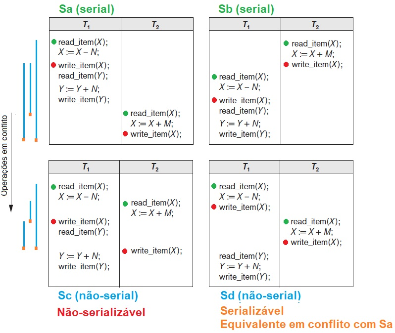
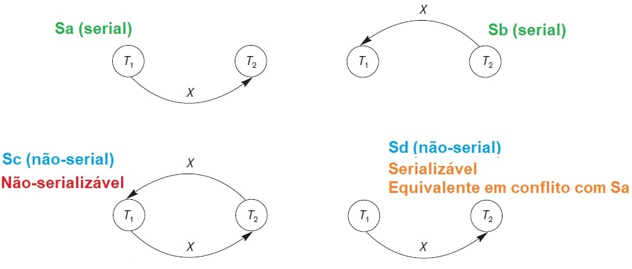
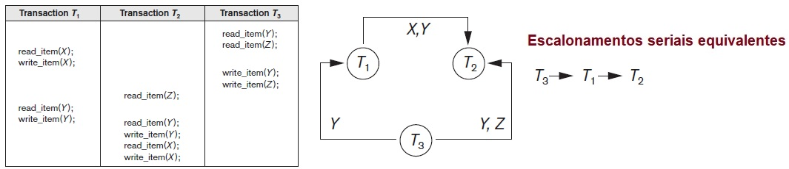
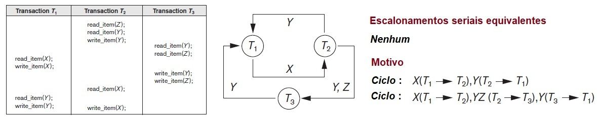
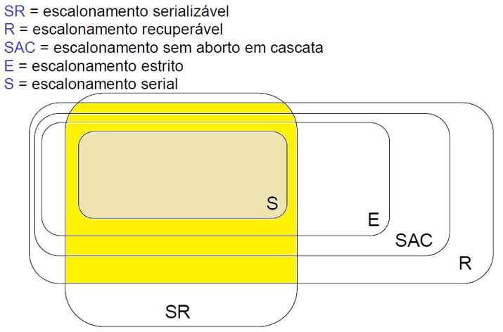

## [Tópico 25] - Processamento de Transações
###### *by Prof. Plinio Sa Leitao-Junior (INF/UFG)*

### <ins>CONTEÚDO</ins>

|_Item do conteúdo_|_Item do conteúdo_|
|-|-|
|1. Visão geral|5. Bloqueio de itens do banco de dados|
|2. Escalonamento|6. Concorrência baseada em bloqueio|
|3. Escalonamento quanto à recuperação|7. _Deadlock_ e _starvation_|
|4. <ins>**ESCALONAMENTO QUANTO À SERIALIZAÇÃO**</ins>|8. Concorrência baseada em _timestamp_|

<hr style="border:2px solid blue">

### 4. <ins>ESCALONAMENTO QUANTO À SERIALIZAÇÃO</ins>

#### RELEMBRANDO ...
Escalonamentos seriais limitam a concorrência &#8212; são inaceitáveis na prática:<br>
&#9888; Se uma transação aguarda a conclusão de uma operação de E/S:<br>
&nbsp;&nbsp;&nbsp;&nbsp;... não é possível 'chavear' o processador [da CPU] para outra transação,<br>
&nbsp;&nbsp;&nbsp;&nbsp;... o que ocasiona a ociosidade de recursos.<br>
&#9888; O problema é agravado no contexto de transações longas ...

Contudo, no contexto de transações de banco de dados que são <ins>independentes entre si</ins>:<br>
&#9745; <ins>Escalonamentos seriais são escalonamentos corretos</ins>.

#### SERIALZAÇÃO DE ESCALONAMENTOS ...

```diff
! Em qualquer escalonamento,
!    se cada de suas transações são executadas de forma completa (do início ao fim),
!    isoladamente das operações de outras transações,
!    o resultado ao final será um estado consistente de banco de dados.
! Tal ocorre em escalonamentos seriais.

+ Um escalonamento não-serial é dito correto se:
+    há o isolamento de suas transações durante a execução,
+    tal que o estado final do banco de dados
+    seja o mesmo estado final de qualquer dos escalonamentos seriais dessas transações,
+    independentemente do estado inicial do banco de dados.

- O conceito de SERIALIZAÇÃO DE ESCALONAMENTOS é utilizado para identificar:
-    que escalonamentos estão corretos,
-    quando as execuções de transações possuem intercalação de suas operações.
```

Ver <ins>exercício</ins> no [Tópico 23](./topico-23.md).

#### DEFINIÇÃO ...

Um escalonamento **S** de **n** transações é serializável se for equivalente a algum escalonamento serial das mesmas **n** transações:<br>
&#9752; ESCALONAMENTOS SERIALIZÁVEIS:<br>
&nbsp;&nbsp;&nbsp;&nbsp;... aqueles que são equivalentes a um (ou mais) dos escalonamentos seriais.<br>
&#9752; ESCALONAMENTOS NÃO-SERIALIZÁVEIS:<br>
&nbsp;&nbsp;&nbsp;&nbsp;... aqueles que não são equivalentes a nenhum escalonamento serial.<br>
&#9752; COMO CONSEQUÊNCIA:<br>
&nbsp;&nbsp;&nbsp;&nbsp;... qualquer escalonamento serial é também um escalonamento serializável.<br>
&#9752; QUESTÃO ...<br>
&nbsp;&nbsp;&nbsp;&nbsp;... como determinar <ins>se dois escalonamentos são equivalentes</ins>?<br>
&#9752; ATENÇÃO ...<br>
&nbsp;&nbsp;&nbsp;&nbsp;... dois escalonamentos não-equivalentes podem <ins>acidentalmente</ins> produzir o mesmo estado final de banco de dados?

#### EQUIVALÊNCIA DE CONFLITO ...

Sejam os escalonamentos **S<sub>1</sub>** e **S<sub>2</sub>** de **n** transações: **T<sub>1</sub>, T<sub>2</sub>,…, T<sub>n</sub>**:<br>
&#x270D; Os escalonamentos **S<sub>1</sub>** e **S<sub>2</sub>** são considerados EQUIVALENTES EM CONFLITO se:<br>
&nbsp;&nbsp;&nbsp;&nbsp;... a ordem relativa de quaisquer duas <ins>operações conflitantes</ins><br>
&nbsp;&nbsp;&nbsp;&nbsp;... for a mesma em ambos os escalonamentos &#8212; **S<sub>1</sub>** e **S<sub>2</sub>**.<br>
&#x270D; Se duas operações conflitantes forem aplicadas em ordens diferentes em **S<sub>1</sub>** e **S<sub>2</sub>**,<br>
&nbsp;&nbsp;&nbsp;&nbsp;... o efeito poderá ser diferente no banco de dados,<br>
&nbsp;&nbsp;&nbsp;&nbsp;... ou nas operações seguintes das transações (em S<sub>1</sub> e S<sub>2</sub>)<br>
&#x270D; Sobre operações conflitantes, ver [Tópico 23](./topico-23.md).

```diff
! Um ESCALONAMENTO NÃO-SERIAL S de n transações é dito SERIALIZÁVEL se
!    for equivalente em conflito a algum escalonamento serial dessas transações.
```

Na figura abaixo, analise as operações em conflito, e compare os escalonamentos S<sub>a</sub>, S<sub>b</sub>, S<sub>c</sub> e S<sub>d</sub>.

&nbsp;&nbsp;&nbsp;&nbsp;&nbsp;&nbsp;&nbsp;&nbsp;&nbsp;&nbsp;&nbsp;&nbsp;

#### COMO SGBDs TESTAM SE O ESCALONAMENTO É SERIALIZÁVEL ...

Em geral, SGBDs não testam realmente se o escalonamento é serializável:<br>
&#9888; Em cenários realistas,<br>
&nbsp;&nbsp;&nbsp;&nbsp;... muitas transações estão ativas simultaneamente a qualquer momento,<br>
&nbsp;&nbsp;&nbsp;&nbsp;... o conjunto de transações ativas modifica-se rapidamente,<br>
&nbsp;&nbsp;&nbsp;&nbsp;... ou seja, o escalonamento é modificado com alta frequência,<br>
&nbsp;&nbsp;&nbsp;&nbsp;... então <ins>é caro e demorado determinar se o escalonamento é serializável</ins> em dado instante.<br>
&#9888; Na prática, <ins>são aplicados protocolos e regras que, se atendidos, resultam em escalonamento serializável.</ins>

#### GRAFO DE PRECEDÊNCIA (GRAFO DE SERIALIZAÇÃO) ...

Um algoritmo para testar serialização de escalonamento emprega o <ins>grafo de precedência</ins>:<br>
&#9918; Grafo dirigido G = (N, E):<br>
&nbsp;&nbsp;&nbsp;&nbsp;... N = {T<sub>1</sub>, T<sub>2</sub>, ..., T<sub>n</sub>} é um conjunto de nós,<br>
&nbsp;&nbsp;&nbsp;&nbsp;... E = {e<sub>1</sub>, e<sub>2</sub>, ..., e<sub>m</sub>} é um conjunto de arcos.<br>
&#9918; Há um nó no grafo para cada transação T<sub>i</sub> no escalonamento.<br>
&#9918; Cada aresta e<sub>i</sub> no grafo tem a forma:<br>
&nbsp;&nbsp;&nbsp;&nbsp;... ( T<sub>j</sub> → T<sub>k</sub> ), 1 ≤ j ≤ n, 1 ≤ k ≤ n,<br>
&nbsp;&nbsp;&nbsp;&nbsp;... T<sub>j</sub> é o nó inicial de e<sub>i</sub>, e<br>
&nbsp;&nbsp;&nbsp;&nbsp;... T<sub>k</sub> é o nó final de e<sub>i</sub>.<br>
&#9918; A aresta ( T<sub>j</sub> → T<sub>k</sub> ) significa que:<br>
&nbsp;&nbsp;&nbsp;&nbsp;... um par de operações conflitantes existem em T<sub>j</sub> e T<sub>k</sub> ,<br>
&nbsp;&nbsp;&nbsp;&nbsp;... a operação conflitante em T<sub>j</sub> ocorre antes no escalonamento da operação conflitante em T<sub>k</sub>.

#### ALGORITMO PARA TESTAR SERIALIZAÇÃO ...

Algoritmo para testar se o escalonamentp S é serializável de conflito, baseado em grafo de precedência:<br>
1. Para cada transação T<sub>i</sub> participante de S, criar um nó denominado T<sub>i</sub> no grafo de precedência.
1. Se T<sub>i</sub> executar a operação _write_item(X)_ e, em seguida (em algum momento), T<sub>j</sub> executar a operação _read_item(X)_, criar a aresta (Ti → Tj) no grafo de precedência.
1. Se T<sub>i</sub> executar a operação _read_item(X)_ e, em seguida (em algum momento), T<sub>j</sub> executar a operação _write_item(X)_, criar a aresta (Ti → Tj) no grafo de precedência.
1. Se T<sub>i</sub> executar a operação _write_item(X)_ e, em seguida (em algum momento), T<sub>j</sub> executar a operação _write_item(X)_, criar a aresta (Ti → Tj) no grafo de precedência.
1. O escalonamento S é serializável se e somente se o grafo de precedência não possuir ciclos.
   - Um <ins>ciclo em um gráfico dirigido</ins> é uma sequência de arestas C = ( (T<sub>j</sub> → T<sub>k</sub>), (T<sub>k</sub> → T<sub>p</sub>), ..., (T<sub>i</sub> → T<sub>j</sub>) ),<br>&nbsp;&nbsp;&nbsp;&nbsp;... em que o nó inicial de cada aresta &#8212; exceto a primeira aresta &#8212; é igual ao nó final da aresta anterior,<br>&nbsp;&nbsp;&nbsp;&nbsp;... e o nó inicial da primeira aresta é igual ao nó final da última aresta,<br>
&nbsp;&nbsp;&nbsp;&nbsp;... ou seja, a sequência começa e termina no mesmo nó.

Observar abaixo o grafo de precedência dos escalonamentos S<sub>a</sub>, S<sub>b</sub>, S<sub>c</sub> e S<sub>d</sub>, definidos na em figura anterior.

&nbsp;&nbsp;&nbsp;&nbsp;&nbsp;&nbsp;&nbsp;&nbsp;&nbsp;&nbsp;&nbsp;&nbsp;

Observar abaixo dois escalonamentos, seus grafos de precedência e suas análises.

&nbsp;&nbsp;&nbsp;&nbsp;&nbsp;&nbsp;&nbsp;&nbsp;&nbsp;&nbsp;&nbsp;&nbsp;

&nbsp;&nbsp;&nbsp;&nbsp;&nbsp;&nbsp;&nbsp;&nbsp;&nbsp;&nbsp;&nbsp;&nbsp;

<hr style="border:2px solid blue">

#### Exercício

Analise os escalonamentos abaixo quanto à serialização [de conflito].

S1: r1(x); r2(z); r1(x); r3(x); r3(y); w1(x); w3(y); r2(y); w2(z); w2(y)<br>
S2: r1(x); r2(z); r3(x); r1(z); r2(y); r3(y); w1(x); w2(z); w3(y); w2(y)

<hr style="border:2px solid blue">

#### Relação entre escalonamentos

&nbsp;&nbsp;&nbsp;&nbsp;&nbsp;&nbsp;&nbsp;&nbsp;&nbsp;&nbsp;&nbsp;&nbsp;
