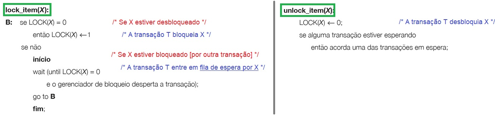
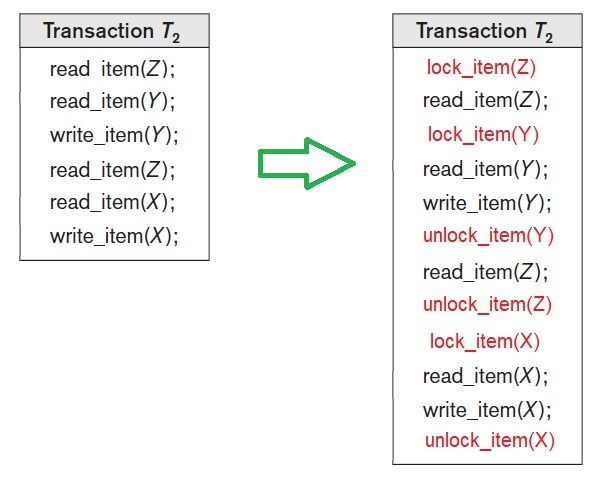
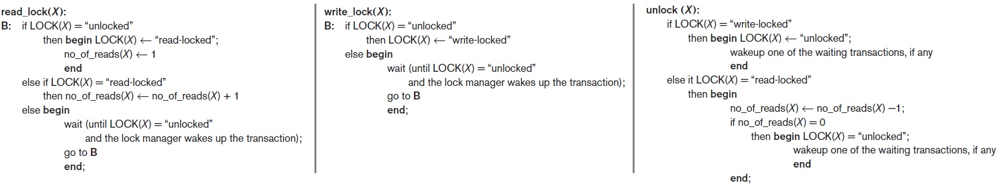
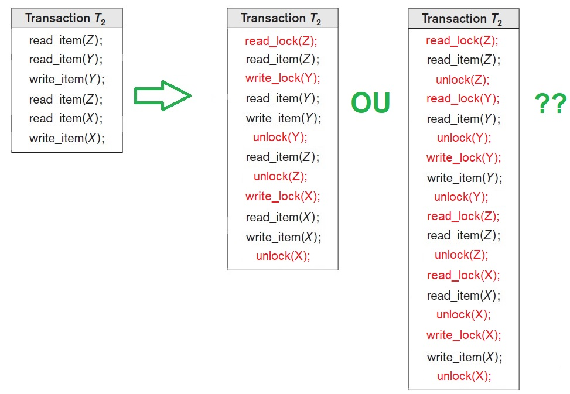
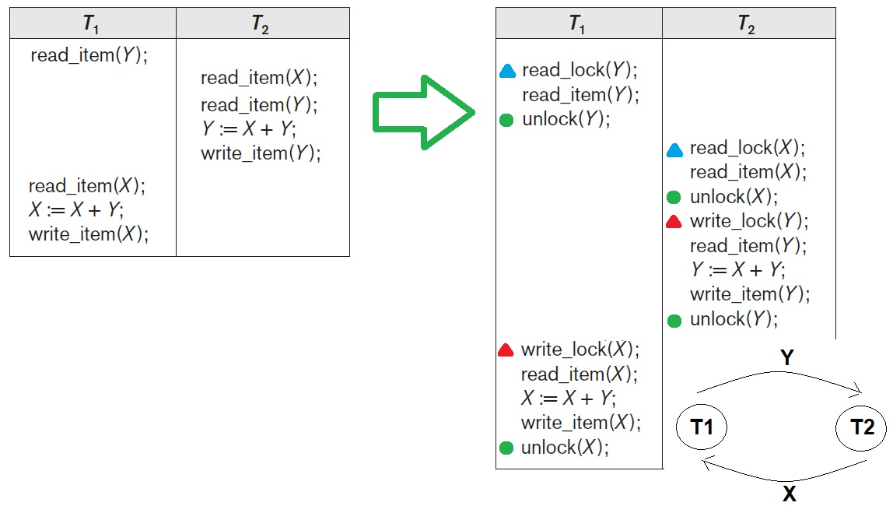

## [Tópico 26] - Processamento de Transações
###### *by Prof. Plinio Sa Leitao-Junior (INF/UFG)*

### <ins>CONTEÚDO</ins>

|_Item do conteúdo_|_Item do conteúdo_|
|-|-|
|1. Visão geral|5. <ins>**BLOQUEIO DE ITENS DO BANCO DE DADOS**</ins>
|2. Escalonamento|6. Concorrência baseada em bloqueio|
|3. Escalonamento quanto à recuperação|7. _Deadlock_ e _starvation_|
|4. Escalonamento quanto à serialização|8. Concorrência baseada em _timestamp_|

<hr style="border:2px solid blue">

**`TÉCNICAS DE CONTROLE DE CONCORRÊNCIA`** são usadas:
- para garantir a propriedade de <ins>não interferência ou isolamento de transações</ins> executadas simultaneamente.

### 5. <ins>BLOQUEIO DE ITENS DO BANCO DE DADOS</ins>

Sobre o <ins>bloqueio de um item de dados</ins> [no banco de dados]:<br>
&#10004; Determina o **status** de um item de dados,<br>
&nbsp;&nbsp;&nbsp;&nbsp;... com respeito às <ins>possíveis operações</ins> que podem ser aplicadas ao item.<br>
&#10004; Utilizado para <ins>sincronizar o acesso</ins> por transações simultâneas ao mesmo item de dados:<br>
&nbsp;&nbsp;&nbsp;&nbsp;... **há um bloqueio para cada item de dados [do banco de dados]**,<br>
&nbsp;&nbsp;&nbsp;&nbsp;... onde o foco são os itens acessados por alguma transação ativa (no escalonamento).<br>

```diff
+ Vários tipos de bloqueio são usados em controle de concorrência.
! O tipo mais simples é o bloqueio binário.
! Há ainda o bloqueio compartilhado/exclusivo.
```

#### &#9752;&#x270D;&#9745; <ins>`BLOQUEIO BINÁRIO`</ins>

Apesar de ser o mais simples, <ins>o bloqueio binário é mais teórico do que prático</ins>:<br>
&#10004; O bloqueio binário é <ins>mais restritivo quanto à concorrência</ins>.<br>
&#10004; No máximo uma transação pode manter o bloqueio em um item específico:<br>
&nbsp;&nbsp;&nbsp;&nbsp;... **`não há duas transações que possam acessar o mesmo item simultaneamente`**.<br>
&#10004; Um bloqueio binário pode ter dois estados (ou valores):<br>
&nbsp;&nbsp;&nbsp;&nbsp;... _`bloqueado`_ e _`não-bloqueado`_ (ou 1 e 0, respectivamente).<br>
&#10004; Se o valor do bloqueio em X for 1,<br>
&nbsp;&nbsp;&nbsp;&nbsp;... então o item X não poderá ser acessado por uma operação de banco de dados que o solicite.<br>
&#10004; Se o valor do bloqueio em X for 0,<br>
&nbsp;&nbsp;&nbsp;&nbsp;... então poderá ser acessado quando solicitado,<br>
&nbsp;&nbsp;&nbsp;&nbsp;... e o valor do bloqueio será alterado para 1.<br>
&#10004; <ins>Operações</ins> usadas no bloqueio binário por uma transação T:<br>
&nbsp;&nbsp;&nbsp;&nbsp;... _`lock_item(X)`_ para T bloquear o item X,<br>
&nbsp;&nbsp;&nbsp;&nbsp;... _`unlock_item(X)`_ para T desbloquear o item X.<br>
&#10004; Ambas as operações &#8212; _`lock_item(X)`_ e _`unlock_item(X)`_ &#8212; são implementadas como unidades indivisíveis:<br>
&nbsp;&nbsp;&nbsp;&nbsp;... uma vez que uma operação de bloqueio ou desbloqueio é iniciada,<br>
&nbsp;&nbsp;&nbsp;&nbsp;... nenhuma intercalação é permitida, até que a operação termine.<br> 
&#10004; Estruturas de dados pala implementar o bloqueio binário:<br>
&nbsp;&nbsp;&nbsp;&nbsp;... uma <ins>tabela de itens bloqueados</ins> &#8212; tabela (arquivo) _hash_ a partir do nome do item:<br>
&nbsp;&nbsp;&nbsp;&nbsp;&nbsp;&nbsp;&nbsp;&nbsp;... cada entrada [na tabela] é _<item de dado, transação>_,<br>
&nbsp;&nbsp;&nbsp;&nbsp;&nbsp;&nbsp;&nbsp;&nbsp;... apenas os itens que estão [correntemente] bloqueados estão na tabela,<br>
&nbsp;&nbsp;&nbsp;&nbsp;&nbsp;&nbsp;&nbsp;&nbsp;... os itens que não estão na tabela de bloqueio são considerados desbloqueados.<br>
&nbsp;&nbsp;&nbsp;&nbsp;... uma <ins>fila de espera</ins> para todo item X bloqueado,<br>
&nbsp;&nbsp;&nbsp;&nbsp;&nbsp;&nbsp;&nbsp;&nbsp;... cada entrada [na fila] é uma transação que aguarda o desbloqueio de X.

Algoritmo para o bloqueio binário pela Transação T:

&nbsp;&nbsp;&nbsp;&nbsp;&nbsp;&nbsp;&nbsp;&nbsp;&nbsp;&nbsp;&nbsp;&nbsp;

<ins>Exemplo de regras</ins> para implementação de bloqueio binário:
1. Uma transação T deve emitir a operação **_lock_item(X)_** antes de qualquer As operações _read_item(X)_ ou _write_item(X)_ são executadas em T.
2. Uma transação T deve emitir a operação **_unlock_item(X)_** depois que todas as operações _read_item(X_) e _write_item(X)_ forem concluídas em T.
3. Uma transação T não emitirá uma operação **_lock_item(X)_** se já possuir o bloqueio no item X.
4. Uma transação T não emitirá uma operação **_unlock_item(X)_** a menos que já mantenha o bloqueio no item X.

&nbsp;&nbsp;&nbsp;&nbsp;&nbsp;&nbsp;&nbsp;&nbsp;&nbsp;&nbsp;&nbsp;&nbsp;

#### &#9752;&#x270D;&#9745; <ins>`BLOQUEIO COMPARTILHADO/EXCLUSIVO`<ins>

O bloqueio compartilhado/exclusivo é <ins>menos restritivo</ins> [quanto à concorrência]:<br>
&#10004; Permite que diversas transações acessem o mesmo item X,<br>
&nbsp;&nbsp;&nbsp;&nbsp;... se as transações acessarem X <ins>apenas para fins de leitura</ins>, pois ...<br>
&nbsp;&nbsp;&nbsp;&nbsp;... operações de leitura não são conflitantes entre si.<br>
&#10004; <ins>Operações</ins> usadas no bloqueio compartilhado/exclusivo por uma transação T:<br>
&nbsp;&nbsp;&nbsp;&nbsp;... _`read_lock(X)`_ para T bloquear o item X para leitura,<br>
&nbsp;&nbsp;&nbsp;&nbsp;... _`write_lock(X`_ para T bloquear o item X para gravação,<br>
&nbsp;&nbsp;&nbsp;&nbsp;... _`unlock(X)`_ para T desbloquear o item X.<br>
&#10004; <ins>Possíveis estados</ins> de um item de dado no bloqueio compartilhado/exclusivo:<br>
&nbsp;&nbsp;&nbsp;&nbsp;... _`bloqueado para leitura`_ (bloqueado por compartilhamento),<br>
&nbsp;&nbsp;&nbsp;&nbsp;... _`bloqueado para gravação`_ (bloqueado exclusivo) e<br>
&nbsp;&nbsp;&nbsp;&nbsp;... _`não-bloqueado`_.<br>

&nbsp;&nbsp;&nbsp;&nbsp;&nbsp;&nbsp;&nbsp;&nbsp;&nbsp;&nbsp;&nbsp;&nbsp;

<ins>Exemplo de regras</ins> para implementação de bloqueio compartilhado/exclusivo:
1. Uma transação [ativa] T deve emitir a operação **_read_lock(X)_** ou **_write_lock(X)_**, [em algum momento] antes que qualquer operação **_read_item(X)_** seja executada em T.
2. Uma transação [ativa] T deve emitir a operação **_write_lock(X)_**, [em algum momento] antes que qualquer operação **_write_item(X)_** seja executada em T.
3. Uma transação [ativa] T deve emitir a operação **_unlock(X)_**, [em algum momento] depois que todas as operações **_read_item(X)_** e **_write_item(X)_** forem concluídas em T.
4. Uma transação [ativa] T não emitirá uma operação **_read_lock(X)_**, se já possuir um `bloqueio para leitura` (compartilhado) ou um `bloqueio para gravação` (exclusivo) no item X. 
5. Uma transação [ativa] T não emitirá uma operação **_write_lock(X)_**, se já possuir um `bloqueio para leitura` (compartilhado) ou um `bloqueio para gravação` (exclusivo) no item X. 
6. Uma transação [ativa] T não emitirá uma operação **_unlock(X)_**, a menos que já possua um `bloqueio para leitura` (compartilhado) ou um `bloqueio para gravação` (exclusivo) no item X.

&nbsp;&nbsp;&nbsp;&nbsp;&nbsp;&nbsp;&nbsp;&nbsp;&nbsp;&nbsp;&nbsp;&nbsp;

#### &#9752;&#x270D;&#9745; <ins>`CONVERSÃO ENTRE BLOQUEIO COMPARTILHADO E EXCLUSIVO`<ins>

Conversão de bloqueio compartilhado/exclusivo &#8212; envolve <ins>'relaxar' as Regras 4 e 5</ins> (acima):<br>
&#9888; A transação T converte o estado do item X &#8212; de _`bloqueado para leitura`_ para _`bloqueado para gravação`_:<br>
&nbsp;&nbsp;&nbsp;&nbsp;... T emite um **_read_lock(X)_** e depois converte o bloqueio emitindo um **_write_lock(X)_**,<br>
&nbsp;&nbsp;&nbsp;&nbsp;... se T não for a única transação que mantém um _`bloqueio para leitura`_ em X,<br>
&nbsp;&nbsp;&nbsp;&nbsp;&nbsp;&nbsp;&nbsp;&nbsp;&nbsp;&nbsp;&nbsp;&nbsp;... T entrará em estado de espera.<br>
&#9888; A transação T converte o estado do item X &#8212; de _`bloqueado para gravação`_ para _`bloqueado para leitura`_:<br>
&nbsp;&nbsp;&nbsp;&nbsp;... T emite um **_write_lock(X)_** e depois converte o bloqueio emitindo um **_read_lock(X)_**.<br>

#### &#9752;&#x270D;&#9745; <ins>`BLOQUEIO COMPARTILHADO/EXCLUSIVO NÃO GARANTE SERIALIZAÇÃO`<ins>

&nbsp;&nbsp;&nbsp;&nbsp;&nbsp;&nbsp;&nbsp;&nbsp;&nbsp;&nbsp;&nbsp;&nbsp;

#### &#9752;&#x270D;&#9745; <ins>`REFLEXÕES ...`<ins>

Para promover maior concorrência entre transações ... <br>
&nbsp;&nbsp;&nbsp;&nbsp;&nbsp;&nbsp;&nbsp;&nbsp;&nbsp;&nbsp;&nbsp;&nbsp;... ou seja, reduzir/evitar transações estejam em estado de espera,<br>
&nbsp;&nbsp;&nbsp;&nbsp;&nbsp;&nbsp;&nbsp;&nbsp;&nbsp;&nbsp;&nbsp;&nbsp;... devido aos estados de bloqueio de dados:<br>
&#9918; As transações [no escalonamento] deveriam ser longas ou curtas ?<br>
&#9918; Se o bloqueio [do Item X] é inevitável, o bloqueio deveria ser compartilhado ou exclusivo ?<br>
&#9918; Se o bloqueio [do Item X] é inevitável, o tempo em estado de bloqueio deveria ser longo ou curto ?<br>
&#9918; Se o bloqueio [do Item X] é inevitável, a granularidade de X deveria ser pequena ou grande ?

Outras questões:<br>
&#9918; O tempo de processamento pode ser afetado pelo número de operações de bloqueio ?<br>
&#9918; Como avaliar ...<br>
&nbsp;&nbsp;&nbsp;&nbsp;&nbsp;&nbsp;&nbsp;&nbsp;&nbsp;&nbsp;&nbsp;&nbsp;... granularidade do item a bloquear _versus_<br>
&nbsp;&nbsp;&nbsp;&nbsp;&nbsp;&nbsp;&nbsp;&nbsp;&nbsp;&nbsp;&nbsp;&nbsp;... número de operações de bloqueio _versus_<br>
&nbsp;&nbsp;&nbsp;&nbsp;&nbsp;&nbsp;&nbsp;&nbsp;&nbsp;&nbsp;&nbsp;&nbsp;... concorrência entre transações.
