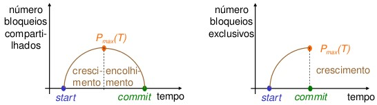

## [Tópico 27] - Processamento de Transações
###### *by Prof. Plinio Sa Leitao-Junior (INF/UFG)*

### <ins>CONTEÚDO</ins>

|_Item do conteúdo_|_Item do conteúdo_|
|-|-|
|1. Visão geral|5. Bloqueio de itens do banco de dados|
|2. Escalonamento|6. <ins>**CONCORRÊNCIA BASEADA EM BLOQUEIO**</ins>|
|3. Escalonamento quanto à recuperação|7. _Deadlock_ e _starvation_|
|4. Escalonamento quanto à serialização|8. Concorrência baseada em _timestamp_|

<hr style="border:2px solid blue">

Reenfatizando ... **`técnicas de controle de concorrência`** são usadas para garantir a propriedade de <ins>não interferência ou isolamento de transações</ins> executadas simultaneamente.

### 6. <ins>CONCORRÊNCIA BASEADA EM BLOQUEIO</ins>

Conforme endereçado no [Tópico 26](./topico-26.md), `bloqueio compartilhado/exclusivo não garante serialização` ...<br>
&#9745; ... o mesmo se aplica para `bloqueio binário`.

#### &#9752;&#x270D;&#9745; <ins>`BLOQUEIO DE DUAS FASES — 2FL (two-phase locking protocol)`<ins>

Uma transação segue o **`protocolo de bloqueio de duas fases`** SE:<br>
&#10004; Todas as operações de bloqueio <ins>precederem a primeira operação de desbloqueio</ins> na transação:<br>
&nbsp;&nbsp;&nbsp;&nbsp;&nbsp;&nbsp;&nbsp;&nbsp;... qualquer operação **_unlock_** <ins>deve ocorrer</ins> ...<br>
&nbsp;&nbsp;&nbsp;&nbsp;&nbsp;&nbsp;&nbsp;&nbsp;... após todas as operações **_read_lock_** e **_write_lock_** da transação.<br>
&#10004; 2PL é um conceito <ins>diretamente aplicado a uma transação individual</ins>, em vez do escalonamento:<br> 
&nbsp;&nbsp;&nbsp;&nbsp;&nbsp;&nbsp;&nbsp;&nbsp;... como qualquer escalonamento conserva a ordem das operações de cada transação,<br>
&nbsp;&nbsp;&nbsp;&nbsp;&nbsp;&nbsp;&nbsp;&nbsp;... então <ins>2PL é preservado nas transações do escalonamento</ins>.

Na figura a seguir, as Transações <ins>T<sub>1</sub> e T<sub>2</sub> não seguem o 2PL</ins>:<br>
&#9888; As Transações T<sub>1</sub> e T<sub>2</sub> foram modificadas para atender ao 2PL,<br>
&nbsp;&nbsp;&nbsp;&nbsp;&nbsp;&nbsp;&nbsp;&nbsp;... gerando as Transações **T<sub>1</sub>'** e **T<sub>2</sub>'**, respectivamente.

&nbsp;&nbsp;&nbsp;&nbsp;&nbsp;&nbsp;&nbsp;&nbsp;&nbsp;&nbsp;&nbsp;&nbsp;

```diff
+ Se a Transação T foi modificada para atender ao 2PL,
+ ......... os escalonamentos que T participa também serão modificados ??
```

A figura abaixo ilustra o protocolo 2PL para a Transação T<sub>x</sub> ...<br>
&#9918; `Fase de expansão ou crescimento`:<br>
&nbsp;&nbsp;&nbsp;&nbsp;&nbsp;&nbsp;&nbsp;&nbsp;... T<sub>x</sub> pode obter bloqueios, mas não pode liberar nenhum bloqueio.<br>
&#9918; `Fase de retrocesso ou encolhimento`:<br>
&nbsp;&nbsp;&nbsp;&nbsp;&nbsp;&nbsp;&nbsp;&nbsp;... T<sub>x</sub> pode liberar bloqueios, mas não pode obter nenhum bloqueio.

&nbsp;&nbsp;&nbsp;&nbsp;&nbsp;&nbsp;&nbsp;&nbsp;&nbsp;&nbsp;&nbsp;&nbsp;

#### FELIZMENTE ...<br>Se cada transação do escalonamento seguir o protocolo 2PL,<br>&nbsp;&nbsp;&nbsp;&nbsp;&nbsp;&nbsp;&nbsp;&nbsp;... o escalonamento é GARANTIDO SER SERIALIZÁVEL. 

```diff
+ O protocolo 2PL garante a serialização de escalonamentos.
! NÃO É NECESSÁRIO TESTAR A SERIALIZAÇÂO DO ESCALONAMENTO.

- Contudo, 2PL não permite todos os escalonamentos serializáveis possíveis,
- ..... alguns escalonamentos serializáveis serão proibidos pelo protocolo.
```

#### O protocolo 2PL PROMOVE A CONCORRÊNCIA ??

```diff
! Se a Transação T foi modificada para atender ao 2PL,
! ......... os escalonamentos que T participa potencialmente terão maior concorrência ??
! Ou seja, 2PL promove a maior concorrência ??

+ NÃO, 2PL limita a concorrência, pois ...
+ ....... o PERÍODO em que o item de dado PERMANECE BLOQUEADO é MAIOR.
+ Este é o preço para garantir a serialização do escalonamento,
+ ........ sem a necessidade de verificar (testar) se é o mesmo serializável.
```

#### &#9752;&#x270D;&#9745; <ins>`TIPOS DE BLOQUEIO DE DUAS FASES — TIPOS DE 2FL`<ins>

Os tipo documentados para o protocolo 2PL são:<br>
&#x270D; `Básico`, `Conservador`, `Estrito` e `Rigoroso`.

#### &#9752;&#9752; BLOQUEIO DE DUAS FASES <ins>`BÁSICO`</ins>

O <ins>**2PL BÁSICO**</ins> representa o protocolo como apresentado até o momento:<br>
&#10004; Ambas &#8212; fase de crescimento e fase de encolhimento &#8212; em estado de transação.

#### &#9752;&#9752; BLOQUEIO DE DUAS FASES <ins>`CONSERVADOR (ESTÁTICO)`</ins>

No <ins>**2PL CONSERVADOR**</ins>:<br>
&#x270D; Há o <ins>bloqueio de todos os itens antes que a transação comece a ser executada</ins> ...<br>
&nbsp;&nbsp;&nbsp;&nbsp;&nbsp;&nbsp;&nbsp;&nbsp;... envolve a pré-declaração dos itens para leitura e gravação da transação,<br>
&nbsp;&nbsp;&nbsp;&nbsp;&nbsp;&nbsp;&nbsp;&nbsp;... ou seja, conhecer previamente todos os itens que a transação lê e escreve;<br>
&nbsp;&nbsp;&nbsp;&nbsp;&nbsp;&nbsp;&nbsp;&nbsp;... se qualquer desses itens não puder ser bloqueado,<br>
&nbsp;&nbsp;&nbsp;&nbsp;&nbsp;&nbsp;&nbsp;&nbsp;... a transação não bloqueará nenhum item, e<br>
&nbsp;&nbsp;&nbsp;&nbsp;&nbsp;&nbsp;&nbsp;&nbsp;... aguardará até que todos os itens estejam disponíveis para bloqueio.<br>
&#x270D; O 2PL CONSERVADOR é um protocolo livre de _deadlock_ (impasse),<br>
&nbsp;&nbsp;&nbsp;&nbsp;&nbsp;&nbsp;&nbsp;&nbsp;... pois o qualquer impasse ocorre somente quando a transação está ativa.<br>
&#x270D; O 2PL CONSERVADOR possui uso prático dificultado,<br>
&nbsp;&nbsp;&nbsp;&nbsp;&nbsp;&nbsp;&nbsp;&nbsp;... devido à complexidade de pré-declarar os conjuntos de leitura e de gravação,<br>
&nbsp;&nbsp;&nbsp;&nbsp;&nbsp;&nbsp;&nbsp;&nbsp;... ou seja, impraticável em alguns casos.<br>
&#x270D; O 2PL CONSERVADOR é ilustrado na figura abaixo.

&nbsp;&nbsp;&nbsp;&nbsp;&nbsp;&nbsp;&nbsp;&nbsp;&nbsp;&nbsp;&nbsp;&nbsp;

#### &#9752;&#9752; BLOQUEIO DE DUAS FASES <ins>`ESTRITO` (MAIS POPULAR)</ins>

No <ins>**2PL ESTRITO**</ins>:<br>
&#x270D; Uma transação T libera seus bloqueios exclusivos (de gravação) SOMENTE após ser confirmada ou abortada:<br>
&nbsp;&nbsp;&nbsp;&nbsp;&nbsp;&nbsp;&nbsp;&nbsp;... ou seja, a liberação de bloqueios exclusivos ocorre apenas no final da transação.<br>
&#x270D; O 2PL ESTRITO conduz a <ins>escalonamentos estritos quanto à recuperabilidade</ins>:<br>
&nbsp;&nbsp;&nbsp;&nbsp;&nbsp;&nbsp;&nbsp;&nbsp;... 2PL Básico e Conservador não garantem escalonamentos recuperáveis.<br>
&#x270D; O 2PL ESTRITO <ins>não é</ins> um protocolo livre de _deadlock_ (impasse).<br>
&#x270D; O 2PL ESTRITO é ilustrado na figura abaixo.

&nbsp;&nbsp;&nbsp;&nbsp;&nbsp;&nbsp;&nbsp;&nbsp;&nbsp;&nbsp;&nbsp;&nbsp;

#### &#9752;&#9752; BLOQUEIO DE DUAS FASES <ins>`RIGOROSO`</ins>

O <ins>**2PL RIGOROSO**</ins> é uma variação mais restritiva do 2PL ESTRITO:<br>
&#x270D; Uma transação T libera qualquer dos seus bloqueios exclusivos ou compartilhados SOMENTE após ser confirmada ou abortada:<br>
&nbsp;&nbsp;&nbsp;&nbsp;&nbsp;&nbsp;&nbsp;&nbsp;... ou seja, a liberação de bloqueios ocorre apenas no final da transação.<br>
&#x270D; O 2PL RIGOROSO também conduz a <ins>escalonamentos estritos quanto à recuperabilidade</ins>.<br>
&#x270D; O 2PL RIGOROSO limita mais a concorrência em relação ao 2PL ESTRITO.<br>
&#x270D; O 2PL RIGOROSO é mais fácil de implementar do que o 2PL ESTRITO ...<br>
&nbsp;&nbsp;&nbsp;&nbsp;&nbsp;&nbsp;&nbsp;&nbsp;... e possui menos _overhead_ em relação ao 2PL ESTRITO.

&nbsp;&nbsp;&nbsp;&nbsp;&nbsp;&nbsp;&nbsp;&nbsp;&nbsp;&nbsp;&nbsp;&nbsp;

<hr style="border:2px solid blue">

#### Exercício

**_Qual a comparação entre 2PL CONSERVADOR e 2PL RIGOROSO ??_**

<hr style="border:2px solid blue">

#### Exercício

**_Analise as sentenças abaixo._**

\"O próprio SGBD (pelo subsistema de controle de concorrência) é responsável por gerar as operações (requisições) **_read_lock_** e **_write_lock_**.<br>
Por exemplo, suponha que o sistema adota o protocolo 2PL ESTRITO.

Caso a Transação T emita um **_read_item(X)_**, o sistema chama a operação **_read_lock(X)_** em nome de T.<br>
- Se o estado de X for `bloqueado para gravação` por outra transação T′, o sistema coloca T em fila de espera para o Item X.
- Caso contrário, o sistema concede a requisição **_read_lock(X)_** e permite que a operação **_read_item(X)_** de T seja executada.

Caso a transação T emita um **_write_item(X)_**, o sistema chama a operação **_write_lock(X)_** em nome de T:
- Se o estado de X for `bloqueado para gravação` ou `bloqueado para leitura` por outra transação T′, o sistema coloca T em fila de espera para o Item X.
- Se o estado de X for `bloqueado para leitura` e T for a única transação que mantém o bloqueio de leitura em X, o sistema atualiza o bloqueio para `bloqueado para gravação` e permite a operação **_write_item(X)_** por T.
- Se o estado de X for `não-bloqueado`, o sistema concede a requisição **_write_lock(X)_** e permite a execução da operação **_write_item(X)_**.

Após cada ação, o sistema deve atualizar sua tabela de bloqueios de forma adequada.\"
