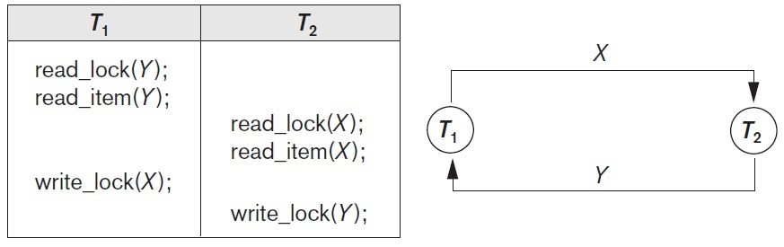

## [Tópico 28] - Processamento de Transações
###### *by Prof. Plinio Sa Leitao-Junior (INF/UFG)*

### <ins>CONTEÚDO</ins>

|_Item do conteúdo_|_Item do conteúdo_|
|-|-|
|1. Visão geral|5. Bloqueio de itens do banco de dados|
|2. Escalonamento|6. Concorrência baseada em bloqueio|
|3. Escalonamento quanto à recuperação|7. <ins>**_DEADLOCK_ E _STARVATION_**</ins>|
|4. Escalonamento quanto à serialização|8. Concorrência baseada em _timestamp_|

### 7. <ins>_DEADLOCK_ E _STARVATION_</ins>

O emprego de BLOQUEIO DE ITENS de banco de dados [potencialmente] ocasiona: 
&#9888; <ins>**_`Overhead`_**</ins> no processamento de transações, pois ... 
&nbsp;&nbsp;&nbsp;&nbsp;&nbsp;&nbsp;&nbsp;&nbsp;... cada operação de leitura ou gravação é precedida por uma solicitação de bloqueio. 
&#9888; Duas <ins>consequências do controle de concorrência</ins> [para garantir o isolamento de transações]: 
&nbsp;&nbsp;&nbsp;&nbsp;&nbsp;&nbsp;&nbsp;&nbsp; <ins>**_`Deadlock`_**</ins> 
&nbsp;&nbsp;&nbsp;&nbsp;&nbsp;&nbsp;&nbsp;&nbsp; <ins>**_`Starvation`_**</ins>

#### &#9752;&#x270D;&#9745; <ins>_`DEADLOCK`_</ins> &#8212; IMPASSE

Considere um escalonamento **S** referente ao conjunto **M** de transações: 
&#9918; Seja o subconjunto **K** (**K &#8838; M**) com cardinalidade **k** (k &#8805; 2). 
&#9918; Cada transação em **K** está aguardando algum item, o qual está bloqueado por alguma outra transação em **K**, 
&nbsp;&nbsp;&nbsp;&nbsp;&nbsp;&nbsp;&nbsp;&nbsp;&nbsp;&nbsp;&nbsp;&nbsp;&nbsp;&nbsp;&nbsp;&nbsp; ... gerando um <ins>ciclo de espera</ins> entre as transação de **K**: 
&nbsp;&nbsp;&nbsp;&nbsp;&nbsp;&nbsp;&nbsp;&nbsp; T1 espera por T2 , 
&nbsp;&nbsp;&nbsp;&nbsp;&nbsp;&nbsp;&nbsp;&nbsp; T2 espera por T3 , 
&nbsp;&nbsp;&nbsp;&nbsp;&nbsp;&nbsp;&nbsp;&nbsp; ... 
&nbsp;&nbsp;&nbsp;&nbsp;&nbsp;&nbsp;&nbsp;&nbsp; Tk-2 espera por Tk-1 e 
&nbsp;&nbsp;&nbsp;&nbsp;&nbsp;&nbsp;&nbsp;&nbsp; Tk-1 espera por Tk e 
&nbsp;&nbsp;&nbsp;&nbsp;&nbsp;&nbsp;&nbsp;&nbsp; Tk espera por T1 . 
&#9918; Ou seja, cada transação em **K** está em uma <ins>fila de espera</ins>, 
&nbsp;&nbsp;&nbsp;&nbsp;&nbsp;&nbsp;&nbsp;&nbsp; ... então há um IMPASSE (_DEADLOCK_), 
&nbsp;&nbsp;&nbsp;&nbsp;&nbsp;&nbsp;&nbsp;&nbsp; ... ou seja, há um espera entre as transações em **K**, que durará `tempo infinito`.

#### &#10004;&#10004; RESOLUÇÃO DE _DEADLOCK_

Para <ins>resolver os impasses (_deadlocks_)</ins> causados pelos ciclos de espera: 
&#9918; SGBDs, em geral, <ins>escolhem uma das transações</ins> envolvidas no ciclo de espera &#8212; a Transação T ... 
&nbsp;&nbsp;&nbsp;&nbsp;&nbsp;&nbsp;&nbsp;&nbsp; ... T é cancelada (abortada) pelo SGBD, 
&nbsp;&nbsp;&nbsp;&nbsp;&nbsp;&nbsp;&nbsp;&nbsp; ... tal que as demais transações do _deadlock_ possam sair do estado de espera, 
&nbsp;&nbsp;&nbsp;&nbsp;&nbsp;&nbsp;&nbsp;&nbsp; ... então T é reiniciada pelo próprio SGBD.

#### &#10004;&#10004;  _TIMESTAMP_ &#8212; RÓTULO DE TEMPO

Cada transação ativa possui seu próprio _timestamp_: 
&#9918; O _timestamp_ da transação T é especificado como **`TS(T)`**. 
&#9918; O _timestamp_ denota o `momento` no qual uma transação foi iniciada: 
&nbsp;&nbsp;&nbsp;&nbsp;&nbsp;&nbsp;&nbsp;&nbsp; ... se Tx iniciou antes que Ty, 
&nbsp;&nbsp;&nbsp;&nbsp;&nbsp;&nbsp;&nbsp;&nbsp; ... então **TS(Tx) < TS(Ty**), 
&nbsp;&nbsp;&nbsp;&nbsp;&nbsp;&nbsp;&nbsp;&nbsp; ... ou seja, o _timestamp_ busca comparar as transações quanto ao momento de início das mesmas. 
&#9918; Protocolos de tratamento (prevenção) de _deadlock_ <ins>baseados em _timestamp_</ins>: 
&nbsp;&nbsp;&nbsp;&nbsp;&nbsp;&nbsp;&nbsp;&nbsp; ... em geral buscam <ins>priorizar a transação mais antiga</ins>. 
&#9918; O mecanismo de _timestamp_ pode ser implementado por atribuir um número inteiro para cada transação ?? 

#### &#10004;&#10004; PROTOCOLO (TÉCNICA) `ESPERAR-OU-MORRER` &#8212; _WAIT-DIE_ 

Suponha que o item `X foi bloqueado por Tx`, e depois `Ty tenta bloquear X`: 
&#9918; Se Ty for mais antiga que Tx &#8212; **`TS(Ty) < TS(Tx)`**: 
&nbsp;&nbsp;&nbsp;&nbsp;&nbsp;&nbsp;&nbsp;&nbsp; ... `Ty irá esperar` pelo desbloqueio de X. 
&#9918; Caso contrário: Se Ty for mais jovem que Tx &#8212; **`TS(Ty) > TS(Tx)`**: 
&nbsp;&nbsp;&nbsp;&nbsp;&nbsp;&nbsp;&nbsp;&nbsp; ... `Ty será cancelada` (abortada) [pelo SGBD] e 
&nbsp;&nbsp;&nbsp;&nbsp;&nbsp;&nbsp;&nbsp;&nbsp; ... `Ty será então reiniciada` [pelo SGBD] <ins>**com o mesmo _timestamp_**</ins>.

#### &#10004;&#10004; PROTOCOLO (TÉCNICA) `FERIR-OU-ESPERAR` &#8212; _WOUND-WAIT_

Suponha que o item `X foi bloqueado por Tx`, e depois `Ty tenta bloquear X`: 
&#9918; Se Ty for mais antiga que Tx &#8212; **`TS(Ty) < TS(Tx)`**: 
&nbsp;&nbsp;&nbsp;&nbsp;&nbsp;&nbsp;&nbsp;&nbsp; ... `Tx será cancelada` (abortada) [pelo SGBD], 
&nbsp;&nbsp;&nbsp;&nbsp;&nbsp;&nbsp;&nbsp;&nbsp;&nbsp;&nbsp;&nbsp;&nbsp;&nbsp;&nbsp;&nbsp;&nbsp; ... para que Ty possa prosseguir, 
&nbsp;&nbsp;&nbsp;&nbsp;&nbsp;&nbsp;&nbsp;&nbsp; ... `Tx será então reiniciada` [pelo SGBD] <ins>**com o mesmo _timestamp_**</ins>. 
&#9918; Caso contrário: Se Ty for mais jovem que Tx &#8212; **`TS(Ty) > TS(Tx)`**: 
&nbsp;&nbsp;&nbsp;&nbsp;&nbsp;&nbsp;&nbsp;&nbsp; ... `Ty irá esperar` pelo desbloqueio de X. 

#### &#10004;&#10004; QUESTÕES

O emprego da técnica `esperar-ou-morrer` gera escalonamentos `livres de deadlock` ?? 
Ou seja, se as transações aguardam apenas por transações mais jovens, nenhum ciclo de espera é criado ??

O emprego da técnica `ferir-ou-esperar` gera escalonamentos `livres de deadlock` ?? 
Ou seja, se as transações aguardam apenas por transações mais antigas, nenhum ciclo de espera é criado ??

Os protocolos `esperar-ou-morrer` e `ferir-ou-esperar` podem abortar e reiniciar transações desnecessariamente, pois tais transações não estavam em ciclos de espera de _deadlocks_ ??

#### &#10004;&#10004; PROTOCOLO (TÉCNICA) `TEMPO ESGOTADO` &#8212; _TIMEOUT_

Suponha que o item `X foi bloqueado por Tx`, e depois `Ty tenta bloquear X`: 
&nbsp;&nbsp;&nbsp;&nbsp;&nbsp;&nbsp;&nbsp;&nbsp; ... `Ty esperará algum tempo` (período de _timeout_), o qual é determinado pelo administrador de banco de dados, na 'esperança' de sair do estado de espera; 
&nbsp;&nbsp;&nbsp;&nbsp;&nbsp;&nbsp;&nbsp;&nbsp; ... se Ty permanecer em estado de espera após esse tempo, ty será cancelada (abortada) [pelo SGBD] e reiniciada. 

#### &#10004;&#10004; PROTOCOLO (TÉCNICA) `SEM-ESPERA` &#8212; _NO WAITING (NW)_

Suponha que o item `X foi bloqueado por Tx`, e depois `Ty tenta bloquear X`: 
&nbsp;&nbsp;&nbsp;&nbsp;&nbsp;&nbsp;&nbsp;&nbsp; ... `Ty será cancelada` (abortada) [pelo SGBD] <ins>imediatamente</ins> e 
&nbsp;&nbsp;&nbsp;&nbsp;&nbsp;&nbsp;&nbsp;&nbsp; ... `Ty será então reiniciada` [pelo SGBD] <ins>após algum atraso (_delay_)</ins>. 

#### &#10004;&#10004; PROTOCOLO (TÉCNICA) `ESPERA-CAUTELOSA` &#8212; _CAUTIOUS WAITING (CW)_

Suponha que o item `X foi bloqueado por Tx`, e depois `Ty tenta bloquear X`: 
&#9918; Se Tx NÃO ESTIVER em [qualquer] <ins>fila de espera</ins>:  
&nbsp;&nbsp;&nbsp;&nbsp;&nbsp;&nbsp;&nbsp;&nbsp; ... `Ty irá esperar` pelo desbloqueio de X. 
&#9918; Caso contrário: Se Tx ESTIVER em [alguma] <ins>fila de espera</ins>: 
&nbsp;&nbsp;&nbsp;&nbsp;&nbsp;&nbsp;&nbsp;&nbsp; ... `Ty será cancelada` (abortada) [pelo SGBD] e 
&nbsp;&nbsp;&nbsp;&nbsp;&nbsp;&nbsp;&nbsp;&nbsp; ... `Ty será então reiniciada` [pelo SGBD]. 
&#9918; O `protocolo espera-cautelosa` busca reduzir o número de abortos/reinicializações desnecessárias [de outros protocolos].

#### &#10004;&#10004; QUESTÃO

O emprego da técnica `espera-cautelosa` gera escalonamentos `livres de deadlock` ?? 
&nbsp;&nbsp;&nbsp;&nbsp;&nbsp;&nbsp;&nbsp;&nbsp; ... se nenhuma transação poderá esperar por outra transação que já esteja `em espera`, 
&nbsp;&nbsp;&nbsp;&nbsp;&nbsp;&nbsp;&nbsp;&nbsp;&nbsp;&nbsp;&nbsp;&nbsp;&nbsp;&nbsp;&nbsp;&nbsp;nenhum ciclo de espera é criado ?? 
&#9918; Por exemplo, seja b(T) o momento em que a Transação T foi bloqueada:  
&nbsp;&nbsp;&nbsp;&nbsp;&nbsp;&nbsp;&nbsp;&nbsp; ... se Ty espera por Tx, então `b(Tx) < b(Ty)`,  
&nbsp;&nbsp;&nbsp;&nbsp;&nbsp;&nbsp;&nbsp;&nbsp; ... então, os tempos de bloqueio formam uma ordem total em todas as transações bloqueadas.

#### &#10004;&#10004; PREVENÇÃO _versus_ DETECÇÃO DE _DEADLOCK_

A DETECÇÃO DE _DEADLOCK_ `não é uma abordagem prática` na maioria das situações: 
&#9918; O SGBD verificaria <ins>se realmente existe</ins> um estado de _deadlock_. 
&#9918; `Contexto para a detecção` de _deadlock_ ;&#8212; cenários teóricos: 
&nbsp;&nbsp;&nbsp;&nbsp;&nbsp;&nbsp;&nbsp;&nbsp; ... baixa interferência entre transações ativas ... 
&nbsp;&nbsp;&nbsp;&nbsp;&nbsp;&nbsp;&nbsp;&nbsp;&nbsp;&nbsp;&nbsp;&nbsp;&nbsp;&nbsp;&nbsp;&nbsp; transações raramente acessam os mesmos itens simultaneamente, 
&nbsp;&nbsp;&nbsp;&nbsp;&nbsp;&nbsp;&nbsp;&nbsp; ... transações curtas, transações bloqueiam poucos itens, poucas transações ativas. 
&#9918; `Contexto para a prevenção` de _deadlock_ ;&#8212; cenários mais realistas: 
&nbsp;&nbsp;&nbsp;&nbsp;&nbsp;&nbsp;&nbsp;&nbsp; ... transações longas e curtas concomitantemente, 
&nbsp;&nbsp;&nbsp;&nbsp;&nbsp;&nbsp;&nbsp;&nbsp; ... algumas transações bloqueiam poucos itens e outras muitos itens, 
&nbsp;&nbsp;&nbsp;&nbsp;&nbsp;&nbsp;&nbsp;&nbsp; ... muitas transações ativas. 

#### &#10004;&#10004; GRAFO DE ESPERA ;&#8212; _WAIT-FOR GRAPH_

O `Grafo de Espera` é um mecanismo para a detecção de _deadlocks_: 
&#9918; O SGBD teria que criar e manter o grafo de espera: 
&nbsp;&nbsp;&nbsp;&nbsp;&nbsp;&nbsp;&nbsp;&nbsp; ... se Ty aguarda para bloquear X, e X está atualmente bloqueado por Se Tx, 
&nbsp;&nbsp;&nbsp;&nbsp;&nbsp;&nbsp;&nbsp;&nbsp;&nbsp;&nbsp;&nbsp;&nbsp;&nbsp;&nbsp;&nbsp;&nbsp; uma aresta direcionada (Ty → Tx) é criada no grafo; 
&nbsp;&nbsp;&nbsp;&nbsp;&nbsp;&nbsp;&nbsp;&nbsp; ... quando Tx liberar os bloqueios que Ty aguarda, 
&nbsp;&nbsp;&nbsp;&nbsp;&nbsp;&nbsp;&nbsp;&nbsp;&nbsp;&nbsp;&nbsp;&nbsp;&nbsp;&nbsp;&nbsp;&nbsp; a aresta direcionada (Ty → Tx) é eliminada do grafo. 
&#9918; `DEADLOCK` ocorre se e somente se o gráfico de espera tiver um ciclo: 
&nbsp;&nbsp;&nbsp;&nbsp;&nbsp;&nbsp;&nbsp;&nbsp; ... com que frequência deve-se verificar a ocorrência de ciclo(s) ?? 
&nbsp;&nbsp;&nbsp;&nbsp;&nbsp;&nbsp;&nbsp;&nbsp;&nbsp;&nbsp;&nbsp;&nbsp;&nbsp;&nbsp;&nbsp;&nbsp; adição de aresta no grafo, 
&nbsp;&nbsp;&nbsp;&nbsp;&nbsp;&nbsp;&nbsp;&nbsp;&nbsp;&nbsp;&nbsp;&nbsp;&nbsp;&nbsp;&nbsp;&nbsp; período de tempo que várias transações aguardaram para bloquear itens, etc. 
&#9918; Exemplo de grafo de espera na figura abaixo.

&nbsp;&nbsp;&nbsp;&nbsp;&nbsp;&nbsp;&nbsp;&nbsp;&nbsp;&nbsp;&nbsp;&nbsp;

#### &#9752;&#x270D;&#9745; <ins>_`STARVATION`_</ins> &#8212; INANIÇÃO

**`Starvation`** ocorre quando <ins>uma transação T não pode prosseguir</ins>  por um período indefinido de tempo: 
&#9918; A transação T `não consegue concluir`, enquanto outras transações no sistema continuam normalmente: 
&nbsp;&nbsp;&nbsp;&nbsp;&nbsp;&nbsp;&nbsp;&nbsp; ... por exemplo, o SGBD <ins>sempre aborta a mesma transação</ins> para resolver um _`deadlock`_; 
&nbsp;&nbsp;&nbsp;&nbsp;&nbsp;&nbsp;&nbsp;&nbsp; ... outro exemplo, T tenta obter `bloqueio exclusivo de X`, 
&nbsp;&nbsp;&nbsp;&nbsp;&nbsp;&nbsp;&nbsp;&nbsp;&nbsp;&nbsp;&nbsp;&nbsp;&nbsp;&nbsp;&nbsp;&nbsp;&nbsp;&nbsp;&nbsp;&nbsp;&nbsp;&nbsp;&nbsp;&nbsp;&nbsp;mas o item X tem vários bloqueios compartilhados por longo período de tempo. 
&#9918; Algumas potenciais soluções: 
&nbsp;&nbsp;&nbsp;&nbsp;&nbsp;&nbsp;&nbsp;&nbsp;&#x270D; (1) Ordenar a fila de espera por ordem de chegada, 
&nbsp;&nbsp;&nbsp;&nbsp;&nbsp;&nbsp;&nbsp;&nbsp;&nbsp;&nbsp;&nbsp;&nbsp;&nbsp;&nbsp;&nbsp;&nbsp; ... as transações estão habilitadas para bloquear um item na ordem em que solicitaram originalmente o bloqueio. 
&nbsp;&nbsp;&nbsp;&nbsp;&nbsp;&nbsp;&nbsp;&nbsp;&#x270D; (2) Atribuir prioridades às transações na fila de espera, 
&nbsp;&nbsp;&nbsp;&nbsp;&nbsp;&nbsp;&nbsp;&nbsp;&nbsp;&nbsp;&nbsp;&nbsp;&nbsp;&nbsp;&nbsp;&nbsp; ... elevar a prioridade de uma transação <ins>quanto mais tempo ela espera</ins>, OU 
&nbsp;&nbsp;&nbsp;&nbsp;&nbsp;&nbsp;&nbsp;&nbsp;&nbsp;&nbsp;&nbsp;&nbsp;&nbsp;&nbsp;&nbsp;&nbsp; ... elevar a prioridade de uma transação <ins>quanto mais ela é abortada</ins> para resolver _deadlocks_. 
&#9918; As técnicas `esperar-ou-morrer` e `ferir-ou-esperar` promovem a ocorrência de `starvation`? 
&nbsp;&nbsp;&nbsp;&nbsp;&nbsp;&nbsp;&nbsp;&nbsp;&nbsp;&nbsp;&nbsp;&nbsp;&nbsp;&nbsp;&nbsp;&nbsp; ... uma transação que foi abortada é reiniciada com mesmo _timestamp_ original, 
&nbsp;&nbsp;&nbsp;&nbsp;&nbsp;&nbsp;&nbsp;&nbsp;&nbsp;&nbsp;&nbsp;&nbsp;&nbsp;&nbsp;&nbsp;&nbsp; ... o que reduz a possibilidade da mesma transação ser abortada repetidamente.
