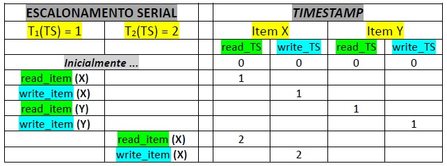
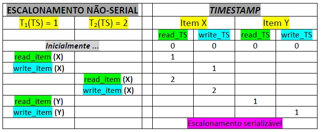
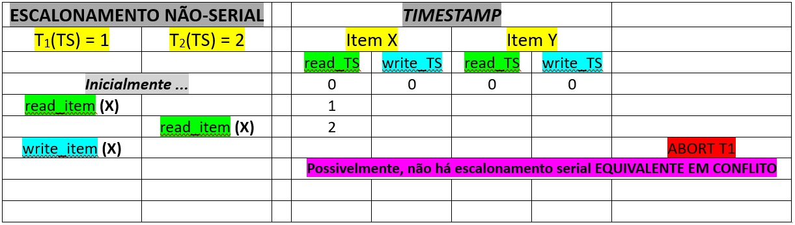

## [Tópico 29] - Processamento de Transações
###### *by Prof. Plinio Sa Leitao-Junior (INF/UFG)*

### <ins>CONTEÚDO</ins>

|_Item do conteúdo_|_Item do conteúdo_|
|-|-|
|1. Visão geral|5. Bloqueio de itens do banco de dados|
|2. Escalonamento|6. Concorrência baseada em bloqueio|
|3. Escalonamento quanto à recuperação|7. _Deadlock_ e _starvation_|
|4. Escalonamento quanto à serialização|8. <ins>**CONCORRÊNCIA BASEADA EM _TIMESTAMP_**</ins>|

<hr style="border:2px solid blue">

### 7. <ins>CONCORRÊNCIA BASEADA EM _TIMESTAMP_</ins>

As abordagens de [controle de] <ins>**concorrência baseada em _timestamp_**</ins>:<br>
&#9888; UTILIZAM o _timestamp_ (rótulo/carimbo de tempo) das transações no escalonamento ...<br>
&nbsp;&nbsp;&nbsp;&nbsp;&nbsp;&nbsp;&nbsp;&nbsp;... para orientar a ordenação de execução das operações conflitantes.<br>
&#9888; NÃO UTILIZAM o mecanismo de bloqueio ...<br>
&nbsp;&nbsp;&nbsp;&nbsp;&nbsp;&nbsp;&nbsp;&nbsp;... por conseguinte, geram escalonamentos **`livres de deadlock`**.

Sobre _timestamp_ (rótulo/carimbo de tempo) das transações no escalonamento, ver [Tópico 28](./topico-28.md) .

#### &#9752;&#x270D;&#9745; <ins>ORDENAÇÃO BASEADA EM _TIMESTAMP_</ins>

A intercalação de operações das transações  &#8212; escalonamento não-serial &#8212; mas deve garantir que:<br>

```diff
!  Em cada par de operações conflitantes no escalonamento,
!  .....  a ordem em que o item [de dado] é acessado deve seguir a ordem do timestamp [de transações] .
```

Cada Item X [do banco de dados] possui <ins>dois valores de _timestamp_</ins>:<br>
&#10004; **`read_TS(X)`** representa o maior _timestamp_ dentre transações que leram o item X com sucesso ...<br>
&nbsp;&nbsp;&nbsp;&nbsp;&nbsp;&nbsp;&nbsp;&nbsp;... ou seja, se <ins>T é a transação mais jovem que leu X</ins> com sucesso, então `read_TS(X) = TS(T)` .<br>
&#10004; **`write_TS(X)`** representa o maior _timestamp_ dentre transações que gravaram (escreveram) o item X com sucesso ...<br>
&nbsp;&nbsp;&nbsp;&nbsp;&nbsp;&nbsp;&nbsp;&nbsp;... ou seja, se <ins>T é a transação mais jovem que gravou X</ins> com sucesso, então `write_TS(X) = TS(T)` .<br>

<hr style="border:2px solid blue">

#### &#9752;&#x270D;&#9745; <ins>ALGORITMO DE ORDENAÇÃO `BÁSICA` DE _TIMESTAMP_</ins>

O algoritmo é também conhecido como _`Basic TO`_ (_Basic Timestamp Ordering_).<br>
BASICAMENTE ...<br>
Se [a transação] T emitir **_read_item(X)_** ou **_write_item(X)_**:<br>
&#9918; O algoritmo compara o **TS(T)** com `read_TS(X)` e `write_TS(X)`,<br>
&nbsp;&nbsp;&nbsp;&nbsp;&nbsp;&nbsp;&nbsp;&nbsp;&nbsp;&nbsp;&nbsp;&nbsp;&nbsp;&nbsp;&nbsp;&nbsp;... para verificar se a <ins>ordem do _timestamp_ de execução da transação</ins> foi preservada,<br>
&nbsp;&nbsp;&nbsp;&nbsp;&nbsp;&nbsp;&nbsp;&nbsp;&nbsp;&nbsp;&nbsp;&nbsp;&nbsp;&nbsp;&nbsp;&nbsp;... tal como ocorre nos escalonamentos seriais,<br>&nbsp;&nbsp;&nbsp;&nbsp;&nbsp;&nbsp;&nbsp;&nbsp;&nbsp;&nbsp;&nbsp;&nbsp;&nbsp;&nbsp;&nbsp;&nbsp;... ou seja, se [possivelmente] há escalonamento serial equivalente:<br>
&nbsp;&nbsp;&nbsp;&nbsp;&nbsp;&nbsp;&nbsp;&nbsp;(1) Se a ordem foi PRESERVADA, a operação &#8212; _read_item(X)_ ou _write_item(X)_ &#8212; é executada;<br>
&nbsp;&nbsp;&nbsp;&nbsp;&nbsp;&nbsp;&nbsp;&nbsp;(1) Se a ordem foi VIOLADA, a transação <ins>T é abortada e reiniciada</ins> [com novo _timestamp_].

CONSIDERE que a transação T emite uma operação **_write_item(X)_**:<br>
&#9888; Se `read_TS(X) > TS(T)`&nbsp;&nbsp;**OU**&nbsp;&nbsp;`write_TS(X) > TS(T)` ...<br>
&nbsp;&nbsp;&nbsp;&nbsp;&nbsp;&nbsp;&nbsp;&nbsp;(1) T será cancelada (abortada), então reiniciada ...<br>
&nbsp;&nbsp;&nbsp;&nbsp;&nbsp;&nbsp;&nbsp;&nbsp;&nbsp;&nbsp;&nbsp;&nbsp;&nbsp;&nbsp;&nbsp;&nbsp;... pois alguma transação mais recente leu ou escreveu o valor do item X antes de T.<br>
&#9888; Caso contrário, `read_TS(X) ≤ TS(T)`&nbsp;&nbsp;**E**&nbsp;&nbsp;`write_TS(X) ≤ TS(T)` ...<br>
&nbsp;&nbsp;&nbsp;&nbsp;&nbsp;&nbsp;&nbsp;&nbsp;(1) a operação **_write_item(X)_** de T será executada,<br>
&nbsp;&nbsp;&nbsp;&nbsp;&nbsp;&nbsp;&nbsp;&nbsp;(2) a atribuição `write_TS(X) = TS(T)` ocorrerá.

CONSIDERE que a transação T emite uma operação **_read_item(X)_**:<br>
&#9888; Se `write_TS(X) > TS(T)` ...<br>
&nbsp;&nbsp;&nbsp;&nbsp;&nbsp;&nbsp;&nbsp;&nbsp;(1) T será cancelada (abortada), então reiniciada ...<br>
&nbsp;&nbsp;&nbsp;&nbsp;&nbsp;&nbsp;&nbsp;&nbsp;&nbsp;&nbsp;&nbsp;&nbsp;&nbsp;&nbsp;&nbsp;&nbsp;... pois alguma transação mais recente escreveu o valor do item X antes de T.<br>
&#9888; Caso contrário, `write_TS(X) ≤ TS(T)` ...<br>
&nbsp;&nbsp;&nbsp;&nbsp;&nbsp;&nbsp;&nbsp;&nbsp;(1) a operação **_read_item(X)_** de T será executada,<br>
&nbsp;&nbsp;&nbsp;&nbsp;&nbsp;&nbsp;&nbsp;&nbsp;(2) a atribuição `read_TS(X) = MAX (TS(T), read_TS(X))` ocorrerá.

&nbsp;&nbsp;&nbsp;&nbsp;&nbsp;&nbsp;&nbsp;&nbsp;&nbsp;&nbsp;&nbsp;&nbsp;

&nbsp;&nbsp;&nbsp;&nbsp;&nbsp;&nbsp;&nbsp;&nbsp;&nbsp;&nbsp;&nbsp;&nbsp;

&nbsp;&nbsp;&nbsp;&nbsp;&nbsp;&nbsp;&nbsp;&nbsp;&nbsp;&nbsp;&nbsp;&nbsp;

**Sempre que o algoritmo _Basic TO_ detecta duas operações conflitantes que ocorrem na ordem incorreta, ele rejeita a última das duas operações, abortando a transação que a emitiu.**

Como CONSEQUÊNCIA ...<br>
&#9918; Se a transação T for abortada, `pode ocorrer aborto em cascata`:<br>
&nbsp;&nbsp;&nbsp;&nbsp;&nbsp;&nbsp;&nbsp;&nbsp; ... qualquer transação **T'** que possa ter usado um valor escrito por T,<br>
&nbsp;&nbsp;&nbsp;&nbsp;&nbsp;&nbsp;&nbsp;&nbsp; ... qualquer transação **T''** que possa ter usado um valor escrito por T',<br>
&nbsp;&nbsp;&nbsp;&nbsp;&nbsp;&nbsp;&nbsp;&nbsp; ... assim por diante.<br>
&#9888; O algoritmo de ordenação básica <ins>GARANTE</ins> ESCALONAMENTOS SERIALIZÁVEIS:<br>
&#9888; O algoritmo de ordenação básica <ins>NÃO GARANTE</ins> ESCALONAMENTOS RECUPERÁVEIS:<br>
&nbsp;&nbsp;&nbsp;&nbsp;&nbsp;&nbsp;&nbsp;&nbsp; ... alterações no algoritmo podem ser aplicadas para ter recuperabilidade [de escalonamento].<br>
&#9888; O algoritmo de ordenação básica <ins>EVITA</ins> _STARVATION_ ?? O reinício cíclico da mesma transação pode ocorrer ...

<hr style="border:2px solid blue">

#### &#9752;&#x270D;&#9745; <ins>ALGORITMO DE ORDENAÇÃO `ESTRITA` DE _TIMESTAMP_</ins>

O algoritmo é também conhecido como _`Strict TO`_ (_Strict Timestamp Ordering_).<br>
Representa uma variação do algoritmo de ordenação básica:<br>
&#9918; A intenção é ter escalonamentos RECUPERÁVEIS ESTRITOS.<br>

CONSIDERE o cenário:<br>
&nbsp;&nbsp;&nbsp;&nbsp;&nbsp;&nbsp;&nbsp;&nbsp;&nbsp;&nbsp;&nbsp;&nbsp;&nbsp;&nbsp;&nbsp;&nbsp;... T emite a operação **_read_item(X)_** ou **_write_item(X)_** , **E**<br>
&nbsp;&nbsp;&nbsp;&nbsp;&nbsp;&nbsp;&nbsp;&nbsp;&nbsp;&nbsp;&nbsp;&nbsp;&nbsp;&nbsp;&nbsp;&nbsp;... `TS(T) > write_TS(X)` .<br>
&#9888; A operação &#8212; _read_item(X)_ ou _write_item(X)_ &#8212; é atrasada até que ...<br>
&nbsp;&nbsp;&nbsp;&nbsp;&nbsp;&nbsp;&nbsp;&nbsp; ... a última transação que escreveu X seja confirmada ou abortada,<br>
&nbsp;&nbsp;&nbsp;&nbsp;&nbsp;&nbsp;&nbsp;&nbsp; ... ou seja, se TS(T') = write_TS(X),<br>
&nbsp;&nbsp;&nbsp;&nbsp;&nbsp;&nbsp;&nbsp;&nbsp;&nbsp;&nbsp;&nbsp;&nbsp;&nbsp;&nbsp;&nbsp;&nbsp;... a operação é atrasada até que T' seja confirmada ou abortada.

SOBRE a <ins>implementação</ins> do algoritmo:<br>
&#9918; [Simular] o BLOQUEIO de X é necessário.<br>
&#9888; Se há bloqueio, então o algoritmo é <ins>passível de _DEADLOCK_</ins> ??<br>
&nbsp;&nbsp;&nbsp;&nbsp;&nbsp;&nbsp;&nbsp;&nbsp; ... Não, pois ...<br>
&nbsp;&nbsp;&nbsp;&nbsp;&nbsp;&nbsp;&nbsp;&nbsp;&nbsp;&nbsp;&nbsp;&nbsp;&nbsp;&nbsp;&nbsp;&nbsp; ... T espera por T' somente se `TS(T) > TS(T')` .
