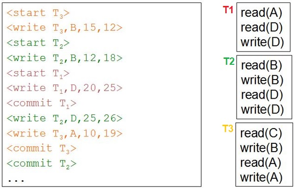

## [Tópico 30] - Recuperação Após Falhas
###### *by Prof. Plinio Sa Leitao-Junior (INF/UFG)*

### <ins>CONTEÚDO</ins>

|_Item do conteúdo_|_Item do conteúdo_|
|-|-|
|1. <ins>**VISÃO GERAL**</ins>|4. Exemplos|
|2. Políticas de atualização|5. _Checkpoint_|
|3. Implementação das<br>políticas de atualização|6. |

<hr style="border:2px solid blue">

### 1. <ins>VISÃO GERAL</ins>

No <ins>contexto de FALHAS</ins> em bancos de dados:<br>
&#10004; Para **`cada transação T`** no escalonamento, o _subsistema de recuperação após falhas_ é responsável por garantir que:<br>
&nbsp;&nbsp;&nbsp;&nbsp;&nbsp;&nbsp;&nbsp;&nbsp;&#9918; todas as operações de **T** sejam concluídas com sucesso e ...<br>
&nbsp;&nbsp;&nbsp;&nbsp;&nbsp;&nbsp;&nbsp;&nbsp;&nbsp;&nbsp;&nbsp;&nbsp;&nbsp;&nbsp;&nbsp;&nbsp; ... seu efeito seja registrado permanentemente no banco de dados; **OU**<br>
&nbsp;&nbsp;&nbsp;&nbsp;&nbsp;&nbsp;&nbsp;&nbsp;&#9918; **T** não tenha qualquer efeito no banco de dados [ou em outras transações].

```diff
! A recuperação de transações após falhas significa que ...
! ... quando uma FALHA que impacta as propriedades ACID (Tópico 22) ocorre ... 
! ... o banco de dados será restaurado para o ESTADO CONSISTENTE ...
! ... MAIS RECENTE POSSÍVEL antes do momento da falha.
```

O SGBD <ins>registra o conteúdo das alterações</ins> aplicadas aos itens de dados pelas diversas transações:<br>
&#10004; Em adição ao banco de dados propriamente dito ...<br>
&nbsp;&nbsp;&nbsp;&nbsp;&nbsp;&nbsp;&nbsp;&nbsp;&#9918; ... um histórico [da sequência] de atualizações aos dados do banco de dados é gravado.

<hr style="border:2px solid blue">

#### &#9752;&#x270D;&#9745; <ins>TIPOS DE FALHAS</ins>

Abaixo está uma classificação simples de falhas no contexto de banco de dados.

<table>
    <thead>
        <tr>
            <th><i></i>Categoria</i></th>
            <th><i>Exemplo(s)</i></th>            
            <th><i>Solução(s)</i></th>            
        </tr>
    </thead>
    <tbody>
        <tr>
            <td><b>Transação</b></td>
            <td>&#10004; Erro casual no sistema &#8212;<br>&nbsp;&nbsp;&nbsp;&nbsp;&nbsp;&nbsp;&nbsp;&nbsp;hardware, software ou rede<br>&#10004; Estouro de número inteiro, divisão por zero<br>&#10004; Violação de regra de integridade<br>&#10004;Aplicação de controle de concorrência</td>
            <td>SGBD trata (recupera) as transações que falharam,<br>mantendo as transações ativas <ins>em processamento</td></tr>ins></td>
        </tr> 
        <tr>
            <td><b>Sistema<b></td>
            <td>&#10004; Perda de conteúdo volátil<br>&#10004; Interrupção de execução do SGBD</td>
            <td>SGBD recupera o banco de dados<br>pelo uso do conteúdo não-volátil</td>
        </tr> 
        <tr>
            <td><b>Mídia</b></td>
            <td>&#10004; Perda de conteúdo não-volátil</td>
            <td>SGBD recupera o banco de dados<br>pelo uso de <i>backups</i></td>
        </tr>     
</tbody>
</table>

<hr style="border:2px solid blue">

#### &#9752;&#x270D;&#9745; <ins>EXEMPLOS DE PROCESSO DE RECUPERAÇÃO APÓS FALHAS</ins>

**`FALHA SEVERA DE DISCO.`** Em caso de falha [catastrófica] de disco, um método de recuperação ...<br>
:sunflower: Restaurar a última cópia do banco de dados ...<br>
&nbsp;&nbsp;&nbsp;&nbsp;&nbsp;&nbsp;&nbsp;&nbsp; cujo _backup_ foi feito anterior ao momento da falha (por exemplo, dias ou semanas antes).<br>
:sunflower: Reconstruir [um estado de] o banco de dados <ins>mais atual possível</ins> ...<br>
&nbsp;&nbsp;&nbsp;&nbsp;&nbsp;&nbsp;&nbsp;&nbsp; ao reaplicar (refazer) as operações de transações confirmadas ...<br>
&nbsp;&nbsp;&nbsp;&nbsp;&nbsp;&nbsp;&nbsp;&nbsp;&nbsp;&nbsp;&nbsp;&nbsp;&nbsp;&nbsp;&nbsp;&nbsp; ... após o _backup_ do banco de dados e anterior ao momento da falha,<br>
&nbsp;&nbsp;&nbsp;&nbsp;&nbsp;&nbsp;&nbsp;&nbsp; desde que tais transações estejam disponíveis em _log_ ...<br>
&nbsp;&nbsp;&nbsp;&nbsp;&nbsp;&nbsp;&nbsp;&nbsp;&nbsp;&nbsp;&nbsp;&nbsp;&nbsp;&nbsp;&nbsp;&nbsp; ... a partir de _backups_ de _log_.

**`FALHA DE TRANSAÇÃO.`** Uma transação pode causar uma inconsistência no banco de dados ...<br>
&nbsp;&nbsp;&nbsp;&nbsp;&nbsp;&nbsp;&nbsp; ... as entradas mantidas no _log_ [_online_]<br>
&nbsp;&nbsp;&nbsp;&nbsp;&nbsp;&nbsp;&nbsp; ... são analisadas para determinar as ações apropriadas à recuperação.<br>
:sunflower: Identificar a operação [da transação] que danifica o banco de dados.<br>
:sunflower: Desfazer os efeitos dessa operação e anteriores da transação ...<br>
&nbsp;&nbsp;&nbsp;&nbsp;&nbsp;&nbsp;&nbsp;&nbsp; a partir de registros no _log_.<br>
:sunflower: Identificar e desfazer as transações que sofrem aborto em cascata.<br>
:sunflower: Refazer algumas operações para restaurar um estado consistente do banco de dados ...<br>
&nbsp;&nbsp;&nbsp;&nbsp;&nbsp;&nbsp;&nbsp;&nbsp; se transações foram confirmadas,<br>
&nbsp;&nbsp;&nbsp;&nbsp;&nbsp;&nbsp;&nbsp;&nbsp; mas algumas de suas operações de escrita ainda não foram gravadas no disco.

<hr style="border:2px solid blue">

#### &#9752;&#x270D;&#9745; <ins>_LOG_ DE BANCO DE DADOS</ins>

O `processo de recuperação` após falhas comumente é baseado em LOG DE BANCO DE DADOS:<br>
&#9888; O LOG possui as operações efetivamente aplicadas ao banco de dados ...<br>
&nbsp;&nbsp;&nbsp;&nbsp;&nbsp;&nbsp;&nbsp;&nbsp; ... as quais levaram o banco de dados ao estado corrente.<br>
&#9888; Noutras palavras, o LOG <ins>registra o histórico de inclusões, exclusões e alterações</ins> de dados ...<br>
&nbsp;&nbsp;&nbsp;&nbsp;&nbsp;&nbsp;&nbsp;&nbsp; ... das transações concluídas com sucesso.<br>
&#9888; Em adição, O LOG também inclui outros tipos de registro que apoiam o processo de recuperação.<br>

```diff
- Então, a recuperação baseada em LOG é uma RECUPERAÇÃO BASEADA EM REDUNDÂNCIA.
```

O LOG é naturalmente <ins>gravado em arquivo</ins>:<br>
&#9888; No tempo de vida de cada banco de dados, **`vários arquivos de LOG são gerados`**:<br>
&nbsp;&nbsp;&nbsp;&nbsp;&nbsp;&nbsp;&nbsp;&nbsp;&#9918; _arquivo-LOG-1_ , _arquivo-LOG-2_ , ...<br>
&nbsp;&nbsp;&nbsp;&nbsp;&nbsp;&nbsp;&nbsp;&nbsp;&#9918; Há possíveis eventos para `fechar um arquivo de LOG` e `criar o próximo arquivo de LOG` ...<br>
&nbsp;&nbsp;&nbsp;&nbsp;&nbsp;&nbsp;&nbsp;&nbsp;&nbsp;&nbsp;&nbsp;&nbsp;&nbsp;&nbsp;&nbsp;&nbsp; ... a cada dia, a cada número de transações, etc.<br>
&nbsp;&nbsp;&nbsp;&nbsp;&nbsp;&nbsp;&nbsp;&nbsp;&#9918; O SGBD sempre grava os registros no <ins>arquivo de LOG corrente</ins> ...<br>
&nbsp;&nbsp;&nbsp;&nbsp;&nbsp;&nbsp;&nbsp;&nbsp;&nbsp;&nbsp;&nbsp;&nbsp;&nbsp;&nbsp;&nbsp;&nbsp; ... ou seja, o SGBD grava registros no último arquivo de LOG criado.<br>
&#9888; O arquivo de LOG é um <ins>arquivo sequencial somente de acréscimo</ins> (_append-only file_).

Os **`Buffers de LOG`** são _buffers_ particulares do `Buffer Pool`, que são alocados para os registros de LOG:<br>
&#9888; Os _buffers_ de LOG armazenam os `registros recentes do LOG`.<br>
&#9888; Com alguma frequência, há a <ins>gravação dos _buffers_ de LOG no arquivo de LOG</ins>:<br>
&nbsp;&nbsp;&nbsp;&nbsp;&nbsp;&nbsp;&nbsp;&nbsp;&#9918; Significa o conteúdo dos _buffers_ de LOG é <ins>anexado ao final</ins> do arquivo de LOG corrente.<br>
&nbsp;&nbsp;&nbsp;&nbsp;&nbsp;&nbsp;&nbsp;&nbsp;&#9918; Alguns eventos que ocasionam a gravação no arquivo de LOG:<br>
&nbsp;&nbsp;&nbsp;&nbsp;&nbsp;&nbsp;&nbsp;&nbsp;&nbsp;&nbsp;&nbsp;&nbsp;&nbsp;&nbsp;&nbsp;&nbsp; ... os _buffers_ de LOG estão cheios, uma ou mais transações foram concluídas, etc.

```diff
+ Ambos — Banco de Dados e Arquivos de LOG — devem ser alvos da política de backup.
```

<hr style="border:2px solid blue">

#### &#9752;&#x270D;&#9745; <ins>TIPOS DE REGISTRO DE _LOG_</ins>

Vários tipos de registro de LOG estão previstos:

|Tipo de registro|Descrição|
|-|-|
|[**start_transaction**, T]|Registra que a transação <ins>T iniciou a execução</ins>|
|[**write_item**, T, X, _old_value_, _new_value_]| Registra que a transação <ins>T alterou o valor do item X</ins><br>de _old\_value_ para  _new\_value_|
|[**read_item**, T, X]|Registra que a transação <ins>T leu o valor do item X</ins> _(\*)_|
|[**commit**, T]|Registra que a transação <ins>T foi concluída com sucesso</ins>, _(\*\*)_<br>... então seu efeito pode ser confirmado no BD _(\*\*\*)_|
|[**abort**, T]|Registra que a transação <ins>T foi abortada</ins>|
|_Outros tipos_|Registram outros eventos no LOG|

_(\*)_ Em caso de escalonamento recuperável sem aborto em cascata, o registro **_read_item_** não é necessário (figura abaixo).<br>
_(\*\*)_ O registro **_commit_** é gravado no LOG após todas as operações de T terem sido executadas com sucesso.<br>
_(\*\*\*)_ O registro **_commit_** está no LOG, mas os efeitos de T podem ainda não ter sido aplicados ao banco de dados.

&nbsp;&nbsp;&nbsp;&nbsp;&nbsp;&nbsp;&nbsp;&nbsp;&nbsp;&nbsp;&nbsp;&nbsp;

<hr style="border:2px solid blue">

#### &#9752;&#x270D;&#9745; <ins>BREVE SOBRE O PROCESSO DE RECUPERAÇÃO</ins>

```diff
@@ O processo de recuperação envolve os 'últimos registros' (!?) no LOG ... @@
+  ... tais registros podem ser lidos (processados) de frente-para-trás e de trás-para-frente ...
+  ... se no LOG houver o registro START mas não o COMMIT para T, a transação não foi concluída.

@@  A depender do contexto da recuperação ... @@
-  ... A transação T não será afetada pela recuperação, OU
-  ... algumas das operações de T necessitarão ser desfeitas — Operação UNDO, OU
-  ... todas as operações de T necessitarão ser refeitas — Operação REDO.
```

<hr style="border:2px solid blue">

#### &#9752;&#x270D;&#9745; <ins>GRAVAÇÃO ANTECIPADA NO LOG</ins> &#8212; `WRITE-AHEAD LOGGING (WAL)`

O processo de recuperação adota a premissa **`write-ahead logging — WAL`** :<br>
&#9888; Em qualquer operação de escrita &#8212; <ins>modifica o estado</ins> do banco de dados ...<br>
&nbsp;&nbsp;&nbsp;&nbsp;&nbsp;&nbsp;&nbsp;&nbsp;... a operação é antes registrada no LOG,<br>
&nbsp;&nbsp;&nbsp;&nbsp;&nbsp;&nbsp;&nbsp;&nbsp;... para então [em algum momento] ser aplicada no banco de dados.

<hr style="border:2px solid blue">

#### Reflexões

O processo de recuperação precisa identifcar alterações que [potencialmente] causam inconsistências no banco de dados ?<br>
Como será a recuperação, se a execução de uma transação violar uma regra de integridade ?<br>
Como será a recuperação, se uma transação for abortada pelo mecanismo de controle de concorrência ?<br>
Como será a recuperação, se houver o aborto em cascata ?<br>
Como será a recuperação, se a mídia do banco de dados for danificada?<br>
