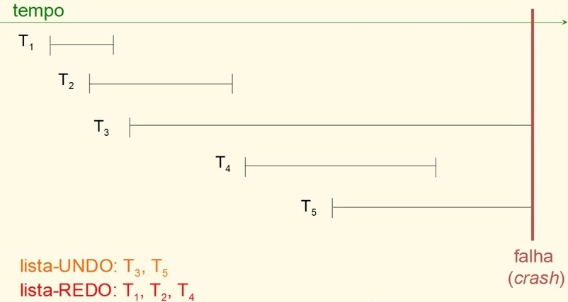

## [Tópico 34] - Recuperação Após Falhas
###### *by Prof. Plinio Sa Leitao-Junior (INF/UFG)*

### <ins>CONTEÚDO</ins>

|_Item do conteúdo_|_Item do conteúdo_|
|-|-|
|1. Visão geral|4. <ins>**EXEMPLOS**</ins>|
|2. Políticas de atualização|5. _Checkpoint_|
|3. Implementação das políticas de atualização|6. |

### 4. <ins>EXEMPLOS</ins>

Este tópico explora exemplos de recuperação de banco de dados, em que a falha é do tipo **`SISTEMA`**, tal como um _system crash_, em que o SDBG é reiniciado.

#### &#9752;&#x270D;&#9745; EXEMPLO &#8212; ABORTO EM CASCATA </ins>

Na figura abaixo: 
&#9918; A transação T1 e T3 serão desfeitas (_rolled back_), pois não alcançaram o ponto de _commit_ no momento da falha. 
&#9918; A transação T2 é desfeita (_rolled back_), pois leu o valor do Item B, o qual foi escrito por T3.

&nbsp;&nbsp;&nbsp;&nbsp;&nbsp;&nbsp;&nbsp;&nbsp;&nbsp;&nbsp;&nbsp;&nbsp;

#### &#9752;&#x270D;&#9745; EXEMPLO &#8212; ALGORITMO `UNDO/REDO` </ins>

&#9888; Ressalta-se que TODAS AS TRANSAÇÕES registradas no LOG corrente ... 
&nbsp;&nbsp;&nbsp;&nbsp;&nbsp;&nbsp;&nbsp;&nbsp;... sofrerão UNDO ou REDO.

Na figura abaixo: 
&#9918; As transações T3 e T5 SERÃO DESFEITAS (operação UNDO), pois ... 
&nbsp;&nbsp;&nbsp;&nbsp;&nbsp;&nbsp;&nbsp;&nbsp;... ambas as transações NÃO POSSUEM o registro _commit_ no LOG. 
&#9918; As transações T1, T2 e T4 SERÃO REFEITAS (operação REDO), pois ... 
&nbsp;&nbsp;&nbsp;&nbsp;&nbsp;&nbsp;&nbsp;&nbsp;... ambas as transações POSSUEM o registro _commit_ no LOG.

&nbsp;&nbsp;&nbsp;&nbsp;&nbsp;&nbsp;&nbsp;&nbsp;&nbsp;&nbsp;&nbsp;&nbsp;

#### &#9752;&#x270D;&#9745; EXEMPLO &#8212; ALGORITMO `UNDO/NO-REDO` </ins>

&#9888; Ressalta-se que TODAS AS TRANSAÇÕES que NÃO POSSUEM o registro _commit_ no LOG corrente ... 
&nbsp;&nbsp;&nbsp;&nbsp;&nbsp;&nbsp;&nbsp;&nbsp;... sofrerão UNDO.

Na figura abaixo: 
&#9918; A transação T4 SERÁ DESFEITA (operação UNDO), pois ... 
&nbsp;&nbsp;&nbsp;&nbsp;&nbsp;&nbsp;&nbsp;&nbsp;... a transação CONCLUIU, 
&nbsp;&nbsp;&nbsp;&nbsp;&nbsp;&nbsp;&nbsp;&nbsp;... mas NÃO TÊM o registro _commit_ no LOG; 
&nbsp;&nbsp;&nbsp;&nbsp;&nbsp;&nbsp;&nbsp;&nbsp;&nbsp;&nbsp;&nbsp;&nbsp;&nbsp;&nbsp;&nbsp;&nbsp;&nbsp;&nbsp;&nbsp;&nbsp;&nbsp;&nbsp;&nbsp;&nbsp;... _&#8810; presume-se que o _commit_ não está no LOG &#8811;_ 
&#9918; As transações T3 e T5 SERÃO DESFEITAS (operação UNDO), pois ... 
&nbsp;&nbsp;&nbsp;&nbsp;&nbsp;&nbsp;&nbsp;&nbsp;... ambas as transações NÃO CONCLUÍRAM.

&nbsp;&nbsp;&nbsp;&nbsp;&nbsp;&nbsp;&nbsp;&nbsp;&nbsp;&nbsp;&nbsp;&nbsp;

#### &#9752;&#x270D;&#9745; EXEMPLO &#8212; ALGORITMO `NO-UNDO/REDO` </ins>

&#9888; Ressalta-se que TODAS AS TRANSAÇÕES que POSSUEM o registro _commit_ no LOG corrente ... 
&nbsp;&nbsp;&nbsp;&nbsp;&nbsp;&nbsp;&nbsp;&nbsp;... sofrerão REDO.

Na figura abaixo: 
&#9918; As transações T1 e T2 SERÃO REFEITAS (operação REDO), pois ... 
&nbsp;&nbsp;&nbsp;&nbsp;&nbsp;&nbsp;&nbsp;&nbsp;... ambas as transações CONCLUÍRAM, 
&nbsp;&nbsp;&nbsp;&nbsp;&nbsp;&nbsp;&nbsp;&nbsp;... e TÊM o registro _commit_ no LOG. 
&#9918; A transação T4 SERÁ REFEITA (operação REDO), pois ... 
&nbsp;&nbsp;&nbsp;&nbsp;&nbsp;&nbsp;&nbsp;&nbsp;... a transação CONCLUIU, 
&nbsp;&nbsp;&nbsp;&nbsp;&nbsp;&nbsp;&nbsp;&nbsp;... e TÊM o registro _commit_ no LOG; 
&nbsp;&nbsp;&nbsp;&nbsp;&nbsp;&nbsp;&nbsp;&nbsp;&nbsp;&nbsp;&nbsp;&nbsp;&nbsp;&nbsp;&nbsp;&nbsp;&nbsp;&nbsp;&nbsp;&nbsp;&nbsp;&nbsp;&nbsp;&nbsp;... _&#8810; presume-se que o _commit_ está no LOG &#8811;_ 

&nbsp;&nbsp;&nbsp;&nbsp;&nbsp;&nbsp;&nbsp;&nbsp;&nbsp;&nbsp;&nbsp;&nbsp;

