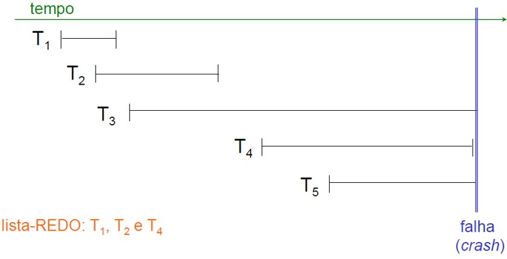

## [Tópico 35] - Recuperação Após Falhas
###### *by Prof. Plinio Sa Leitao-Junior (INF/UFG)*

### <ins>CONTEÚDO</ins>

|_Item do conteúdo_|_Item do conteúdo_|
|-|-|
|1. Visão geral|4. Exemplos|
|2. Políticas de atualização|5. <ins>**_CHECKPOINT_**</ins>|
|3. Implementação das<br>políticas de atualização|6. |

<hr style="border:2px solid blue">

### 5. <ins>_CHECKPOINT_</ins>

`CHECKPOINT` é um **`tipo de registro gravado no LOG`**, para ...<br>
&#9888; ... <ins>reduzir o tempo de processamento</ins> durante a recuperação.

O `FORMATO` de um registro de _checkpoint_:<br>
&#10004; **[** **checkpoint** **,** _&#8810; lista de transações ativas &#8811;_ **]** , onde ...<br>
&nbsp;&nbsp;&nbsp;&nbsp;&nbsp;&nbsp;&nbsp; ... o registro indica que transações estavam ativas (em curso),<br>
&nbsp;&nbsp;&nbsp;&nbsp;&nbsp;&nbsp;&nbsp; ... no momento em que o registro foi gravado no LOG.

<hr style="border:2px solid blue">

#### &#9752;&#x270D;&#9745; EXEMPLO &#8212; _CHECKPOINT_ NO ALGORITMO `UNDO/REDO` </ins>

Sobre o <ins>último registro de _checkpoint_</ins> no LOG:<br>
&#9888; A transação T NÃO SERÁ REFEITA (operação REDO) se ...<br>
&nbsp;&nbsp;&nbsp;&nbsp;&nbsp;&nbsp;&nbsp;&nbsp;... o registro _commit_ no LOG estiver ANTERIOR ao registro de _checkpoint_.

Na figura abaixo (à direita):<br>
&#9918; As transações T<sub>1</sub> e T<sub>2</sub> NÃO SERÃO REFEITAS (operação REDO), pois ...<br>
&nbsp;&nbsp;&nbsp;&nbsp;&nbsp;&nbsp;&nbsp;&nbsp;... para ambas as transações,<br>
&nbsp;&nbsp;&nbsp;&nbsp;&nbsp;&nbsp;&nbsp;&nbsp;... o registro de _commit_ ocorre ANTES do registro de _checkpoint_ no LOG .<br>
&#9918; A transação T<sub>4</sub> SERÁ REFEITA (operação REDO), pois ...<br>
&nbsp;&nbsp;&nbsp;&nbsp;&nbsp;&nbsp;&nbsp;&nbsp;... a transação tem o registro de _commit_ APÓS o registro de _checkpoint_ no LOG.<br>
&#9918; As transações T<sub>3</sub> e T<sub>5</sub> SERÃO DESFEITAS (operação UNDO), pois ...<br>
&nbsp;&nbsp;&nbsp;&nbsp;&nbsp;&nbsp;&nbsp;&nbsp;... ambas as transações NÃO POSSUEM o registro de _commit_ no LOG.

&nbsp;&nbsp;&nbsp;&nbsp;

<hr style="border:2px solid blue">

#### &#9752;&#x270D;&#9745; EXEMPLO &#8212; _CHECKPOINT_ NO ALGORITMO `UNDO/NO-REDO` </ins>

```diff
+ Por que o registro de CHECKPOINT não de aplica ao algoritmo UNDO/NO-REDO ?
```

<hr style="border:2px solid blue">

#### &#9752;&#x270D;&#9745; EXEMPLO &#8212; _CHECKPOINT_ NO ALGORITMO `NO-UNDO/REDO` </ins>

Sobre o <ins>último registro de _checkpoint_</ins> no LOG:<br>
&#9888; A transação T NÃO SERÁ REFEITA (operação REDO) se ...<br>
&nbsp;&nbsp;&nbsp;&nbsp;&nbsp;&nbsp;&nbsp;&nbsp;... o registro _commit_ no LOG estiver ANTERIOR ao registro de _checkpoint_.

Na figura abaixo (à direita):<br>
&#9918; As transações T<sub>1</sub> e T<sub>2</sub> NÃO SERÃO REFEITAS (operação REDO), pois ...<br>
&nbsp;&nbsp;&nbsp;&nbsp;&nbsp;&nbsp;&nbsp;&nbsp;... para ambas as transações,<br>
&nbsp;&nbsp;&nbsp;&nbsp;&nbsp;&nbsp;&nbsp;&nbsp;... o registro de _commit_ ocorre ANTES do registro de _checkpoint_ no LOG .<br>
&#9918; A transação T<sub>4</sub> SERÁ REFEITA (operação REDO), pois ...<br>
&nbsp;&nbsp;&nbsp;&nbsp;&nbsp;&nbsp;&nbsp;&nbsp;... a transação CONCLUIU,<br>
&nbsp;&nbsp;&nbsp;&nbsp;&nbsp;&nbsp;&nbsp;&nbsp;... e TÊM o registro _commit_ no LOG;<br>
&nbsp;&nbsp;&nbsp;&nbsp;&nbsp;&nbsp;&nbsp;&nbsp;&nbsp;&nbsp;&nbsp;&nbsp;&nbsp;&nbsp;&nbsp;&nbsp;&nbsp;&nbsp;&nbsp;&nbsp;&nbsp;&nbsp;&nbsp;&nbsp;... _&#8810; presume-se que o _commit_ está no LOG &#8811;_<br>

&nbsp;&nbsp;&nbsp;&nbsp;

<hr style="border:2px solid blue">

#### &#9752;&#x270D;&#9745; _FUZZY CHECKPOINT_ </ins>

O `PROCESSO de GRAVAÇÃO` de um registro de _checkpoint_:<br>
:eight_spoked_asterisk: (1) Suspender, temporariamente, a execução de transações.<br>
:eight_spoked_asterisk: (2) Forçar a gravação [em disco] de todos os _buffers_ de dados que foram modificados.<br>
:eight_spoked_asterisk: (3) Gravar um registro de _checkpoint_ no LOG, e forçar a gravação do LOG no disco.<br>
:eight_spoked_asterisk: (4) Retomar a execução de transações.<br>
Há um <ins>_OVERHEAD_ na gravação do registro de _checkpoint_</ins> , principalmente devido ao Passo (2) acima ...<br>
&nbsp;&nbsp;&nbsp;&nbsp;&nbsp;&nbsp;&nbsp; ... as transações suspensas no Passo (1) precisam aguardar ...<br>
&nbsp;&nbsp;&nbsp;&nbsp;&nbsp;&nbsp;&nbsp; ... o término dos Passos (2) e (3) para a retomada de sua execução.

```diff
- O tempo necessário para forçar a gravação [em disco] de todos os buffers de dados modificados ...
- ... atrasa SOBREMANEIRA o processamento das transações suspensas no Passo (1).
! TAL não é ACEITÁVEL, na prática.
```

**`FUZZY CHECKPOINT`** busca solucionar esse _overhead_:<br>
:eight_spoked_asterisk: (1) Suspender, temporariamente, a execução de transações.<br>
:eight_pointed_black_star: (1.1) Gravar um registro de **_`begin`\_`checkpoint`_** no LOG.<br>
:eight_pointed_black_star: (1.2) Retomar a execução das transações suspensas no Passo (1).<br>
:eight_spoked_asterisk: (2)<sup>**\*\***</sup> Forçar a gravação [em disco] de todos os _buffers_ de dados que foram modificados.<br>
:eight_pointed_black_star: (3) Gravar um registro de **_`end`\_`checkpoint`_** no LOG, e forçar a gravação do LOG no disco.<br>
<sup>**\*\***</sup> até que os Passo 3 sejam completado, o registro de _checkpoint_ anterior é o último (mais recente) registro de _checkpoint_ válido.
