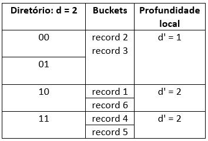

## Resultado

Clique [AQUI](../media/sgbd-2024-2-bcc-resumo.pdf) para ver as notas.

#### Avaliação em 12/09/2024

(V) Uma página em um _buffer_ do SGBD... (F) O _buffer pool_ do SGBD é tipicamente... (V) O acesso a dados por meio... (F) Em um sistema em que a CPU fica ociosa... (V) Quando o gerenciador de _buffer_ precisa... (F) Uma página é substituída de... (F) Se a memória principal e a memória _cache_... (V) Se os registradores e a _cache_... (V) No contexto da hierarquia de memória... (V) O custo de armazenamento por unidade de dados... (F) As várias camadas de _cache_... (V) O emprego de _pin-count_ nas páginas... (V) O processo de _design_ de banco de dados... (V) A organização de arquivos determina... (V) Em cada transação, aplicações... (V) Na hierarquia de memória, a _cache_... (F) Quanto mais "perto"... (F) O _dirty bit_ pode ser aplicado... (V) Várias transações do banco de dados... (V) Uma modificação da política _clock policy_... 

#### Avaliação em 19/09/2024

(F) A função teto é em geral... (V) A função piso é em geral... (V) Quando o tamanho do bloco... (V) Em alocação de blocos... (F) Na política FIFO de gerência... (F) A política FIFO requer... (F) Na organização de registros não espalhada, é previsto... (V) A organização de registros não espalhada é aplicável... (F) O _pin-count_ determina se... (F) Se o _pin-count_ de uma página... (F) Independente do predicado de busca... (V) A busca binária em arquivos... (V) O tamanho do _buffer pool_ em geral... (F) Em arquivos com registros de tamanho fixo, o cabeçalho... (V) Registros de comprimento variável são aplicáveis... (F) Em registros de tamanho variável, qualquer... (V) O cabeçalho de arquivo em geral contém informações... (V) A estratégia _double buffering_ permite... (V) Em arquivos de registros de tamanho fixo e variável, os registros... (V) Há cenários em que o SGBD...

#### Avaliação em 26/09/2024
1. **(a)** Rfixo = (47+1) + (9+1) + (9+1) + (1+1) + (3+1) = 38 + 10 + 10 + 2 + 4 = 74 bytes Rvariável = ((39+1) * 0.5) + ((3+1) * 0.25) + ((7+1) * 0.5) = 20 + 1 + 4 = 25 bytes R = Rfixo + Rvariável + 1 = 74 + 25 + 1 = 100 bytes **(b)** bfr = piso ( B / R ) = piso ( 1024 / 100 ) = piso ( 10,24 ) = 10 registros por bloco **(c)** B = teto ( r / bfr ) = teto ( 40000 / 10 ) = 4000 blocos
2. Aplicar uma marcação lógica... Ter uma lista de registros ...
3. É necessário conhecer ... O desempenho é melhor que ...
4. O bucket A1A1A1A1 estiver ... d = d', para o bucket ...

#### Avaliação em 03/10/2024

#### Avaliação em 10/10/2024

1.

2. E-D-A-C-B
3. Há menos registros de índice do que registros no arquivo de dados (um registro de índice para cada bloco de dados): a quantidade de registros impacta o número de blocos. Um registro de índice é usualmente menor em tamanho do que um registro de dados: o tamanho do registro impacta o fator de bloco, que por sua vez impacta o número de blocos.

#### Avaliação em 17/10/2024

O campo de indexação é o campo de ordenação (primário, agrupamento); O campo de indexação é um campo chave (primário, secundário); O campo de indexação é um campo não-chave (agrupamento, secundário); Vários índices desse tipo podem ser criados para um mesmo arquivo de dados, mesmo que seus campos de indexação sejam distintos entre si (secundário); O índice é esparso (primário, agrupamento, secundário); O índice é denso (secundário); A busca binária pode ser aplicada na pesquisa via o índice (primário, agrupamento, secundário); O arquivo de índice é um arquivo ordenado ou não ordenado ().

#### Avaliação em 31/10/2024

|Questão|Árvore B|Árvore B+|
|:-:|:-:|:-:|
|01|5.p + 15.(p – 1) + 5.(p – 1) &#8804; B 25.p &#8804; 1024+20 p = piso(1044/25) &#8756; **p = 41**|5.p + 15.(p – 1) &#8804; B 20.p &#8804; 1024 + 15 p = piso(1039/20) &#8756; **p = 51**|
|02|v = p – 1 = 41 – 1 &#8756; **v = 40**|v = p – 1 = 51 – 1 &#8756; **v = 50**|
|03|**vfolha = 40**|vfolha.(15 + 5) + 5 &#8804; B 20.vfolha + 5 &#8804; 1024 vfolha = piso(1019/20) &#8756; **vfolha = 50**|
|04|**k**|**k**|
|05|**q * k**|**q * k**|
|06|**q * q * kfolha**|**q * q * kfolha**|
|07|**k + (q * k) + (q * q * kfolha)**|**q * q * kfolha**|
